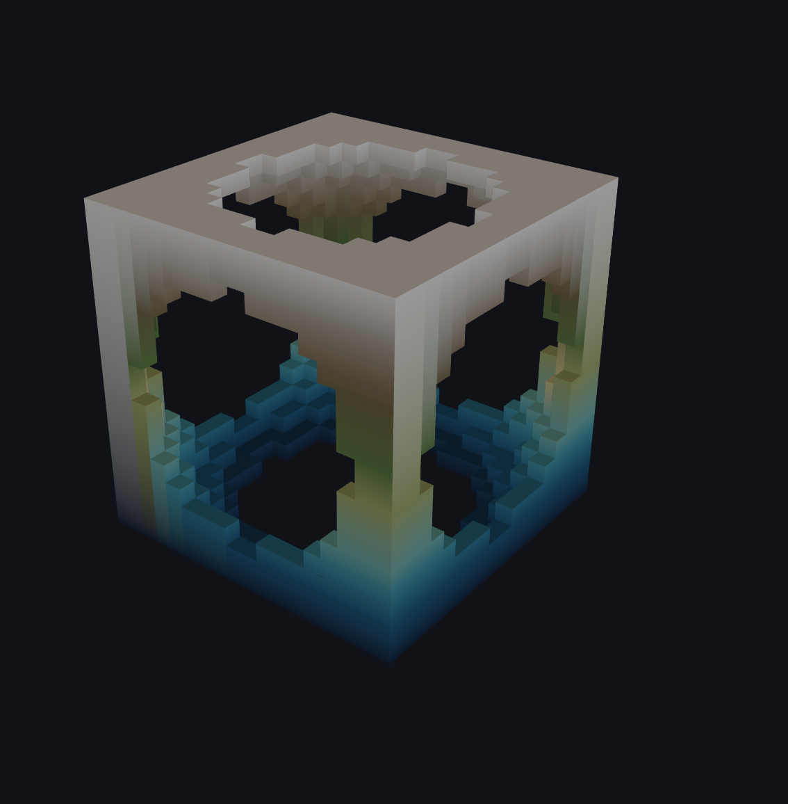
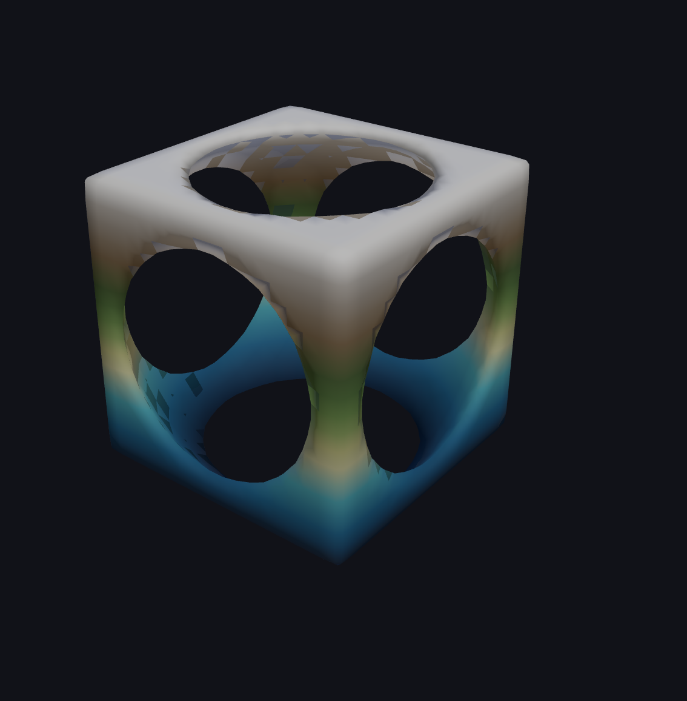
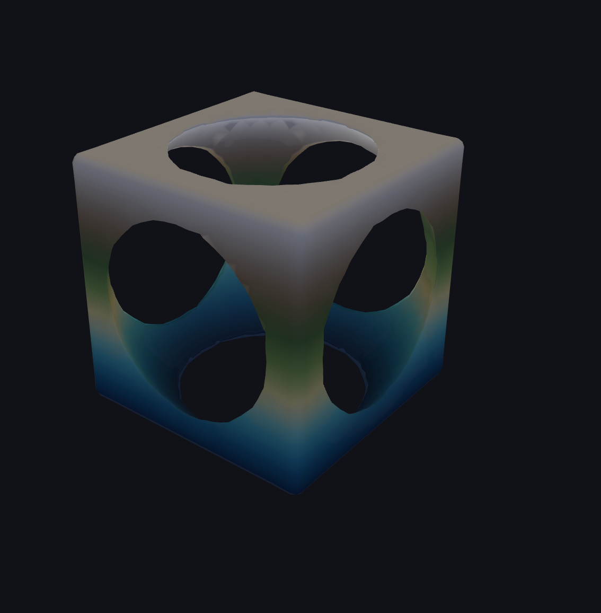

# Procedural World Building

Coursework for a weekly design course, built with React, TypeScript, and
Three.js. Each **topic** is a page in the app and a chapter in the study
notebook under [`docs/`](docs/). The app accumulates as the course goes rather
than replacing what came before, so every earlier topic is still reachable and
still runs.

**Topics are not weeks.** The course meets weekly but not every week produces
work — some are lectures — so pages, branches and docs are numbered by topic.
Topic 3 is the third body of work, not the third week.


## Contents

- [Topics](#topics)
  - [Topic 1 — 3D Objects](#topic-1--3d-objects)
  - [Topic 2 — Noise](#topic-2--noise)
  - [Topic 3 — Voxels](#topic-3--voxels)
- [Study notebook](#study-notebook) — the full documentation index
- [Keyboard](#keyboard)
- [Getting started](#getting-started)
- [Project structure](#project-structure)
- [Conventions](#conventions)
- [Built with](#built-with)

## Topics

### [Topic 1 — 3D Objects](docs/topics/topic-1-objects.md)

A real-time WebGL object viewer. Five primitives swapped in place, a draggable
XYZ gizmo storing orientation as a quaternion so the object never gimbal-locks,
and material controls lit by a generated `RoomEnvironment` cubemap.


### [Topic 2 — Noise](docs/topics/topic-2-noise.md)

A field of values in `[0, 1]`, built and then progressively shaped:

- **Layers** — a stack of value-noise fields, composited bottom-up with nine
  blend modes. Opens on a six-octave fBm stack, which measures at a Hurst
  exponent of 0.75 with R² 0.990 — inside the band real topography occupies.
- **Warp** — looks the field up at coordinates displaced by another noise
  field, so strata fold and ridges curve.
- **Automata** — a 3×3(×3) neighbour rule run to its fixed point, turning
  speckled noise into connected landmasses and caves.
- **Erosion** — droplet hydraulic erosion plus thermal slippage, which is what
  cuts dendritic valley networks that noise alone never produces.
- **Output** — eight per-cell shaping ops, five colour ramps interpolated in
  OKLab, and three geometry modes: height field, point cloud, or planet.


### [Topic 3 — Voxels](docs/topics/topic-3-voxels.md)

Solids defined as one scalar function of position, rather than as a grid of
samples, and combined with constructive solid geometry:

- **Density fields** — seven primitives (sphere, box, torus, cylinder,
  half-space, gyroid, and terrain as a solid rather than a height map, so it
  can have caves cut into it). Five of the seven return true Euclidean
  distance, measured; the panel says which.
- **CSG** — union, intersection and difference are `min`, `max` and
  `max(a, −b)`. No polygon clipping and no intersection curves to solve. A
  per-operation blend width turns any boolean into a weld or a fillet.
- **Four meshers** over the same field — blocks (with optional greedy merging
  of coplanar faces, 40–73% fewer quads and provably lossless), marching cubes
  with a case table derived rather than transcribed, surface nets, and dual
  contouring, which is the only one that can reconstruct a sharp corner:
  measured error at a box's corners falls from 23.8% of a cell to 1.2%.

The same field, meshed four ways — a box with four spheres drilled out of it,
sampled at 40³. Only dual contouring reconstructs the box's edges:

| Blocks | Marching cubes | Surface nets | Dual contouring |
| --- | --- | --- | --- |
|  |  |  |  |
| 1,536 tris · 3,072 verts | 4,288 tris · 12,864 verts | 4,272 tris · 2,128 verts | 4,272 tris · 2,128 verts |

## Study notebook

The write-ups are the coursework, not a side effect of it. The full index —
with a description of what each document covers — is in
**[`docs/README.md`](docs/README.md)**. In short:

| Area | Contains |
| --- | --- |
| [`docs/topics/`](docs/topics/) | One chapter per topic: what it does, how it works, and the decisions behind it |
| [`docs/analysis/`](docs/analysis/) | Measurement and comparison reports that outgrew their chapter |
| [`docs/project/`](docs/project/) | Infrastructure — Firebase setup, auth, and the survey that preceded it |
| [`docs/images/`](docs/images/) | Screenshots, all captured from the running app |

## Keyboard

| Key | Effect |
| --- | --- |
| `H` | Hide every panel and give the whole window to the object. Press again to bring them back |
| `Esc` | Always restores the panels, never hides them |

Focus mode works on every topic — it hides the topic nav, Topic 2's sidebar and
Topic 1's floating control widget. `Esc` only ever restores, which is what makes
hiding the UI safe to try, and a small clickable reminder stays in the corner.
The shortcut is ignored while a select or text field has focus, since a letter
key means something there, but it still works from a slider or checkbox, which
is where focus usually sits after changing a value.

## Getting started

```bash
npm install
npm run dev
```

Then open the URL Vite prints (default `http://localhost:5173`).

| Script | Purpose |
| --- | --- |
| `npm run dev` | Start the dev server with hot module replacement |
| `npm run build` | Typecheck and produce a production build in `dist/` |
| `npm run lint` | Run ESLint |
| `npm run preview` | Serve the production build locally |

Firebase is optional. With no `.env` the header says so and all three topics
run exactly as before — see [`docs/project/firebase-setup.md`](docs/project/firebase-setup.md).

## Project structure

```
src/
├── main.tsx                  Entry point
├── App.tsx                   Topic nav shell, page switching, focus mode
├── Slider.tsx                Labelled range input, shared by both pages
├── InfoTip.tsx               Hover explanation, portalled out of the scrolling panel
├── LayerPanel.tsx            Layer stack editor (Topic 2)
├── pages/
│   ├── ObjectViewerPage.tsx  Topic 1 — viewer and its control panel
│   ├── NoisePage.tsx         Topic 2 — viewport, sidebar, and noise state
│   └── VoxelPage.tsx         Topic 3 — viewport, sidebar, and CSG state
├── SceneCanvas.tsx           Topic 1 Three.js scene, render loop, disposal
├── RotationGizmo.tsx         Draggable XYZ orientation widget
├── shapes.ts                 Shape definitions and geometry factory
├── theme.ts                  Shared accent colour and hex parsing
├── palette.ts                Colour ramps, OKLab interpolation, ramp fitting
├── NoiseMapPreview.tsx       Sidebar source map, click to inspect a cell
├── NoiseViewport.tsx         3D scene — height field, point cloud, or planet
├── noise.ts                  PRNG, sampling, shaping ops, blend modes, compositing
├── automata.ts               Cellular automaton over the composited field
├── erosion.ts                Droplet hydraulic erosion over the height field
├── density.ts                Distance-field primitives, CSG operations, scenes (Topic 3)
├── mesher.ts                 Blocks, greedy, marching cubes, surface nets, dual contouring
├── VoxelViewport.tsx         3D scene for the meshed solid
├── CsgPanel.tsx              Shape stack editor (Topic 3)
├── AuthBar.tsx               Header sign-in / sign-out
├── firebase/                 Firebase config, auth context and provider
├── App.css                   Shell, panel, and canvas styling
└── index.css                 Global reset

docs/
├── README.md                 Study notebook index — start here
├── topics/                   One chapter per topic
│   ├── topic-1-objects.md
│   ├── topic-2-noise.md
│   └── topic-3-voxels.md
├── analysis/                 Measurement and comparison reports
│   └── topic-3-meshing-and-chunking.md
├── project/                  Infrastructure and setup
│   ├── firebase-setup.md
│   └── firebase-integration-report.md
└── images/                   Screenshots, captured from the running app

CLAUDE.md                     Working agreements, for AI assistants and humans
```

Adding a topic is one page component in `src/pages/`, one entry in the `PAGES`
array in `App.tsx` — which carries its own `render`, and the shell opens on the
last entry — and one chapter in `docs/topics/`.

## Conventions

Decisions specific to a topic live in that topic's chapter. These hold
everywhere.

**Scenes are built once and mutated in place.** Geometry swaps replace
`mesh.geometry` rather than the mesh itself, so the render loop never loses the
object it closed over. Changing resolution rebuilds the point cloud's geometry
without tearing down the renderer.

**Values are routed by how they behave.** Continuous ones (rotation, spin,
scale) reach the render loop through refs, keeping pointer-rate updates out of
React. Discrete ones (material properties) are applied in effects, since
writing them every frame would be wasted work.

**Panels are hidden with `display: none`, not made transparent.** Their
controls leave the tab order with them, so tabbing while the UI is hidden
cannot land inside a panel you cannot see. Both canvases watch their container
with a `ResizeObserver`, so the view reflows to the full width rather than
stretching.

**Claims in the docs are measured, not estimated.** Every number in this
repository — Hurst exponents, millisecond costs, triangle counts, percentage
savings — came from running the code and reading the result. Where a
measurement contradicted the expectation, the note says so rather than quietly
dropping it.

**Screenshots are captured from the running app**, by driving it in a headless
browser rather than by posing a mock-up. A figure and the numbers beside it
therefore describe the same run.

**Work for a topic happens on its own branch** — `topic-3-voxels` and so on —
and lands on `main` collapsed into one to three commits, when the topic is done
and not before. A merge would replay every branch commit onto main and only
`git log --first-parent` would hide them; compressing first means the log stays
short however it is read, while the reasoning survives in the commit messages
rather than being discarded.

These conventions are restated in [`CLAUDE.md`](CLAUDE.md), which is where an
AI assistant working in this repo will actually look for them.

## Built with

React 19 · TypeScript · Vite · Three.js
