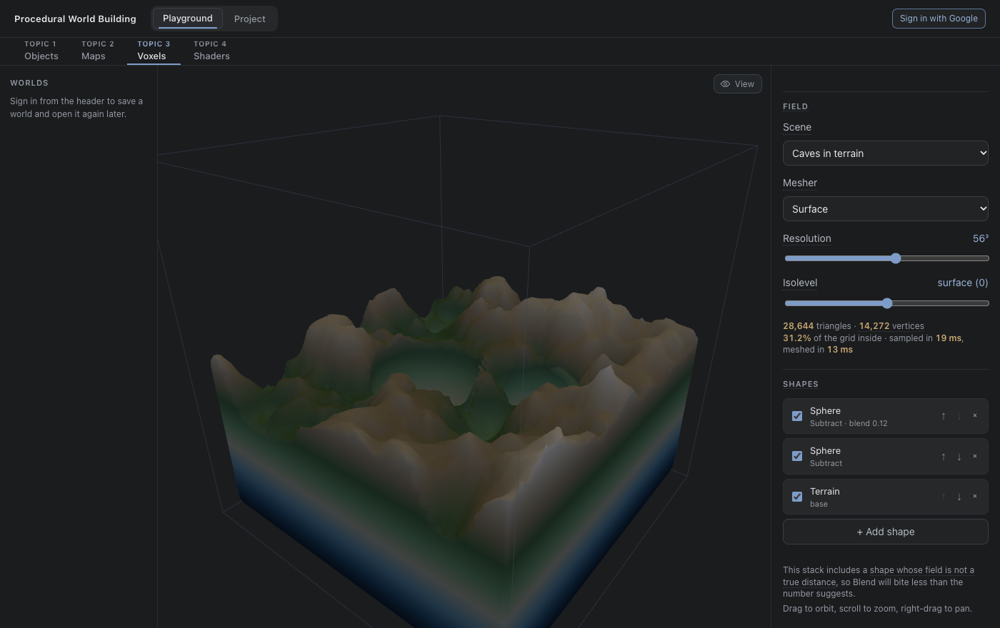
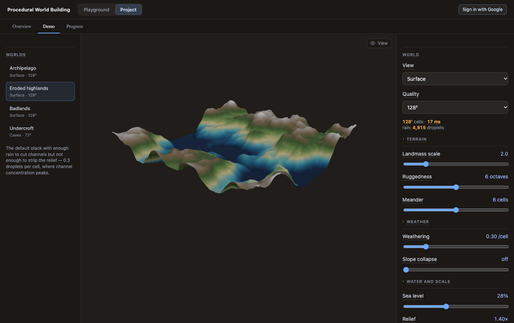
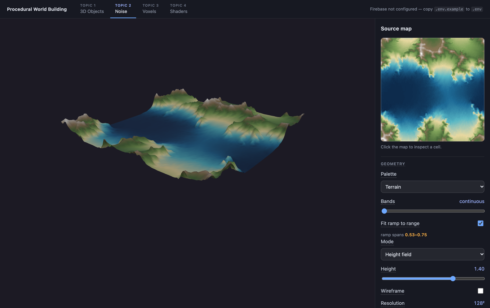
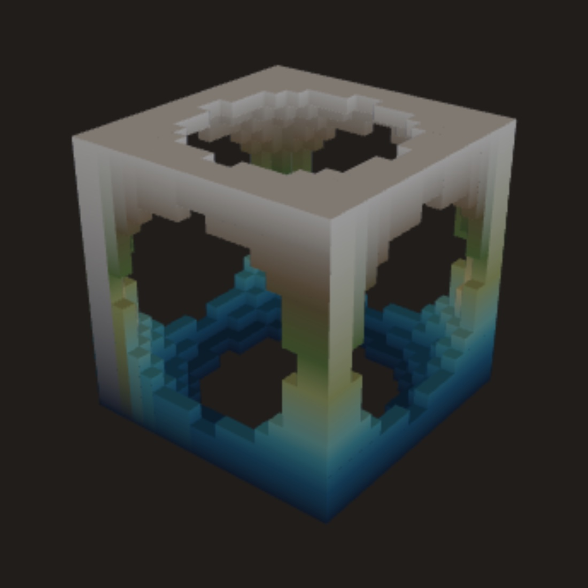
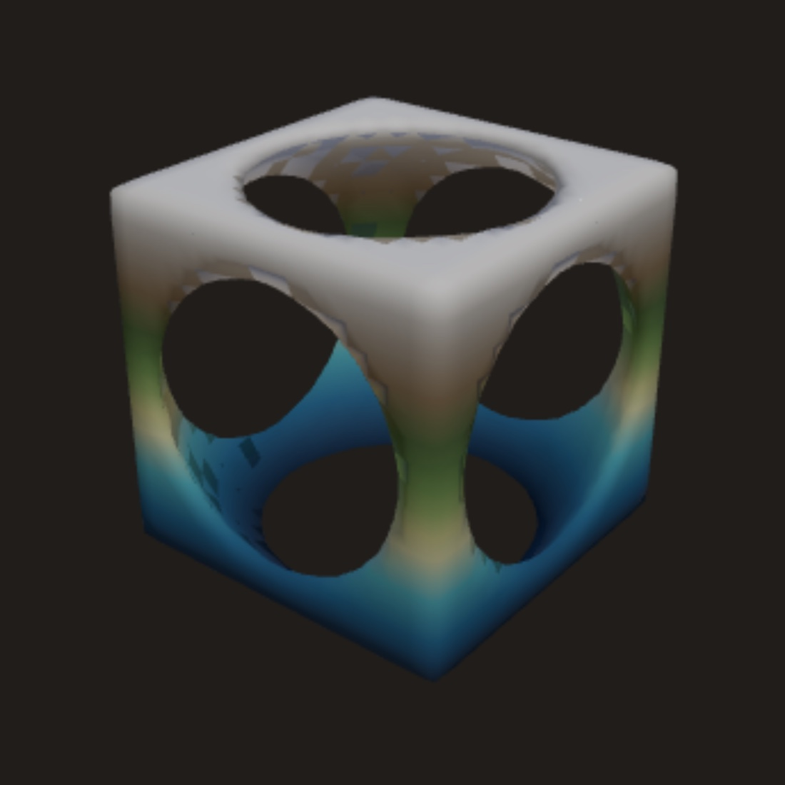
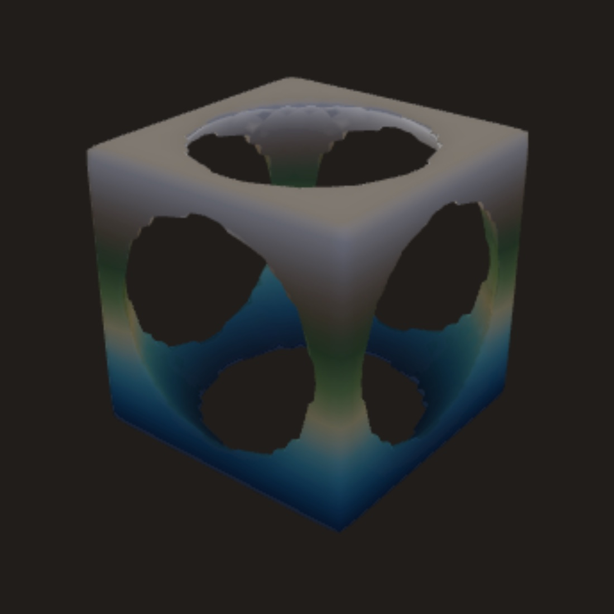
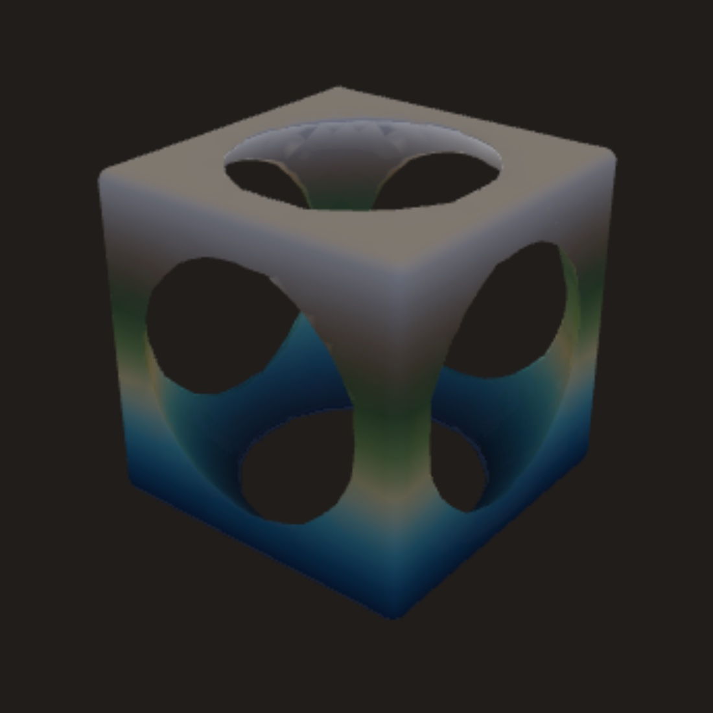

# Procedural World Building

Coursework for a weekly design course, built with React, TypeScript, and
Three.js. The app has two halves. **Playground** holds the topics — one per
body of work, each taking a single technique apart with every parameter it has
on screen. **Project** puts them back together: one generated world that every
system reads from, presented rather than dissected.

Each topic is a page in the Playground and a chapter in the study notebook
under [`docs/`](docs/). The app accumulates as the course goes rather than
replacing what came before, so every earlier topic is still reachable and still
runs.



## Contents

- [The project](#the-project) — the integrated world
- [Topics](#topics) — the Playground
  - [Topic 1 — Objects](#topic-1--objects)
  - [Topic 2 — Maps](#topic-2--maps)
  - [Topic 3 — Voxels](#topic-3--voxels)
  - [Topic 4 — Shaders](#topic-4--shaders)
- [Study notebook](#study-notebook) — the full documentation index
- [Keyboard](#keyboard)
- [Getting started](#getting-started)
- [Project structure](#project-structure)
- [Conventions](#conventions)
- [Built with](#built-with)

## The project

One procedurally generated world, assembled from the techniques the topics take
apart. The Playground asks how a single technique behaves; the project asks what
happens when they all have to agree on the same ground.

Three pages, none of them a topic — the project cuts across all of them and is
numbered by nothing:

- **Overview** — what is being built, which systems build it, and how far each
  one is actually wired in. Its hero is a live viewport running the demo's own
  generator, not a captured image.
- **Demo** — the integrated world, with nine controls where Topic 2 has thirty.
  Two views of the same heightfield: a surface, and the same field read as a
  solid with a tunnel network cut out of it.
- **Explore** — three worlds you can fly around in, generated from one system.
  Chunked terrain from a hashed height function, landmarks that are terms in
  that function rather than placed meshes, and scatter that answers to the
  ground. <kbd>W</kbd><kbd>A</kbd><kbd>S</kbd><kbd>D</kbd> to walk the terrain,
  <kbd>R</kbd>/<kbd>F</kbd> to fly and <kbd>G</kbd> to land, and <kbd>M</kbd> for
  an overview of the whole world with a pin where you were standing.
- **Progress** — technique to contribution, in dependency order rather than
  chronological, with the measurement each study produced.



The demo's two views are the same world, not two worlds. One heightfield is
generated — fBm stack, domain warp, droplet erosion, thermal collapse, sea level
— and the caves view turns that same array into a signed distance function and
subtracts a gyroid network from it with Topic 3's CSG, meshed back to triangles
with surface nets. Moving a terrain dial moves both. At the defaults that is
128² cells and 4,915 droplets in about 18 ms; the cave scenario meshes 118,092
triangles in about 13 ms at 72³.

Two things are deliberately **not** integrated yet, and both pages say so rather
than implying otherwise: Topic 4's surface shading, which lives inside a
full-screen GPU pipeline built around one fixed terrain and has to be lifted out
of it rather than called, and its GPU erosion simulation.

See [`docs/project/app-structure.md`](docs/project/app-structure.md) for how the
two sections are divided, what the demo reuses, and why the navigation was
written rather than installed.

## Topics

The Playground. Each topic is one technique, taken apart.

### [Topic 1 — Objects](docs/topics/topic-1-objects.md)

A real-time WebGL object viewer. Five primitives swapped in place, a draggable
XYZ gizmo storing orientation as a quaternion so the object never gimbal-locks,
and material controls lit by a generated `RoomEnvironment` cubemap.


### [Topic 2 — Maps](docs/topics/topic-2-maps.md)

A field of values in `[0, 1]`, built and then progressively shaped:

- **Layers** — a stack of value-noise fields, composited bottom-up with nine
  blend modes. Opens on a six-octave fBm stack, which measures at a Hurst
  exponent of 0.75 with R² 0.990 — inside the band real topography occupies.
- **Warp** — looks the field up at coordinates displaced by another noise
  field, so strata fold and ridges curve.
- **Automata** — a 3×3(×3) neighbour rule run to its fixed point, turning
  speckled noise into connected landmasses and caves.
- **Erosion** — droplet hydraulic erosion plus thermal slippage, which is what
  cuts dendritic valley networks that noise alone never produces.
- **Output** — eight per-cell shaping ops, six colour ramps interpolated in
  OKLab, and three geometry modes: height field, point cloud, or planet.



### [Topic 3 — Voxels](docs/topics/topic-3-voxels.md)

Solids defined as one scalar function of position, rather than as a grid of
samples, and combined with constructive solid geometry:

- **Density fields** — eight primitives (sphere, box, torus, cylinder, cone,
  half-space, gyroid, and terrain as a solid rather than a height map, so it
  can have caves cut into it). Six of the eight return true Euclidean
  distance, measured; the panel says which.
- **CSG** — union, intersection and difference are `min`, `max` and
  `max(a, −b)`. No polygon clipping and no intersection curves to solve. A
  per-operation blend width turns any boolean into a weld or a fillet.
- **Four meshers** over the same field — blocks (with optional greedy merging
  of coplanar faces, 40–73% fewer quads and provably lossless), marching cubes
  with a case table derived rather than transcribed, surface nets, and dual
  contouring, which is the only one that can reconstruct a sharp corner:
  measured error at a box's corners falls from 23.8% of a cell to 1.2%.

The same field, meshed four ways — a box with four spheres drilled out of it,
sampled at 40³. Only dual contouring reconstructs the box's edges:

| Blocks | Marching cubes | Surface nets | Dual contouring |
| --- | --- | --- | --- |
|  |  |  |  |
| 1,536 tris · 3,072 verts | 4,288 tris · 12,864 verts | 4,272 tris · 2,128 verts | 4,272 tris · 2,128 verts |

### [Topic 4 — Shaders](docs/topics/topic-4-shaders.md)

A shading study and four GPU simulations. Topics 1–3 computed on the CPU and
handed finished geometry to the graphics card; this topic moves the work itself
into a shader — first to decide what colour a surface is, then to decide what
the surface *does*.

- **Surface shading** — one eroded terrain, eight fragment shaders. The geometry,
  the light and the camera never change, so the only thing that differs between
  them is the answer to "what colour is this pixel?": matte diffuse, a
  height palette, a slope-driven material, procedural noise, Fresnel and
  atmosphere, all five layered, animated water that reads its own depth from
  the heightfield, and a stylized contour map. The terrain is carved by Topic 2's own
  droplet erosion, so the two topics share a landscape.
- **Water ripples** — the wave equation on a 512² grid. Its stability limit is
  measured rather than quoted: C = 0.500 stays bounded, C = 0.510 reaches a peak
  amplitude of 4.4 × 10³⁰ within about 300 steps, bracketing the theoretical
  CFL bound of exactly 1/2.
- **Reaction–diffusion** — Gray–Scott. Two chemicals and four constants,
  producing the coral and fish-skin patterns Turing described in 1952.
- **Hydraulic erosion** — the virtual-pipe model, five passes per step. Not a
  port of Topic 2's erosion but a different algorithm, because droplets are
  serial by nature and a GPU cannot run them. Ground and sediment are a closed
  system, held to 0.001% drift over 5,900 steps.
- **Fish schooling** — Reynolds' three rules, one fish per texel. Every fish
  reads every other, so 1,024 fish is 1,048,576 neighbour tests per step and
  the O(N²) wall is a dial you can turn.

The page uses two visual registers, both matte and both on a dark ground:
**dusk after dark** for anything lit in 3D, and **slate and chalk** for the flat
field views, which are maps rather than photographs.


## Study notebook

The write-ups are the coursework, not a side effect of it. The full index —
with a description of what each document covers — is in
**[`docs/README.md`](docs/README.md)**. In short:

| Area | Contains |
| --- | --- |
| [`docs/topics/`](docs/topics/) | One chapter per topic: what it does, how it works, and the decisions behind it |
| [`docs/analysis/`](docs/analysis/) | Measurement and comparison reports that outgrew their chapter |
| [`docs/project/`](docs/project/) | Infrastructure — the explorable worlds, the showcase worlds, the visual system, how the app is divided into Playground and Project, Firebase setup and auth, and the survey that preceded it |
| [`docs/images/`](docs/images/) | Screenshots, all captured from the running app |

## Keyboard

| Key | Effect |
| --- | --- |
| `H` | Hide every panel and give the whole window to the object. Press again to bring them back |
| `Esc` | Always restores the panels, never hides them |

Focus mode works on every topic and on the Project Demo — it hides both
navigation rows, both side panels and the dividers between them, leaving the
viewport the whole window. `Esc` only
ever restores, which is what makes hiding the UI safe to try, and a small
clickable reminder stays in the corner.
The shortcut is ignored while a select or text field has focus, since a letter
key means something there, but it still works from a slider or checkbox, which
is where focus usually sits after changing a value.

## Getting started

```bash
npm install
npm run dev
```

Then open the URL Vite prints (default `http://localhost:5173`).

| Script | Purpose |
| --- | --- |
| `npm run dev` | Start the dev server with hot module replacement |
| `npm run build` | Typecheck and produce a production build in `dist/` |
| `npm run lint` | Run ESLint |
| `npm run preview` | Serve the production build locally |

Firebase is optional. With no `.env` the header says so and every topic runs
exactly as before. With one, you can sign in and save a world from any topic
to your account — parameters only, never geometry, because the generator is
deterministic. See [`docs/project/firebase-setup.md`](docs/project/firebase-setup.md).

## Project structure

```
src/
├── main.tsx                  Entry point
├── App.tsx                   Two-row nav shell, page switching, focus mode
├── routes.ts                 The route model: both destination tables, path ↔ state, useRoute
├── Slider.tsx                Labelled range input, shared by both pages
├── InfoTip.tsx               Hover explanation, portalled out of the scrolling panel
├── LayerPanel.tsx            Layer stack editor (Topic 2)
├── pages/
│   ├── ObjectViewerPage.tsx  Topic 1 — viewer and its control panel
│   ├── NoisePage.tsx         Topic 2 — viewport, sidebar, and noise state
│   ├── VoxelPage.tsx         Topic 3 — viewport, sidebar, and CSG state
│   └── ShaderPage.tsx        Topic 4 — strategy selector and parameters
├── SceneCanvas.tsx           Topic 1 Three.js scene, render loop, disposal
├── RotationGizmo.tsx         Draggable XYZ orientation widget
├── shapes.ts                 Shape definitions and geometry factory
├── theme.ts                  Shared accent colour and hex parsing
├── palette.ts                Colour ramps, OKLab interpolation, ramp fitting
├── NoiseMapPreview.tsx       Sidebar source map, click to inspect a cell
├── NoiseViewport.tsx         3D scene — height field, point cloud, or planet
├── noise.ts                  PRNG, sampling, shaping ops, blend modes, compositing
├── automata.ts               Cellular automaton over the composited field
├── erosion.ts                Droplet hydraulic erosion over the height field
├── density.ts                Distance-field primitives, CSG operations, scenes (Topic 3)
├── mesher.ts                 Blocks, greedy, marching cubes, surface nets, dual contouring
├── VoxelViewport.tsx         3D scene for the meshed solid
├── CsgPanel.tsx              Shape stack editor (Topic 3)
├── ShaderViewport.tsx        Topic 4 WebGL context, render loop, pointer input
├── gpu/                      GPU simulations (Topic 4)
│   ├── core.ts               Ping-pong render targets, passes, ramp textures
│   ├── simulation.ts         The contract every strategy implements
│   ├── ripples.ts            Wave equation
│   ├── reactionDiffusion.ts  Gray–Scott
│   ├── erosion.ts            Virtual-pipe hydraulic erosion
│   ├── boids.ts              Fish schooling
│   └── index.ts              The strategy registry
├── AuthBar.tsx               Header sign-in / sign-out
├── Workspace.tsx             Three resizable columns: library, canvas, inspector
├── ViewControls.tsx          Floating View popover over the viewport, display-only controls
├── ControlSection.tsx        Collapsible sidebar group
├── ConfigPanel.tsx           The worlds library — the left column on every topic
├── explore/                  Three explorable worlds, one system
│   ├── terrain.ts            Hashed height function, shaping ops, landmarks
│   ├── chunks.ts             The ring of chunks that follows the camera, and scatter
│   ├── controls.ts           Pointer-locked WASD flight
│   ├── relief.ts             Coarse mesh of the height field, shared by the two below
│   ├── survey.ts             The overview: the whole world, seen from above
│   ├── worlds.ts             The three specs — no code path branches on which
│   ├── ExploreViewport.tsx   Scene, fog, lights, water, distant backdrop, render loop
│   └── ExplorePage.tsx       World cards, the curtain, the debug HUD
├── showcase/                 Five demonstration worlds, four documents each
│   ├── worlds.ts             The presets, built from each topic's own defaults
│   ├── validate.ts           Whether a preset is storable and renderable
│   └── seed.ts               Wrote them into the account; now unmounted
├── config/
│   ├── spec.ts               The per-topic contract and shared validators
│   ├── objectConfig.ts       Topic 1's saved shape
│   ├── noiseConfig.ts        Topic 2's saved shape
│   ├── voxelConfig.ts        Topic 3's saved shape
│   └── shaderConfig.ts       Topic 4's saved shape
├── project/                  The Project section — separate from the topics, not Topic 5
│   ├── ProjectLayout.tsx     Reading shell: measured column, generous margins, own scroller
│   ├── ProjectOverview.tsx   What is being built, which systems, how far each is wired in
│   ├── ProjectDemo.tsx       The integrated world and its nine high-level controls
│   ├── ProjectProgress.tsx   Technique → contribution, in dependency order
│   ├── world.ts              Generation orchestration — composes Topics 2 and 3, copies neither
│   ├── useWorld.ts           Deferred generation, and a ramp fitted per view
│   └── project.css           The Project section's own styling
├── firebase/                 App init, auth context and provider, Firestore, Storage
├── App.css                   Shell, panel, and canvas styling
└── index.css                 Global reset

docs/
├── README.md                 Study notebook index — start here
├── topics/                   One chapter per topic
│   ├── topic-1-objects.md
│   ├── topic-2-maps.md
│   ├── topic-3-voxels.md
│   └── topic-4-shaders.md
├── analysis/                 Measurement and comparison reports
│   ├── energy-and-idle-cost.md
│   └── topic-3-meshing-and-chunking.md
├── project/                  Infrastructure and setup
│   ├── explorable-worlds.md
│   ├── showcase-worlds.md
│   ├── visual-system.md
│   ├── app-structure.md
│   ├── firebase-setup.md
│   └── firebase-integration-report.md
└── images/                   Screenshots, captured from the running app

firestore.rules               Owner-scoped Firestore access rules
storage.rules                 Owner-scoped Storage access rules
CLAUDE.md                     Working agreements, for AI assistants and humans
```

Adding a topic is one page component in `src/pages/`, one entry in the
`PLAYGROUND` array in `routes.ts` — the Playground opens on the last entry —
one line in `PLAYGROUND_PAGES` in `App.tsx`, and one chapter in `docs/topics/`.
Topics are added to the Playground; the Project is not where new coursework
goes.

## Conventions

Decisions specific to a topic live in that topic's chapter. These hold
everywhere.

**Chrome is neutral so the worlds do not have to be.** Every colour the
interface uses is a semantic token in `src/index.css` — neutral charcoal
surfaces, one slate blue for interaction, and nothing else. What a topic
*generates* is governed separately by `theme.ts`, `palette.ts` and
`gpu/style.ts`, and is as saturated as its subject needs. The two used to share
constants, which meant restraining a button would have washed out a lit surface.
See [the visual system](docs/project/visual-system.md).

**One font family, and the hierarchy comes from size and weight.** The Project
pages are more spacious than the Playground; that difference is carried by size,
line height and whitespace, never by a second typeface. The stack is declared
once on `body`, which is what keeps a control from inheriting the user agent's
serif when it moves.

**The app has two sections, and they are not peers of each other's pages.**
Playground is where a technique is taken apart, Project is where the techniques
are put back together — so they sit on their own row above the topic tabs, and
the two sets are never shown at once. The project is not Topic 5: topics are
numbered bodies of coursework, and the project cuts across all of them.
Navigation is the History API in forty lines rather than a router, because seven
static destinations use almost none of what a router is for — measured at
`react-router-dom` 7.18.4 costing 15,235 bytes gzipped for the exports this
would have needed.

**Every topic has the same three columns.** Library on the left, viewport in
the middle, inspector on the right, under the topic nav — so the hierarchy
reads app → topic → world → parameter. Both boundaries drag and are remembered
per topic, because Topic 2 has far more controls than Topic 1 and one shared
width would be wrong for both.

**Controls are placed by what they change, not by topic.** The right sidebar
answers "how is this made"; the floating **View** popover over the viewport
answers "how am I looking at it". A control belongs in View only if changing it
leaves the generated world identical — which is why Topic 4 keeps relief,
lighting, Fresnel and haze in the sidebar: on a page about shading, the
appearance is the subject.

**A simulation step advances state; a draw presents it.** The render loop calls
`step` only while a simulation is advancing and `draw` every frame, so anything
a control changes about appearance has to be written in `draw` or it will not
update while paused. Topic 4's shading study got this wrong once and the bug
was invisible except as "the sliders do nothing".

**Scenes are built once and mutated in place.** Geometry swaps replace
`mesh.geometry` rather than the mesh itself, so the render loop never loses the
object it closed over. Changing resolution rebuilds the point cloud's geometry
without tearing down the renderer.

**Values are routed by how they behave.** Continuous ones (rotation, spin,
scale) reach the render loop through refs, keeping pointer-rate updates out of
React. Discrete ones (material properties) are applied in effects, since
writing them every frame would be wasted work.

**Panels are hidden with `display: none`, not made transparent.** Their
controls leave the tab order with them, so tabbing while the UI is hidden
cannot land inside a panel you cannot see. Both canvases watch their container
with a `ResizeObserver`, so the view reflows to the full width rather than
stretching.

**Viewports stop drawing when nothing is moving.** Every topic runs on
`startRenderLoop` in `renderLoop.ts`, which caps the frame rate at 60 and stops
scheduling frames entirely once the frame function reports the view is static.
Measured before it existed: an idle Topic 1 issued 295 draw calls a second and
a paused simulation 59, all of them redrawing an image identical to the one
already on screen. Idle is now 0 on every topic. Waking is deliberately
over-eager — any pointer movement anywhere wakes every loop — because a frame
that finds nothing to do is far cheaper than a viewport that never wakes.

**Every viewport sits on one shared ground.** `VIEWPORT_BACKGROUND` in
`theme.ts` is the single source; Topics 1–3 previously hardcoded `#111218`
in three separate files and matched only by accident. It is deliberately not
near-black: against near-black a muted surface glows by contrast, which is most
of what reads as "sci-fi" in a stylised render. Topic 4's map views keep a
lighter slate board of their own, so chalk contour lines have something to read
against.

**Claims in the docs are measured, not estimated.** Every number in this
repository — Hurst exponents, millisecond costs, triangle counts, percentage
savings — came from running the code and reading the result. Where a
measurement contradicted the expectation, the note says so rather than quietly
dropping it.

**Screenshots are captured from the running app**, by driving it in a headless
browser rather than by posing a mock-up. A figure and the numbers beside it
therefore describe the same run.

**Work for a topic happens on its own branch** — `topic-3-voxels` and so on —
and lands on `main` collapsed into one to three commits, when the topic is done
and not before. A merge would replay every branch commit onto main and only
`git log --first-parent` would hide them; compressing first means the log stays
short however it is read, while the reasoning survives in the commit messages
rather than being discarded.

These conventions are restated in [`CLAUDE.md`](CLAUDE.md), which is where an
AI assistant working in this repo will actually look for them.

## Built with

React 19 · TypeScript · Vite · Three.js
