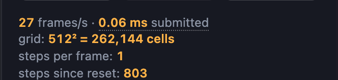
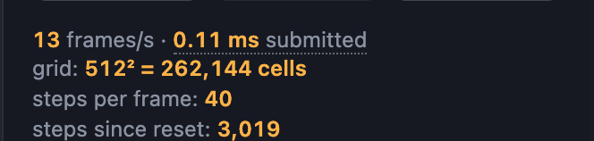

# Energy and idle cost

Jessica Hsiao · Procedural World Building

A record of where this app's power actually goes, and of what was done about
it. The question that started it was a practical one — a laptop running the
Topic 4 simulations gets warm — but the answer turned out not to be about the
simulations at all.

Everything below was measured by driving the running app. Where a number
contradicts what I expected, it is written down as a correction rather than
quietly dropped: two of the four findings here reversed an assumption I had
already acted on.

## Contents

- [How it was measured](#how-it-was-measured)
- [Finding 1 — most of the cost was frames nobody could see](#finding-1--most-of-the-cost-was-frames-nobody-could-see)
- [Finding 2 — what does not run](#finding-2--what-does-not-run)
- [Finding 3 — the simulation is not the expensive part](#finding-3--the-simulation-is-not-the-expensive-part)
- [Finding 4 — the resolution lever that isn't](#finding-4--the-resolution-lever-that-isnt)
- [The dials already on the page](#the-dials-already-on-the-page)
- [What was rejected](#what-was-rejected)
- [What this does not measure](#what-this-does-not-measure)

## How it was measured

Every GPU draw entry point — `drawArrays`, `drawElements` and their instanced
forms — was wrapped on the prototype, and each call recorded the destination
viewport rectangle. That gives two quantities per second: **draw calls**, which
is how much work the page hands to the driver, and **fragment area**, which is
how much surface the GPU is asked to shade. A separate `requestAnimationFrame`
chain counted frames alongside, independent of the app's own loop.

Two caveats that apply to every number on this page.

**No frame rate here is a GPU figure.** Headless Chrome on this machine falls
back to SwiftShader, a CPU rasteriser. The frame rates below are real
measurements of this app in this environment, and the *ratios* between them are
meaningful, but the absolute values would be very different on hardware. Draw
counts and fragment counts do not have this problem — they are properties of
what the page asks for, not of what executes it.

**Fragment area is exact for a full-screen pass and an upper bound for
geometry.** A simulation step and a map display both draw a quad covering the
whole target, so viewport area is precisely the fragment count. The shading
study's terrain mesh and the schooling fish do not cover their viewport, so
their figures are ceilings, marked as such.

## Finding 1 — most of the cost was frames nobody could see

Every viewport ran an unconditional `requestAnimationFrame` chain. A paused
simulation, a motionless shading study, a voxel scene sitting still — each
issued a full-screen pass every frame, producing an image identical to the one
already on the display. The render loop now returns whether the view is still
in motion, and schedules nothing when it is not.

Draw calls per second with nothing happening on screen:

| View | Before | After |
| --- | --- | --- |
| Topic 1 — Objects, at rest | 295 | **0** |
| Topic 4 — shading study, spin off | 42 | **0** |
| Topic 4 — simulation paused | 59 | **0** |
| Topic 3 — voxels, camera still | 39 | **0** |
| Topic 2 — noise, after a parameter change | 30 | **0** |

Topic 1's 295 is not a typo. It ran two canvases — the scene and the
orientation gizmo — each drawing several objects per frame at the display's
full rate, for a picture that had not changed since the last pointer movement.

The zero is a real zero, confirmed against an independent frame counter: with
the shading study's spin off, the probe's own `requestAnimationFrame`
chain ticked at **60.0 per second** while the app issued **0** draw calls. The
loop is asleep, not merely quiet.

Going idle risks a view that never wakes, so waking is deliberately
over-eager: any pointer movement anywhere on the window wakes every loop, as do
resize and any parameter change. A frame that wakes, finds nothing to do and
goes back to sleep costs one check — far cheaper than being wrong about it.

One subtlety cost more than the rest. `OrbitControls.update()` reports movement
down to its own `1e-6` epsilon, and under damping that residual decays about 5%
per frame, so trusting it kept a loop awake for hundreds of frames after a
drag — an orbit was still reporting movement four seconds after the pointer was
released, rendering motion orders of magnitude below one pixel. Gating on a
threshold the eye can resolve brings the coast-down to a measured **76 frames**,
about 1.3 s at 60 Hz.

## Finding 2 — what does not run

Two things that sound like they need fixing, and do not.

**A topic you are not looking at does not exist.** `App.tsx` renders exactly
one entry of `PAGES`, so leaving Topic 4 unmounts the viewport: the loop is
cancelled, the simulation disposed and the WebGL context destroyed. Nothing
steps in the background, and nothing is held in memory waiting to resume.

**A hidden tab gets no frames, from the browser.** Measured on Topic 4 with a
second tab brought to the front:

| App tab | `requestAnimationFrame` | Draw calls |
| --- | --- | --- |
| In front | 20/s | 39/s |
| In the background | **0/s** | **0/s** |
| Back in front | 20/s | 41/s |

What the browser keys on is **visibility, not focus** — the same run had
`document.hasFocus()` false throughout and kept animating happily. That
distinction is the behaviour you want: a window you can see but have not
clicked into should still be running; a window that is minimised, in a
background tab, or fully covered by another app should not. Chrome already
draws that line correctly, so a `visibilitychange` handler would be duplicating
it, and the only case it could *add* is the one where stopping would be wrong.

The loop does clamp its per-frame delta to 0.1 s, so a tab resuming after ten
minutes hidden does not advance a simulation by one enormous step.

## Finding 3 — the simulation is not the expensive part

This is the result that reversed an assumption. I had been treating the
simulation steps as the expensive thing — reaction–diffusion runs fourteen
sub-steps per frame, erosion runs three sub-steps of five passes each, and
those numbers are large. But a simulation step runs at its grid resolution,
while the pass that puts the result on screen runs at the canvas resolution,
and the canvas is much bigger than any of the grids.

Measured over 6-second windows, viewport 1071 × 827 CSS pixels at a device
pixel ratio of 2, so **3.54 M pixels** per display pass:

| View | Frames/s | Sim grid | Sim passes/s | Sim Mfrag/s | Display passes/s | Display Mfrag/s |
| --- | ---: | :---: | ---: | ---: | ---: | ---: |
| Shading study, spin 5°/s | 13.8 | — | 0 | 0 | 27.7 | ≤ 98.0 |
| Shading study, spin off | — | — | 0 | **0** | **0** | **0** |
| Water ripples | 24.2 | 512² | 24.2 | 6.3 | 24.2 | 85.6 |
| Reaction–diffusion, 14 steps | 20.2 | 512² | 282.2 | 74.0 | 20.2 | 71.4 |
| Hydraulic erosion, 3 steps | 18.0 | 256² | 270.0 | 17.7 | 18.0 | 63.8 |
| Fish schooling | 18.5 | 32² | 37.0 | 0.04 | 37.0 | ≤ 131.0 |

The ratio of the last two columns is the finding:

- **Fish schooling: the one case where fragment area lies.** The flock is
  1,024 texels — a 32² texture, one fish per texel — against at least 65
  Mfrag/s for the backdrop alone, which reads as a thousand to one. But
  schooling is O(N²): every fish reads *every* other, so each of those 1,024
  fragments performs 1,024 texture taps, around a million per pass. Counting
  area, the simulation is free; counting work, it is the same order as the
  display pass, and at the largest school — 9,216 fish — it is 85 million taps
  per pass and dominates everything else on the page. This is the measurement's
  blind spot, not a result.
- **Water ripples: 13 : 1.** One wave step at 512² against one full-screen pass
  at 3.54 M.
- **Hydraulic erosion: 3.6 : 1**, despite running 270 passes per second. A
  256² grid is 65,536 fragments; it takes 54 of those to equal one display
  pass.
- **Reaction–diffusion: roughly 1 : 1** — the only one where the simulation
  genuinely competes, and only because fourteen sub-steps at 512² happens to
  land near the same order as one pass at 3.54 M.

So "the simulations are consuming too much energy" was, for the three grid
simulations, not really about the simulations. The heavy thing on this page is the same
heavy thing on every page: shading a few million fragments to put a picture on
a retina display.

## Finding 4 — the resolution lever that isn't

Given finding 3, the obvious move is to render at a lower resolution. All the
viewports cap the device pixel ratio at 2; dropping that to 1 quarters the
display pass. Measured on hydraulic erosion, same scene, same parameters:

| Pixel ratio | Canvas | Display passes/s | Total Mfrag/s |
| --- | --- | ---: | ---: |
| 2 | 2142 × 1654 | 17.8 | 80.5 |
| 1 | 1071 × 827 | 55.6 | **103.9** |

Each frame became four times cheaper, and total fragment throughput went
**up**. The work saved per frame was immediately spent on running more frames:
17.8 → 55.6 per second, a 3.1× speed-up that more than consumed the saving.

The lesson generalises past this one measurement. **Below the frame cap,
reducing per-frame work buys frame rate, not energy.** A render loop that is
free to run as fast as it can will convert any efficiency gain straight into
throughput. Resolution only becomes an energy saving once the frame rate is
already pinned at the cap, because only then is there nowhere for the saving to
go — and at a fixed 60 fps the arithmetic is stark: 3.54 M × 60 = 212 Mfrag/s
against 886 k × 60 = 53 Mfrag/s.

Which makes **the frame cap the actual lever**, and resolution merely the thing
that decides whether the cap can be reached. The loops cap at 60, which on a
120 Hz display halves the work on its own. That cap cannot be demonstrated in
this environment — SwiftShader never gets near it, and the probe's own
`requestAnimationFrame` ceiling here is 60 — so it is reported as implemented,
not as measured.

## The dials already on the page

Two simulations expose their sub-step count directly, which is the per-frame
work dial in the most literal form. On reaction–diffusion, over the full range
of `Steps per frame`:

| Steps | Frames/s | Sim Mfrag/s | Display Mfrag/s |
| --- | ---: | ---: | ---: |
| 1 | 27.8 | 7.3 | 98.6 |
| 14 (default) | 20.2 | 74.0 | 71.4 |
| 40 | 12.7 | 132.8 | 44.9 |

| 1 step per frame | 40 steps per frame |
| --- | --- |
|  |  |

Note what the sweep does *not* do: it does not change total cost by anything
like 40×. Going from 1 to 40 steps multiplies the simulation term by 18 but
divides the frame rate by 2.2, so the display term falls by the same factor —
the page ends up doing 178 Mfrag/s instead of 106, a 1.7× increase for forty
times the chemistry. The dial trades frame rate for simulation speed far more
than it trades energy for either.

The honest summary for anyone running this on a battery: **pause it, or turn
spin off.** Those take the page to zero. Spin now defaults to 0, so the shading
study arrives in the cheaper of the two states measured above rather than the
13.8 fps one. Everything else is a trade
between two kinds of work, not a reduction in work.

## What was rejected

- **A `visibilitychange` pause** — measured as redundant; see
  [finding 2](#finding-2--what-does-not-run).
- **Lowering the pixel ratio** — measured as a frame-rate change rather than an
  energy saving at the frame rates this app actually reaches; see
  [finding 4](#finding-4--the-resolution-lever-that-isnt). It becomes worth
  revisiting if the loops start hitting the 60 fps cap on real hardware, which
  they plausibly do.
- **Trusting `OrbitControls` to say when it has stopped** — it reports motion
  far below a pixel for hundreds of frames; replaced with an explicit
  threshold.

## What this does not measure

- **Actual power.** Draw calls and fragments are proxies. A watt meter, or
  macOS's `powermetrics` against a real GPU, would be the real instrument;
  nothing here claims a figure in joules.
- **GPU time.** The `ms submitted` in the page's own readout is wall-clock time
  spent *handing work to the driver*, which returns long before the GPU has
  finished. It is a useful relative signal and not a kernel timing.
- **Work per fragment.** Area counts how many fragments are shaded, not what
  each one does. A reaction–diffusion fragment takes nine taps for its
  Laplacian; a schooling fragment takes one per fish in the flock. Where those
  differ by three orders of magnitude, as in fish schooling above, the area
  figure is meaningless on its own.
- **Vertex and CPU cost.** Only fragment area was counted. The shading study's
  192² surface is 36,864 vertices with displacement and normals computed in the
  vertex shader, which this method is blind to.
- **The idle state as the page reports it.** The readout's frame rate holds its
  last value when the loop goes to sleep rather than falling to zero, so the
  app's own display cannot currently be used to show idling — which is why the
  zeroes in finding 1 come from an external counter.

## See also

- [Topic 4 — Shaders](../topics/topic-4-shaders.md), whose `## Notes` section
  covers the render loop as part of the page it belongs to.
