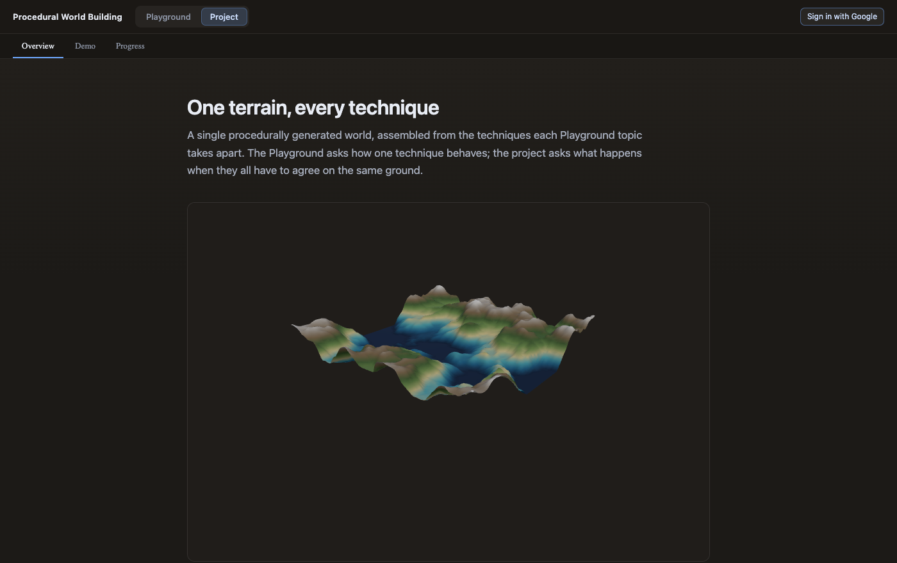

# Playground and Project

Jessica Hsiao · Procedural World Building

How the app is divided, why it is divided that way, and why the navigation that
holds the two halves apart was written rather than installed.

## Contents

- [Two experiences, not seven pages](#two-experiences-not-seven-pages)
- [Navigation](#navigation)
- [Why no router](#why-no-router)
- [What the Project pages are](#what-the-project-pages-are)
- [The integration](#the-integration)
- [What is deliberately not shared](#what-is-deliberately-not-shared)
- [Notes](#notes)

## Two experiences, not seven pages

The app has two top-level destinations.

**Playground** holds the topics. Each one takes a single technique apart
and exposes every parameter it has, because on those pages the parameter space
*is* the subject — you cannot learn what carry capacity does without being able
to set it somewhere destructive.

**Project** is where the techniques are put back together. It generates one
world and makes every system work from it, so a change to the terrain is a
change to everything downstream rather than to a demo of its own.

The two want opposite things from a user interface. A Playground topic is dense
on purpose: every pixel within reach of the viewport is worth a control. The
Project pages are read rather than driven, so they get a measured column,
generous margins, and type large enough to present from. Putting them at the
same navigation level would have implied they were the same kind of thing.

**The project is not a topic.** Topics are bodies of coursework and they are
numbered; the project cuts across all of them and is numbered by nothing. It
gets its own section rather than a fifth tab.

## Navigation

Two rows in the header:

```
Procedural World Building    [ Playground | Project ]              [ auth ]
──────────────────────────────────────────────────────────────────────────
Topic 1 Objects   Topic 2 Maps   Topic 3 Voxels   Topic 4 Shaders   Topic 5 …
```

The section row is a pill group — weight and a filled background, because these
are destinations rather than tabs. The second row is tabs with an underline,
which is what it was before. Switching section never shows both sets at once.

| Path | Page |
| --- | --- |
| `/` | Project Overview |
| `/project` | Project Overview |
| `/project/demo` | Project Demo |
| `/project/progress` | Project Progress |
| `/playground/objects` | Topic 1 |
| `/playground/maps` | Topic 2 |
| `/playground/voxels` | Topic 3 |
| `/playground/shaders` | Topic 4 |

Anything unrecognised falls back rather than erroring: an unknown project page
lands on Overview, an unknown topic on the newest one, and anything else on `/`.

Entering a section always lands on its own front door — Playground on its newest
topic, the Project on Overview. Neither remembers where you were last, because a
button that leads somewhere different depending on history is worse than one
that is predictable.

## Why no router

`react-router-dom` 7.18.4 was measured rather than argued about. Bundling only
the seven exports this app would have used, minified, with React external:

| | bytes | gzipped |
| --- | --- | --- |
| App bundle before this change | 1,507,580 | 425,492 |
| `react-router-dom` on top of it | +42,538 (+2.8%) | +15,235 (+3.6%) |

3.6% would not have settled it either way. What settled it was utilisation.
Seven static destinations, no route parameters, no nested data loading, no
loaders or actions, no code splitting, no scroll restoration — the library's
whole value is in the cases this app does not have. Against that, the repo runs
on four runtime dependencies deliberately, and `src/routes.ts` does the job in
about forty lines that a reader of this notebook can follow end to end.

The History API carries it: `pushState` on navigate, a `popstate` listener for
back and forward. The two halves do not fight because `pushState` never fires
`popstate` — the setter updates both the address and the state, the listener
updates only the state. A push to the address already shown is dropped, so
clicking the active tab does not stack duplicate history entries to walk back
through.

Firebase Hosting already rewrote `**` to `/index.html`, so deep links work on
the deployed site with no configuration change. That was in place for the SPA
before any of these URLs existed.

If this ever grows route parameters or per-route data loading, that is the point
to reconsider — and swapping a library in would touch one file.

## What the Project pages are

### Overview

What the project is, which systems build it, and how far each one is actually
wired in. The systems table carries a status — *in the demo*, *partly wired*,
*not yet wired* — because listing four techniques without it would imply all
four were integrated. Three are, to different depths.

The hero is a live viewport running the demo's own generator at its defaults,
not a captured image. A screenshot would be a claim about the code rather than
the code's output, and would go stale the first time a default moved.



### Demo

The integrated world, and the one Project page that is an instrument rather than
a reading. It borrows the Playground's `Workspace` — three resizable columns and
the floating **View** popover — rather than inventing a second layout language
for the same job.

Nine controls against Topic 2's thirty. A control earns its place here by
changing the world in a way worth describing, which eight erosion dials that
each need a measurement to set responsibly do not. So the droplet's character is
fixed to Topic 2's `gorges` preset, chosen there against a structure-function
sweep, and what the project exposes is how much rain falls on it.

> The project picks the settings that need evidence, and leaves the ones that
> read as decisions.


### Progress

The chain from technique to contribution, ordered by what depends on what rather
than by when it was built — erosion is third because it needs a noise field to
cut, not because it happened in week three. The dates are in the git history,
which is a better place for them.

Each stage carries what the study found, where the study found something: the
six-octave result, the erosion decay curve, the warp threshold, the OKLab step
count. Two stages are marked *not yet wired* and stay on the list, because
leaving them off would make the gap invisible rather than honest.


## The integration

The demo's two views are the same world, not two worlds. One heightfield is
generated; the surface view renders it directly, and the caves view turns that
same array into a signed distance function and subtracts a tunnel network from
it. Moving a terrain dial moves both.

```
fBm octave stack          noise.ts        compositeLayers
  → domain warp           noise.ts        warpField
  → droplet erosion       erosion.ts      erodeStep
  → thermal collapse      erosion.ts      thermalPass
  → sea level             project/world.ts  flood
  ├→ surface              NoiseViewport
  └→ heightfield as SDF   project/world.ts  meshCaves
       → CSG subtract     density.ts      combine, getShape('gyroid')
       → surface nets     mesher.ts       meshSurfaceNets
       → solid            VoxelViewport
```

Everything in the right-hand column is imported. `src/project/world.ts` adds the
order those calls run in and the mapping from nine controls onto their
parameters — no algorithm is reimplemented.

At the demo's defaults: 128² cells, 4,915 droplets, about 18 ms to generate. The
`Undercroft` scenario at 72³ meshes 118,092 triangles in about 13 ms on top of
an 8 ms generation.

Generation runs behind `useDeferredValue`, so a slider drag commits at full rate
and the terrain follows a beat behind rather than sticking the thumb. The seven
fields generation actually reads are separated from the rest, so relief and
palette — which change nothing in the field — do not regenerate it.

## What is deliberately not shared

**Procedural code is reused, panels are not.** The demo imports every generator
and both viewports. It does not import a Playground inspector: dumping Topic 2's
sidebar into the Project would have been reuse of the wrong thing.

**`world.ts` repeats `NoisePage`'s orchestration rather than sharing it.** About
forty lines of function calls, no algorithms. The alternative was refactoring
Topic 2's memo chain into something parameterised over both callers, and the
cost of getting that wrong lands on a page that already works. If a third caller
appears, extract then.

**The demo has no Firestore collection of its own.** Its worlds are built into
the page, so nothing on it needs you to be signed in. Giving the project a fifth
`TopicId` would mean editing and redeploying `firestore.rules`, and a stale
ruleset fails as `permission-denied`, which looks identical to not being signed
in. The saved-world infrastructure would carry project worlds with no new
machinery whenever that is wanted — see
[Firebase setup](firebase-setup.md).

**Shader integration is not faked.** Topic 4's eight strategies live inside a
full-screen GPU pipeline built around one fixed terrain, so they cannot be
pointed at a different mesh. Wiring them in means lifting the material out of
that pipeline rather than calling it. Until that happens, the demo renders with
the standard material from Topic 1 and both the Overview and Progress say so.

## Notes

**The hero mounted at 814×0 and nothing said so.** `.noise-viewport` sizes
itself with `flex: 1` because in the Playground it is always a flex child; in
the Overview's plain block wrapper it had no height at all. Typecheck, lint and
build were all clean, and the page rendered a correctly-styled empty panel.
Caught by screenshotting the page and looking at it, which is the whole reason
that step is in `CLAUDE.md`.

**The cave solid came out entirely deep blue.** The two viewports index the
colour ramp by different quantities: `NoiseViewport` by the field's value, which
lives in roughly `[0, 1]`, and `VoxelViewport` by a vertex's world-space Y, which
lives in `[-1.3, 1.3]` — on a finished isosurface the density is zero everywhere
by construction, so height is the only signal left in the geometry. A ramp
fitted to the field put every vertex below its floor, so the whole solid clamped
to the terrain palette's deepest stop and the tunnels were invisible inside it.
Two domains, fitted separately.

**The gyroid's gaps are subtracted, not its walls.** A gyroid's walls are the
solid part, so subtracting them leaves two interlocking halves rather than a
cave system. Subtracting the gaps leaves a connected network — which is why the
cave density control moves the gyroid's wall *thickness* rather than its scale.
Scale would change how many tunnels there are, rescaling the whole network, and
the dial would read as zoom instead of as more cave.

**The heightfield SDF is not a true distance field.** `y − terrain(x, z)` returns
a vertical gap, not the shortest distance to the surface, so it reads short on a
steep slope — the same inexactness `density.ts` flags on its own `terrain`
primitive. That is why the tunnel subtraction is a hard boolean: a smooth blend
assumes a unit gradient and bites unevenly where that fails.

**Sea level raises the floor rather than recolouring it.** Painting the low
ground blue leaves it bumpy, and a lake with a textured surface reads as wet
ground rather than as water. Clamping everything below the waterline to one
height makes it flat, which is the whole visual signal — and the terrain
palette's lowest stops are already the two blues, so the colour follows for
free.

**`/` lands on the Project, not on a topic.** The app has a front door now, and
"what am I building" is the right thing behind it; a visitor following a bare
link should not arrive in the middle of a shader study. It is one constant,
`HOME` in `src/routes.ts`, if that should ever be a topic instead.
