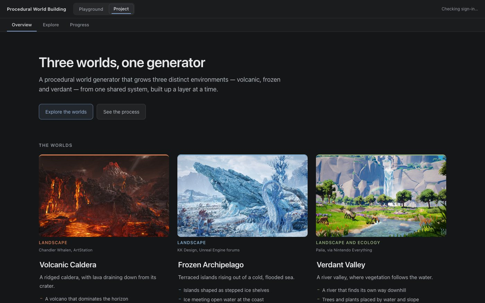
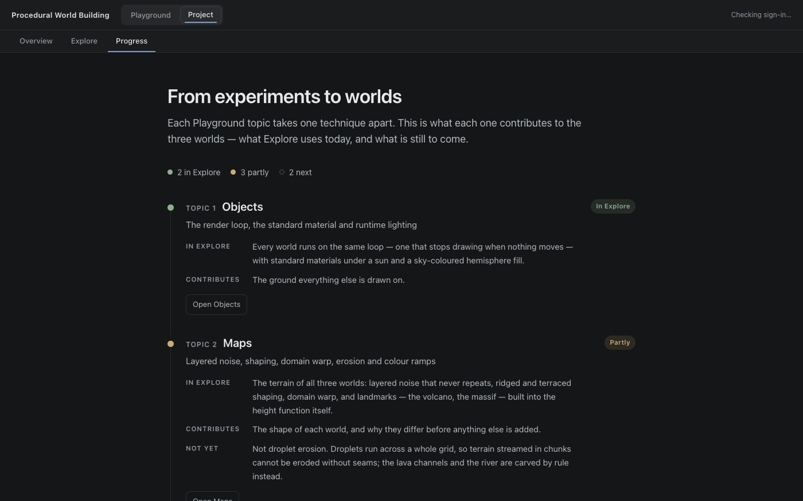

# Playground and Project

Jessica Hsiao · Procedural World Building

How the app is divided, why it is divided that way, and why the navigation that
holds the two halves apart was written rather than installed.

## Contents

- [Two experiences, not seven pages](#two-experiences-not-seven-pages)
- [Navigation](#navigation)
- [Why no router](#why-no-router)
- [What the Project pages are](#what-the-project-pages-are)
- [The integration](#the-integration)
- [What is deliberately not shared](#what-is-deliberately-not-shared)
- [Notes](#notes)

## Two experiences, not seven pages

The app has two top-level destinations.

**Playground** holds the topics. Each one takes a single technique apart
and exposes every parameter it has, because on those pages the parameter space
*is* the subject — you cannot learn what carry capacity does without being able
to set it somewhere destructive.

**Project** is where the techniques are put back together. It generates one
world and makes every system work from it, so a change to the terrain is a
change to everything downstream rather than to a separate page of its own.

The two want opposite things from a user interface. A Playground topic is dense
on purpose: every pixel within reach of the viewport is worth a control. The
Project pages are read rather than driven, so they get a measured column,
generous margins, and type large enough to present from. Putting them at the
same navigation level would have implied they were the same kind of thing.

**The project is not a topic.** Topics are bodies of coursework and they are
numbered; the project cuts across all of them and is numbered by nothing. It
gets its own section rather than a fifth tab.

## Navigation

Two rows in the header:

```
Procedural World Building    [ Playground | Project ]              [ auth ]
──────────────────────────────────────────────────────────────────────────
Topic 1 Objects   Topic 2 Maps   Topic 3 Voxels   Topic 4 Shaders   …   Topic 7 Vector Fields
```

The section row is a pill group — weight and a filled background, because these
are destinations rather than tabs. The second row is tabs with an underline,
which is what it was before. Switching section never shows both sets at once.

| Path | Page |
| --- | --- |
| `/` | Project Overview |
| `/project` | Project Overview |
| `/project/explore` | Project Explore |
| `/project/progress` | Project Progress |
| `/playground/objects` | Topic 1 |
| `/playground/maps` | Topic 2 |
| `/playground/voxels` | Topic 3 |
| `/playground/shaders` | Topic 4 |

Anything unrecognised falls back rather than erroring: an unknown project page
lands on Overview, an unknown topic on the newest one, and anything else on `/`.
The address bar is corrected to the page shown, with `replaceState` so Back
does not return to the dead path — which is what `/project/demo` does now that
the Demo page is gone.

Entering a section always lands on its own front door — Playground on its newest
topic, the Project on Overview. Neither remembers where you were last, because a
button that leads somewhere different depending on history is worse than one
that is predictable.

## Why no router

`react-router-dom` 7.18.4 was measured rather than argued about. Bundling only
the seven exports this app would have used, minified, with React external:

| | bytes | gzipped |
| --- | --- | --- |
| App bundle before this change | 1,507,580 | 425,492 |
| `react-router-dom` on top of it | +42,538 (+2.8%) | +15,235 (+3.6%) |

3.6% would not have settled it either way. What settled it was utilisation.
Seven static destinations, no route parameters, no nested data loading, no
loaders or actions, no code splitting, no scroll restoration — the library's
whole value is in the cases this app does not have. Against that, the repo runs
on four runtime dependencies deliberately, and `src/routes.ts` does the job in
about forty lines that a reader of this notebook can follow end to end.

The History API carries it: `pushState` on navigate, a `popstate` listener for
back and forward. The two halves do not fight because `pushState` never fires
`popstate` — the setter updates both the address and the state, the listener
updates only the state. A push to the address already shown is dropped, so
clicking the active tab does not stack duplicate history entries to walk back
through.

Firebase Hosting already rewrote `**` to `/index.html`, so deep links work on
the deployed site with no configuration change. That was in place for the SPA
before any of these URLs existed.

If this ever grows route parameters or per-route data loading, that is the point
to reconsider — and swapping a library in would touch one file.

## What the Project pages are

Three pages, each with one job:

| Page | Job |
| --- | --- |
| Overview | The concept: three worlds, their references, one pipeline, the build order |
| Explore | The experience: walk the worlds in the browser |
| Progress | The process: each Playground topic → what Explore uses → what it contributes |

### Overview

A presentation board rather than a reading column — the one page that uses
`ProjectLayout`'s wide variant, because three worlds side by side at an 880px
measure shrink to thumbnails.

Each world is a hero reference image, a one-line description, three goals and
two smaller references, and every image is labelled with what it informs —
*Landscape*, *Atmosphere*, *Lava behaviour* — because a wall of mood images
says nothing about what is being built. Colour identifies a world only as an
accent line on its hero image, its caption and its goal markers; the UI stays
neutral. Captions sit under the images, never on them: the references are busy
enough that no text over them would be reliably readable.

Below the board, **one pipeline, three worlds**: the five stages down the side,
the three worlds across, and in each cell what that stage actually does in that
world today, read off the specs in `src/explore/worlds.ts`. It is the page's
central claim made checkable. Then **built in layers**, with each layer marked
*In place*, *In progress* or *Next* by what Explore does today.

The reference images live in `public/inspiration/<world>/` so the app and the
README read the same files. They are by other artists, and the page says so.



### Explore

The worlds themselves; see [Explorable worlds](explorable-worlds.md).

### Progress

One entry per Playground topic, each with three things: what Explore actually
uses of it, what it contributes, and — where there is one — what is not there
yet. A status marks each: *In Explore*, *Partly*, or *Next*. Two topics are in
fully, three in part, two not yet, and the page says which rather than listing
seven techniques beside three worlds and implying all seven are in them.



## The Demo page, retired

There was a fourth Project page, Demo: Topic 2's droplet erosion and Topic 3's
CSG caves composed on one 128² heightfield, with nine controls and built-in
scenarios. It was the first place two topics had to agree on the same data, and
it is in the git history.

It was removed because Explore became the interactive experience and the two
told different stories — Demo a single eroded tile, Explore three streamed
worlds that cannot use droplet erosion at all, since droplets need the whole
grid and chunks cannot see their neighbours. Two interactive pages with two
terrain systems made the project harder to explain, not easier. Its two
generators, `world.ts` and `useWorld.ts`, had no other caller and went with it.
What it proved — that the heightfield can be read as a distance field and cut
with CSG — is listed on Progress as the route to caves.

## Notes

**Two stylesheets both owned `.world-name`.** The Overview's world titles
rendered at 13px instead of 22: the Playground's saved-worlds library in
`App.css` already styles `.world-name`, loads globally, and won the cascade.
Nothing failed — the page simply looked wrong, and it was found by reading the
computed style in the browser. The Overview's board classes are prefixed
`board-` now.

*The notes below are about the retired Demo page and the earlier Overview hero
that ran its generator. They are kept because the findings outlived the pages.*

**The hero mounted at 814×0 and nothing said so.** `.noise-viewport` sizes
itself with `flex: 1` because in the Playground it is always a flex child; in
the Overview's plain block wrapper it had no height at all. Typecheck, lint and
build were all clean, and the page rendered a correctly-styled empty panel.
Caught by screenshotting the page and looking at it, which is the whole reason
that step is in `CLAUDE.md`.

**The cave solid came out entirely deep blue.** The two viewports index the
colour ramp by different quantities: `NoiseViewport` by the field's value, which
lives in roughly `[0, 1]`, and `VoxelViewport` by a vertex's world-space Y, which
lives in `[-1.3, 1.3]` — on a finished isosurface the density is zero everywhere
by construction, so height is the only signal left in the geometry. A ramp
fitted to the field put every vertex below its floor, so the whole solid clamped
to the terrain palette's deepest stop and the tunnels were invisible inside it.
Two domains, fitted separately.

**The gyroid's gaps are subtracted, not its walls.** A gyroid's walls are the
solid part, so subtracting them leaves two interlocking halves rather than a
cave system. Subtracting the gaps leaves a connected network — which is why the
cave density control moves the gyroid's wall *thickness* rather than its scale.
Scale would change how many tunnels there are, rescaling the whole network, and
the dial would read as zoom instead of as more cave.

**The heightfield SDF is not a true distance field.** `y − terrain(x, z)` returns
a vertical gap, not the shortest distance to the surface, so it reads short on a
steep slope — the same inexactness `density.ts` flags on its own `terrain`
primitive. That is why the tunnel subtraction is a hard boolean: a smooth blend
assumes a unit gradient and bites unevenly where that fails.

**Sea level raises the floor rather than recolouring it.** Painting the low
ground blue leaves it bumpy, and a lake with a textured surface reads as wet
ground rather than as water. Clamping everything below the waterline to one
height makes it flat, which is the whole visual signal — and the terrain
palette's lowest stops are already the two blues, so the colour follows for
free.

**`/` lands on the Project, not on a topic.** The app has a front door now, and
"what am I building" is the right thing behind it; a visitor following a bare
link should not arrive in the middle of a shader study. It is one constant,
`HOME` in `src/routes.ts`, if that should ever be a topic instead.
