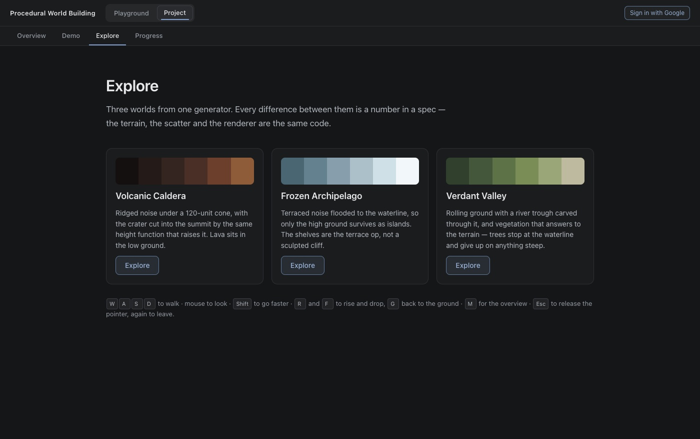
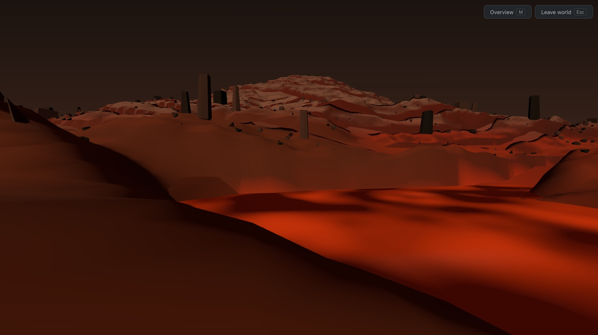
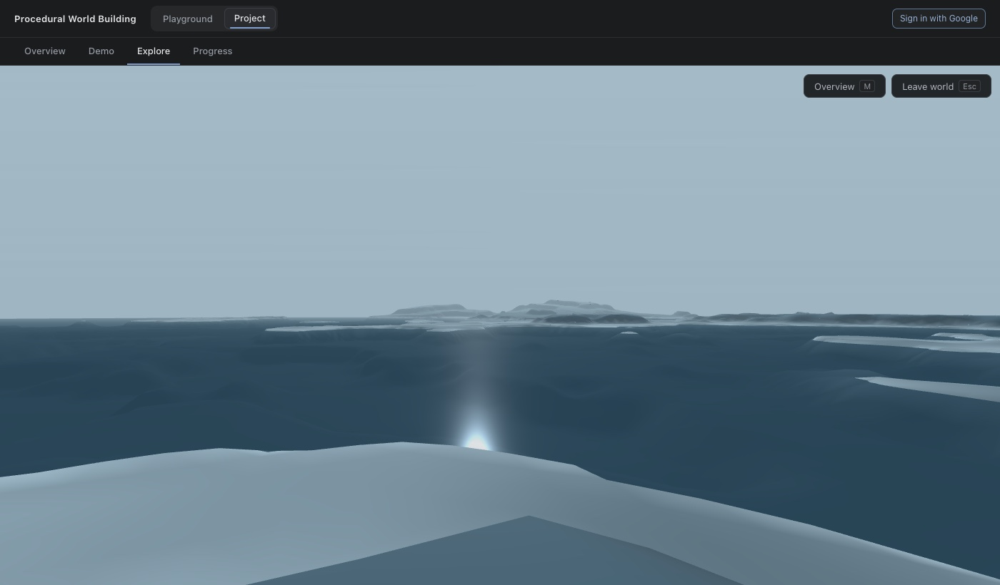
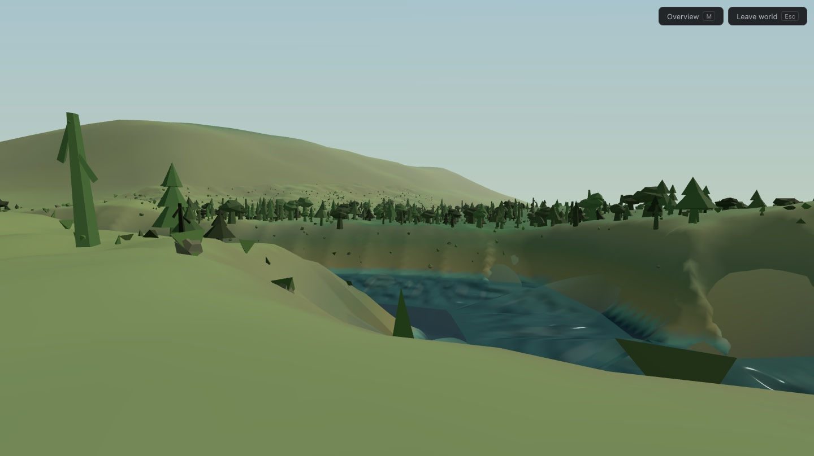
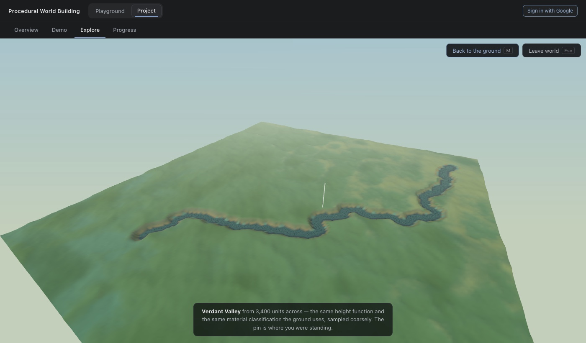

# Explorable worlds

Jessica Hsiao · Procedural World Building

Three worlds you can fly around in, generated from one system. What the
architecture is, what it costs, and the four things that were wrong before the
measurements found them.

## Contents

- [One system, three numbers sets](#one-system-three-number-sets)
- [The pipeline](#the-pipeline)
- [Chunks](#chunks)
- [The height function](#the-height-function)
- [Macro topography](#macro-topography)
- [The backdrop](#the-backdrop)
- [Ground, and why it stopped being one colour](#ground-and-why-it-stopped-being-one-colour)
- [The river](#the-river)
- [Scatter](#scatter)
- [Moving](#moving)
- [The overview](#the-overview)
- [Performance](#performance)
- [Notes](#notes)

## One system, three number sets



There is no per-world code. `WorldSpec` holds terrain parameters, a landmark, a
colour ramp, fog, lights, scatter rules and a spawn, and every one of those
fields feeds the same chunk builder, the same scatter pass and the same
renderer. Nothing downstream branches on a world's `id`. That is the claim the
demo exists to make, so the implementation had to be honest about it.

| | Volcanic Caldera | Frozen Archipelago | Verdant Valley |
| --- | --- | --- | --- |
| Octave shaping | ridge | none | none |
| Shaping of the sum | none | **terrace** | none |
| Amplitude | 30 | 38 | 27 |
| Domain warp | 16 | 9 | 12 |
| Landmark | volcano, 210 high | massif, 130 high | none — see [Macro topography](#macro-topography) |
| Macro relief | — | — | **massifs to 203, river corridor damped** |
| Waterline | 16 (81% dry) | 21 (**48% dry**) | −13 (97% dry) |
| Scatter | pillars, rocks | bergs, rocks | **trees**, rocks |
| Seed | 1337 | 20260108 | 77 |

Seeds are fixed. A spawn point chosen against one terrain means nothing if the
terrain is re-rolled on refresh, and a presentation cannot afford to find that
out live.







## Chunks

A 5×5 ring of 160-unit chunks follows the camera, each 64×64 quads — 204,800
triangles on screen, constant regardless of how far you travel.

Chunks line up because **they do not know about each other**. Every vertex asks
the height function for its own world coordinate, so two chunks sharing an edge
ask the same question at the same place and get the same answer. There is no
stitching step and no neighbour lookup.

Positions are chunk-local with the mesh placed at the chunk origin. In world
space, a vertex 10,000 units out loses enough float precision to make the
surface visibly shimmer.

**The fog is doing structural work.** Its colour is also the scene background,
so there is no horizon line — the terrain dissolves into distance at the same
colour the sky already is, and the edge of the loaded ring is never visible.
Any difference between the two draws a hard line exactly where the world is
supposed to end.

## The height function

Hashed value noise, not the project's existing noise. `compositeLayers` fills a
fixed grid, and `density.ts`'s continuous version samples a 16×16 lattice that
wraps — fine inside a 1.3-unit cube, visibly tiled after a hundred units of
walking. Here an integer coordinate pair goes through an integer mix and comes
back as a value in [0, 1). Same Hermite fade and bilinear interpolation as the
rest of the project's value noise; only the lattice lookup differs. Nothing is
allocated, so a chunk can be built on demand.

**There is no hydraulic erosion, and that is a real loss.** Droplets run over a
whole grid and accumulate across it, so there is no way to erode one chunk
without its neighbours disagreeing at the seam. Topic 2's dendritic channels are
the better landform and they are not here. What stands in for them is ridged
shaping and domain warp, both of which are pointwise and therefore chunkable.

**Landmarks are terms in the height function, not placed meshes.** The volcano
is a cone with a crater subtracted from its summit, added to the height at every
coordinate inside its radius. That makes it procedural, seamless across chunks
for free, and — because it sits at a known coordinate — something a spawn point
can be aimed at.

## Macro topography

Verdant's terrain used to be one band of octaves, and it read as one band of
octaves: rolling ground of roughly the same size everywhere, with nothing to
walk toward. The brief for this pass was explicit that the fix is *not* more
amplitude everywhere — gentle near the river, rolling at mid distance, ridges
and mountains far out.

That is three terms, and the order they are applied in is the whole design:

    macro terrain -> downhill river route -> river carving -> local detail

**`macroField` is the mountains**, at frequency 0.0007 — a wavelength of about
1,400 units, so one mass spans most of the play area. It is thresholded at 0.6
and squared, which is what keeps them as discrete masses rather than a swell.
That shaping costs more than it looks: thresholding and squaring yields about
38% of the nominal amplitude, so 170 produced 65-unit hills. The figure is 440
now, which measures as 169.5 units with 25.9% of the area raised.

**`routeField` is what the river is routed on** — the tilt, the macro term and
the first two octaves, but not the fine detail. Routing on the full height
function put the course into the first hollow it found and it never came out:
5,131 self-overlaps. Routing on the regional shape alone lets it find the real
watershed, and the detail it then runs through is small enough not to trap it.

**`valleyFloor` takes the mountains back out near the finished course.** Without
it the river is routed through terrain that then has a 200-unit massif standing
on its bank, which is a canyon, not a valley. It removes 88% of the macro term
within 380 units of the course, easing out with a smoothstep.

The reach is the one number here that was actually a trade, so it was priced
rather than picked. Measured across settings, from viewpoints that can see the
water:

| `valleyFloor.reach` | best skyline, after fog | p90 bank slope |
| --- | --- | --- |
| 460 | 4.62° | 0.427 |
| **380** | **5.29°** | **0.440** |
| 300 | 4.78° | 0.448 |
| 240 | 3.88° | 0.464 |
| 180 | 3.88° | 0.482 |

Narrowing it does not buy skyline — it mostly steepens the banks, which is the
canyon it exists to prevent. 380 is the best of both and the setting in use.

Dry ground across the play area now runs p1 −6.2, p25 18.3, p50 27.0, p75 36.9,
p90 45.9, p99 126.9, max 171.1. The long tail is the point: the median is still
valley, and the top percentile is mountain.

The river was unchanged by any of this, as it should be — it is routed before
the carve and before the damping. (It has since been smoothed once and given a
controlled width, and relaxed into its valley; see [The river](#the-river).
Now 226 nodes, 4,477 units, falls 65.5, no validation problems.)

## The backdrop

The chunk ring is 5×5 at 160 units, so terrain exists 400 units from the camera
and the far plane sat just past it at 480. Mountains measured at 1,300 to 2,200
units out therefore could not appear in the world at all. Nothing was wrong with
the terrain; there was no distance to put it in.

**So there is a second, much coarser mesh behind the ring**: 5,200 units across
at 160 cells, the same height function and the same material classification,
51,200 triangles in one draw call, built once per world in 13–29 ms.

Widening the ring instead would mean RADIUS 8 — 289 chunks against 25, and 11×
the build cost, to draw ground whose detail is far below a pixel at that range.
The extent is 5,200 because this world's fog is 99% opaque by 2,600 units, so a
half-width of 2,600 is as far as anything can be seen from the middle; wider is
triangles behind a wall of haze. At 1,300 units, where the massifs stand, the
fog leaves about 30% — which is why they read as pale silhouettes rather than
as green hills, and why `colorRange` is left fitted to the valley and the peaks
allowed to clamp.

**It is sunk 3 units.** It samples the same height function as the ring, so in
the near field the two surfaces are coincident and z-fight across the whole
ground — far more noticeable than anything the backdrop adds. At the 400 units
where the ring ends, a 3-unit step subtends 0.4°.

**Near the river it is also lowered to the ground beneath it.** This paragraph
used to claim that sinking a height field cannot make it poke through the floor.
That holds at its vertices and not between them: a triangle is a straight line
between its corners, and the river channel is narrower than one 32.5-unit cell,
so a triangle with a corner on each bank bridged the channel as a flat slanted
slab. Measured, it stood above the carved riverbed at 24.3% of the points under
the water, by up to 6.6 units, and through the transparent water it read as a
dark wedge — a report of a broken river mesh, when the water strip passed every
check (no flipped sides, no crossing edges, no long or degenerate triangles, no
non-adjacent indices). Painting the backdrop magenta for one frame showed it.

So within reach of the river each backdrop vertex takes the lowest ground in a
9×9 sample window one cell either side of it. Every point of a triangle lies
within one cell of each of its corners, so the whole triangle is then no higher
than the ground beneath it: 0 of 25,746 points under the water, and 0 of 99,306
within 160 units of the river. The backdrop now builds in 330 ms instead of 47,
once per world entry, behind the curtain.

`buildRelief` is shared with the overview, which wants the same thing from the
other direction: the same height function sampled coarsely over far more ground
than the ring. One function means the ridge on the horizon, the ridge on the
map and the ridge you eventually walk onto are the same ridge.

## The pipeline

Everything downstream of the height function reads one thing:

```
height → slope → water depth → moisture → material → object probability
         ──────────── environment.ts ───────────    ──── worlds.ts ────
```

`environment.ts` turns a coordinate into a **Site**: its height, slope, depth
below the waterline, distance to the shore, altitude across the world's range,
moisture, and two noise fields. Material bands and scatter rules are both
written against those fields and nothing else — so "trees stop at the waterline"
and "the bank is wet soil" are the same fact stated twice rather than two
unrelated thresholds that happen to agree.

A world's surface is a **list of bands**, each saying what it looks like and how
much of it there is at a site. The renderer blends them by weight. That is what
makes the boundaries organic for free: two bands that both claim a point simply
mix, and the noise inside their masks makes the line where one wins wander
rather than follow a contour.

| World | Materials |
| --- | --- |
| Verdant Valley | deep water · shallow water · river bank · wet grass · grass · dry upland grass · exposed rock |
| Frozen Archipelago | deep ocean · shallows · coastal ice · exposed rock · blue ice · snow · summit snow |
| Volcanic Caldera | lava · scorched · ash · basalt · charcoal · volcanic soil |

None of them is chosen by height alone. The bank is wherever the water is near,
the lush grass is wherever the ground is damp, the rock is wherever the slope is
too steep for anything else to hold, and the snow accumulates where it is high
*and* flat — which is why the peaks go white and their flanks do not.

### Thresholds come from the terrain, not from taste

The first attempt wrote plausible-looking numbers and produced a world that was
one colour. Measuring what the ground actually does is what fixed it. Over a
1,400-unit square of Verdant Valley:

| | p25 | p50 | p90 | p95 |
| --- | --- | --- | --- | --- |
| land height | 12.7 | 16.3 | — | 22.4 |
| slope | 0.014 | 0.015 | **0.050** | — |
| moisture | 0.26 | 0.31 | — | 0.60 |

Against that, the original bands were nonsense in two specific ways. The
altitude range put all the land between 0.74 and 1.01, so the "dry upland"
band — which starts at 0.58 — claimed **71.7%** of the world and gave it the one
pale green it had. And the rock band started at a slope of 0.13 when the 90th
percentile is 0.050, so it existed in the list and **never won anywhere at all**.

| Band | before | after |
| --- | --- | --- |
| dry upland grass | 71.7% | 15.0% |
| grass | 12.6% | 49.0% |
| lush grass | 3.3% | 17.3% |
| water | 11.7% | 13.7% |
| exposed rock | **0%** | 3.0% |
| river bank | 0.7% | 1.8% |

A threshold written against a range the ground does not occupy is not a
threshold.

### Lava had to be made coherent

Flooding everything below a waterline gives hundreds of unconnected red patches
wherever the noise happens to dip: a red camouflage pattern rather than a lava
field. The fix is in the **height function**, not the material — seven channels
are carved radiating from the crater, wandering with radius so they are drainage
rather than spokes, deepest mid-way and closing at the toe. The waterline then
only reaches what they cut, the crater, and the deepest hollows: **95% of the
ground is dry**, against the 75% that produced the scattered patches.

### Two bands that overlap are one band

Charcoal and volcanic soil both spanned the same altitude at first, so they
blended everywhere and six materials came back as a single rust. They split the
low ground on the patch field instead — one takes the high half, the other the
low — and read as two materials because they are no longer in the same places.

## The river

Verdant Valley's river is a drainage system rather than a trough with a flat
plane over it. The pipeline:

```
terrain → downhill route → longitudinal profile → channel → banks → water → flow
```

**Route.** Greedy descent from the highest ground in a source box, stepping
inside a ±70° forward cone — which is what makes a loop impossible, since the
route can turn but never come back on itself. Candidates are scored on height,
on how far they turn, and on how far they stray from an overall bearing; a
low-frequency wander is added afterwards so it meanders rather than running the
fall line.

**Into the valley.** The bearing holds the route hard (drift 2.6), so on its own
it crossed the valley instead of following it. A light relaxation fixes that
without hydrology: ten passes in which every interior node looks ±90 units
across for the lowest ground (penalised by distance), moves a quarter of the way
there, and is then pulled halfway toward its neighbours' midpoint; no node
strays more than 90 units, and the ends never move. "Lowest" means the ground
the river will actually lie in — the raw height with the mountain mass damped
as `valleyFloor` will damp it.

**One course.** The relaxed route is Gaussian-smoothed once, over 12 units, and
resampled every 20 — the largest turn left is 0.79 rad — and *everything* is
built on that line: the profile, the carve, the banks, the water. Earlier the
water followed its own smoothing while the channel followed the raw corners,
which is how they stopped agreeing.

**Profile.** Water elevation against distance downstream, monotonic *by
construction* rather than checked afterwards: each node takes the lower of a
small drop below the previous node and a fixed depth below the valley ground
there. The first guarantees it always falls; the second keeps it in the ground
where the course crosses a rise. The drop is a floor, not a rate — 0.004 per
unit. At 0.016 the water was forced down faster than the valley descends,
ended up below the valley floor, and the carve dug a trench to reach it.
Measured: **226 nodes, 4,477 units, from 46.5 at the source to −19.0 at the
outlet — 1.46% overall, with no uphill step anywhere.**

**Width comes from the course, not the terrain.** Half-width grows from 80% of
the spec's at the source to 125% at the mouth, wanders ±12% over about 500
units, widens up to 12% on bends gentler than a 150-unit radius, is
Gaussian-smoothed over about five nodes, may change by at most 0.8 units
between neighbouring nodes, and never exceeds 55% of the tightest bend radius
within a node's span, less the 5 units the water runs under the bank. That
bend limit is itself smoothed before anything is clamped to it — clamped to the
raw per-node limit, the width followed every flicker of curvature in a sawtooth.
The terrain has no say: the channel is carved to fit the river. Half-widths run
6.8–28.5, median 19.2, and grow by quarter 18.1 → 18.1 → 18.9 → 21.0; the
narrowest are the tight bends.

**Channel.** Measured from the nearest point on the course — a segment, not a
node, or the bank scallops every 20 units — the cross-section is built around
the water:

```
      land ─────╮
                 ╲   release: about 10°, as long as the rise needs
   wet bank ──────╲___       10 units, rising to 0.9 above the water
  ~~~~~~~~~~~~~~~~~~~~╲~~~~  water, exactly `width` from the centreline
    shelf ╲________________  bed, flat across the middle 40%
```

Under the water the ground is always below it: the bed is flat across the
middle 40%, then shelves the whole way up to 0.35 under the surface at the
edge, so the water shallows gradually. A 10-unit wet bank climbs to 0.9 above
the water — about 5° — and then the release eases to the land over a run as
long as its rise needs for a ~10° slope, within the carve's 130-unit reach.
Where the land is lower than the river, a floor just above the water holds over
most of that release before fading into the land — a long low levee rather than
a step. Within the channel no point of ground is at or above the water; past
the bank, none counts as riverbed.

**Water.** A ribbon along the centreline, not a plane. A plane can only be
level, and this surface falls 65.5 units from source to outlet; there is no
single elevation that is right for it. It follows the course with a light
8-unit smoothing that only rounds the 20-unit polyline's corners, is level
across, and is the channel's own width plus 5 units — so its edge runs under
bank already about 0.3 above the water, and the shoreline seen is where the bank
meets the water, not the end of a mesh. Past that shoreline a wet-mud margin is
solid for 4 units and gone by 8.5 on every reach.

**Depth in the shader.** The water knows how deep it is at every pixel without
reading the terrain. Under the water the carve ignores the land: the ground is a
fixed function of distance from the centreline — flat bed across the middle
40%, shelving to 0.35 under the surface at the channel edge, then the wet bank
climbing to 0.9 above it. So each vertex carries two more numbers, the
channel's half-width and its bed depth (7.3–11.2 units), and the fragment
shader evaluates that same cross-section. Checked against the carved terrain at
50,266 points across the water: median error 0.014 units, p90 0.18, and 0.3% of
points disagreeing about whether there is water there at all — at the tightest
bends, where the water's lightly smoothed centreline sits off the carve's
segments.

Depth — the water surface minus the carved bed at that pixel, not distance
from the edge — drives absorption. Colour runs through three stops, none
lighter than the world's water colour: a desaturated green-blue over the
shallows, the world's own teal, and a darker blue-green in the channel, blended
on 1 − e^(−depth/k) so it changes fast over the first unit of depth and then
flattens. Opacity follows the same curve, from about a fifth over the shallows
to the full 0.9 in the middle, so the bed shows through the edges. Past the
shoreline the alpha fades out, so the water's edge is the computed shoreline,
not the end of the strip. Schlick's Fresnel mixes in the sky colour at grazing
angles, at 0.2 — the scene has no environment map to reflect.

The first pass read as glue, and it was several choices stacking. Metalness
was 0.32: water is a dielectric, and a partly metallic surface with depth
transparency over it looks like a resin coating. The shallows were lifted
toward pale green, so the edges went milky. The ripples were 5–10 units across
with the normal tilted at 0.9, which caught the light as broad soft glossy
patches and made the surface look swollen; the current streaks were bands
16 × 45 units, wider than the river in places; and a foam band drew a pale
line along both banks. Now: metalness 0, roughness 0.3; ripples 1.5–3 units at
0.35, faded where they would shrink below a few pixels; the current a few faint
dashes at 0.018; no foam. See [Notes](#notes) for the
versions this replaced.

**Flow needs no uniform.** The ribbon is laid out with `v` running downstream, so
scrolling the ripples along `v` *is* scrolling them along the local tangent. A
world-space shader would need the tangent passed per segment and interpolated;
here the geometry already knows, and a bend is handled without being told.

### The terrain had no watershed

The first traced course was 3,380 units long and ended 530 units from its own
source. Greedy descent on flat ground does not descend — it circles. Measured:
mean height across the whole play area ran **16.7 to 26.5**, ten units over three
and a half thousand.

So the terrain gained a regional tilt, about 45 units of fall from the high
north-east to the low south-west. Small enough to be invisible standing on it,
and the reason water goes one way rather than another.

### Three faults the measurements caught

**It braided.** A meander wavelength of ~290 units at a 20-unit step is a turn
radius of about 44 units, so the course met itself: a cross-section taken across
the river came back as bed, briefly ridge, then bed again, ninety units out. The
validator now checks for self-overlap between parts of the course far apart
along it.

**The bank never appeared.** It was measured as lateral distance from the channel
edge, but the carved bank rises gradually — everywhere `shore` was high the
ground was still under several units of water, and by the time it surfaced
`shore` had decayed to zero. It is measured as height above *this node's* water
surface now, which still follows the river downhill rather than ringing a global
elevation.

**Rock won underwater.** The channel wall is steep by construction, so the
exposed-rock band was claiming ground seven units below the surface. It is gated
on depth like the others.

### Validation

`validateRiver.ts` walks the course and checks what the construction is supposed
to guarantee: water never rises downstream, the bed stays below the water, width
stays positive, neighbouring nodes stay a step apart, the source is in the play
area and most of the course with it, and no two distant parts of the course
overlap. All constraints hold, and the river is identical on a second build.

## Scatter

Candidates per chunk from a deterministic per-chunk sequence, filtered by bands
on height and slope, then gated by a low-frequency field. The gate is what turns
a scatter into a landscape: without it the survivors are spread evenly over
everything that qualifies, and nothing in nature is evenly spread. With it,
stands have edges and boulder fields have gaps.

Rejection rather than solving for valid ground: asking the environment at a
point is cheap, and a rule that rejects most of its attempts is *how* a band
produces clustering. Trees crowd the flat low ground because that is where the
attempts survive, not because anything clusters them.

Three scales, because a world with only landmarks and trees has a hole exactly
where a viewer spends most of their time looking: landmarks at hundreds of
units, trees and boulders at tens, shrubs and rubble at one to three.

### Props are built, and normalised

A tree is a trunk and two or three foliage tiers merged into one buffer — about
90 triangles, and it reads as a tree at the distance anything here is seen from.
The trunk matters more than it sounds: the gap of ground visible under the
canopy is what stops a stand reading as a row of traffic cones. Five variants:
tall pine, broad pine, broadleaf, young pine, and a dead snag. Boulders are
regular solids with their vertices displaced by a hash of their own position,
split into independent faces first so the result is faceted rather than smoothly
lumpy — which is the difference between stone and a potato.

**Every geometry is normalised to one unit**, and that is why the module exists
separately from the scatter. Before, each geometry carried its own size — a cone
4.2 units tall, a box 5 — and the scatter then multiplied by a scale of up to 7
and a vertical stretch of up to 2.1. Those compose: a pillar could come out at
5 × 7 × 2.1 = **73 units**, taller than the volcano's flank, and the trees threw
the same spikes. Nothing in the rule said so, because the rule only knew about
its own two multipliers. Normalised, a rule's `scale` is the object's height in
world units and a number in a spec means what it says.

Size, lean, rotation and colour all vary per instance, and the two lateral axes
vary independently of each other — a boulder wider than it is deep is what stops
it reading as a sphere.

## Moving

<kbd>W</kbd><kbd>A</kbd><kbd>S</kbd><kbd>D</kbd> and the mouse, <kbd>Shift</kbd>
to sprint. <kbd>R</kbd> and <kbd>F</kbd> rise and drop; <kbd>G</kbd> puts you
back on the ground. <kbd>Space</kbd> and <kbd>C</kbd> work as the other common
pair for up and down.

**The camera walks by default and flies when asked.** It flew unconditionally
at first, with the ground only as a floor it could not drop through, and the
reasoning was that the most useful thing a viewer can do is rise above a ridge
to see what is behind it. That is still true and still why flying exists. What
it got wrong is the rest of the time: walk forward off a hill and you keep your
altitude, hanging over the valley. Nothing about that reads as exploring a
world.

There is no mode key to remember. Asking to go up *is* asking to fly, so R, F,
Space and C each switch to flight, and G lands. Neither mode has collision —
walking into a cliff climbs it — because a demo of terrain does not need to be
a demo of movement, and a contact test that gets a cliff wrong is worse than
none.

Height is eased rather than pinned. Following the surface exactly makes a
sprint over broken ground jitter, because the eye tracks every lump the feet
would absorb. A drop of more than about twelve units eases faster, so stepping
off a cliff reads as a fall rather than a long glide.

Keys are read from `event.code`, the physical key, not `event.key`. On an AZERTY
keyboard W and A are somewhere else entirely, and with a modifier held they
produce different characters again.

## The overview

<kbd>M</kbd> from anywhere, locked or not, lifts you out of the world and orbits
it from above.



**It is a toggle inside Explore rather than a separate page.** It is the same
world and the same spec, so a page of its own would duplicate the scene setup
and — worse — make you leave the world to find out where you are. The question
it answers is "where am I in this", which is only interesting while you are in
it.

**It runs the same classification as the ground**, so the pale band you can see
from above is the bank you were standing on. It was a height ramp at first,
which quietly disagreed with everything once the bands landed. It is also
3,400 units at 192 samples rather than 4,200 at 128 — 17.7 units a cell against
33, which is the difference between a river with a shape and a smudge.

**It is a separate coarse mesh, not a wider chunk ring.** Seeing the whole
landmark means covering about 3,400 units; at the ring's resolution that is 625
chunks and five million triangles, for a view where one triangle is below a
pixel. The same height function on a 128² grid gives the same landform in 32,768
triangles. The detail thrown away is detail the view cannot resolve.

It is geometry rather than a rendered map because the thing worth seeing from
above is relief — where the high ground is, how the valley runs, which way the
islands lie — and that reads from shading. The pin is a vertical line rather
than a dot: from overhead a flat marker on sloping ground cannot be placed in
depth.

## Performance

Three minutes of sprinting per world — 20,808 units, about 165 chunk boundaries
crossed:

| | Volcanic | Frozen | Verdant |
| --- | --- | --- | --- |
| Chunk build, median | 5.1–5.4 ms | 5.7–6.3 ms | 6.4–7.9 ms |
| Chunk build, p90 | 5.7–6.4 ms | 6.4–7.3 ms | 6.6–9.2 ms |
| Chunk build, worst after warm-up | 7.8–8.7 ms | 10.5–10.8 ms | 9.9–11.0 ms |
| Live chunks, max | 25 | 25 | 25 |
| Scatter instances, max | 4,544 | 2,713 | 6,879 |
| Ring triangles | 204,800 | 204,800 | 204,800 |
| Backdrop triangles | 51,200 | 51,200 | 51,200 |
| Backdrop build, once per world | 17 ms | 13 ms | 29 ms |

Ranges, because two runs of the same walk differ by about 15% and a single
figure would be false precision. Verdant is the dearest: every vertex asks the
river where it is twice — once to carve the height and once to classify the
surface — and the scatter now asks a third time, to keep props out of the
water. It is the dearest backdrop for the same reason.

**The worst build is always crossing 0**, and in Verdant it is 60–64 ms, which
is four dropped frames. It is the JIT seeing this code for the first time:
after eight crossings the worst is 9.9–11.0 ms, inside the 16.7 ms budget, and
in the app that first build happens behind the curtain rather than under a
viewer who is moving. Reporting it as *the* worst case, as this table used to,
described a stutter nobody experiences.

Nothing grows. Entering and leaving all three worlds twice returns the canvas
count to zero every time and moves the heap from 85.4 MB to 93.1 MB — the
backdrop is built per world and disposed with it.

The render loop is the project's own, so a world that nobody is flying stops
scheduling frames entirely — the loop reports "still moving" only while the
pointer is locked.

## Notes

**From above the river read as a canal, and the data said why.** With the
water and the channel fixed, the remaining problem was morphology, measured on
the course before changing anything:

| | Before | After |
| --- | --- | --- |
| Sinuosity over 600-unit reaches, median / max | 1.025 / 1.10 | 1.073 / 1.238 |
| Longest run within ±4° of one heading | 220 units | 100 units |
| Nodes where the valley's lowest ground is inside the channel | 41 of 214 | 67 of 226 |
| Ground removed at the bank edge, median | 24.7 | 12.6 |
| Land 30 units out, above the water, median | 26.2 | 14.1 |
| Wet-bank slope (edge +3), median | 20.4° | 8.4° |
| Release slope (+15), median — the land there was ~5° | 22.0° | 4.1° |
| Steepest point per cross-section, median / p90 | 38.6° / 47.4° | 16.6° / 26.6° |
| Half-width, by quarter downstream | 17.2 → 15.8 → 20.6 → 24.0 | 18.1 → 18.1 → 18.9 → 21.0 |
| Median width change between nodes | 0.08 | 0.35 |

Nearly straight, nearly constant in width, and sitting in a trench about 25
units under land that had been gentle: the route crossed its valley rather than
following it, and the water — forced to fall 0.016 per unit — sat below the
valley floor wherever the valley fell more slowly. The relaxation, the gentler
profile floor and the length-scaled release fixed the first and the trench; the
width terms and the smoothed bend limit fixed the rest.

The first relaxation overshot: reach 140 and 16 passes gave sinuosity up to
1.78, one 92° bend, and twelve places the validator found the course too close
to itself — and with the old gradient the longer course dug *deeper*, 33 units.
Reach 90, ten passes and twice the distance penalty, with the gradient floor
lowered, gave the numbers above and a clean validator.

The mud band had been 14 units of *height* above the water, set when the bank
was steep. On the new bank the ground stays within a unit of the water for 10
units and rises at ~10° after, so 14 spread mud a median 48 units from the
water, and even 3 spread it 18. For a river it is now horizontal — units past
the channel's edge — which gives the same margin on every reach.

The water shader read as a stretched texture from above. Its ripples were
sampled on uv.x, which runs 0–1 across whatever the width is, so there were
always seven and eleven ripple cells across and the pattern traced the strip's
edges; the streaks were 10 units across by 2 along — short bright bars across
the flow. Both are now in world units in both directions (a per-vertex
`aLateral`), the ripples broader with the normal tilted 0.9 instead of 1.5, the
streaks long soft bands about 16 × 45 units at 0.035 instead of 0.06, roughness
0.2 → 0.26. The animation is the same code.

Cost: building the river takes 16 ms instead of 6 (Node), three times per world
entry; a height lookup near the river is 2.07 µs against 1.98 with the wider
130-unit reach. Chunk build times above have not been re-measured in the
browser.

**The river looked like two layers, and it was the water being too narrow.**
From the bank there seemed to be a teal river and, beside and under it, a
darker navy one with straight polygonal edges. Traced through the scene, there
is exactly one water mesh (`createRiverSurface`, opacity 0.72, render order 1)
and no riverbed mesh; the overview's own water is built only in survey mode and
hidden on the ground. The backdrop was the first suspect — a second terrain at
32.5-unit cells, sunk only 3 units — but measured across the water's width it
stands above the detailed ground at 2.3% of points, by at most 4.8 units, and
never reaches the water surface.

The cause was a disagreement about how wide the river is. The water covered the
channel's flat bed plus 4%; the carved bank then climbs gently, and the ground
stayed below the water level for a median 17.6 units more on each side (p90
22.4) — on every one of 422 cross-sections. The ground classifier paints
anything more than 2 units below the water as `deep water`, `#1b3f54`, so that
strip was navy ground with no water over it, sitting lower than the teal
surface: a second, darker river, edged by the ribbon on one side and by terrain
triangles on the other. Painting the band magenta for one frame made it
unambiguous — bright magenta outside the water, a purple tint under it.

The first fix widened the water to fit: each side walked outward until the
ground rose above the water level. It removed the navy strip and made the
river worse. The width now belonged to whatever low ground was nearby —
half-widths of 14.6 to 123 units, median 45, twice the channel; jumps of 11
units between cross-sections 4 units apart; left and right up to 3.5× apart —
and on the bend in front of the old spawn the search ran out of the channel
into unrelated hollows (81 and 74 units) while the fold clamp held the inside
at 16–22, so one bank swung through a fan of petal-shaped quads. 72 of 1,171
quads fanned. It hid a carving problem with a geometry one.

The fix that stuck turned the relationship round: a width chosen from the
course, a channel carved to that width with a bank that leaves the water, and
water of the same width — described under [The river](#the-river). Measured
against the shoreline-search version:

| | Shoreline search | Channel first |
| --- | --- | --- |
| Water half-width | 14.6–123, median 45 | 11.4–28.8, median 23.4 |
| Largest change between samples 4 apart | 11.1 | 0.16 |
| Fan-shaped quads | 72 | 0 |
| Folded quads / pinched vertices | 0 / 0 | 0 / 0 |
| Ground inside the channel at or above the water | — | 0 |
| Ground painted riverbed outside the water | — | 0 |
| Water edge vertices over ground below the surface | 89 of 2,344 | 1 of 2,314 |

Two settings were found by measuring. The bend limit first used 75% of the
radius measured across two nodes either side, which averaged the tightest part
of a bend away; one quad's outer edge then travelled 13× as far as its inner
one. It now takes the tightest radius on the dense line within a node's span,
at 55%, which caps that ratio at about 3.4 (measured max 3.9). And the water
first ran 2.5 units past the channel, which left 21 edge vertices up to 0.32
under the water on the inside of bends where its lightly smoothed centreline
sits a unit off the carve's segments; 3.5 left one.

The environment also stopped counting depth past the bank. 296 points within
the carve zone still lie below the water level, all in the first ~100 units:
the river starts on the highest ground in its source box, and the hillside
falls away beyond the bank. That ground is land that happens to lie lower, and
counting it as depth had painted it as riverbed.

A height lookup near the river costs 12% more with segments than with nodes
(2.05 µs against 1.83, Node, 200,000 calls); chunk build times above were
measured before and have not been re-measured in the browser.

**The river surface folded at its bends.** It was built straight from the
route's 215 nodes: left and right were the node's tangent turned a quarter,
offset by the half-width. That half-width reached 33.5 units — widened on bends
on purpose — while a 1.11 rad turn over a 20-unit step is a bend radius of 18,
and wherever the offset exceeds the bend radius the inner edge runs backwards
and the quads fold into bow-ties. Counted: 1 folded quad of 214, and a hard
corner in the water at every node, visible from the ground as a straight-edged
wedge where the strip snapped round.

The first fix made it worse. A centripetal Catmull–Rom through the nodes has to
pass through each one, so it squeezes a 64° turn into a few units right at the
node — a tighter bend than the polyline had — and folded quads went from 1 to
21. The ribbon now follows the route Gaussian-smoothed over 12 units instead,
which spreads each turn out: **0 folded quads of 1,171**, without the edge
repair in `src/ribbon.ts` having to step in once. A 6-unit window left a fold
and a 20-unit window strayed 6.14 units from the route; 12 is the setting in
use. That smoothing has since moved from the water into the river itself, so
the channel is carved along the same smoothed line (see above).

The same pass found the bend-widening term subtracting raw `atan2` values: a
heading crossing due west read as a turn of nearly 2π and widened 8 nodes to
the cap. Wrapped now. Those 8 nodes carve 0.7 units narrower on average (3.6
at most) — too small to move the figures above, which were measured before.

The flow was already where it belongs: the ripples and streaks are in the
fragment shader, reading `uv`, and the strip itself never moves. It only needed
`v` to stay a continuous distance downstream, which the resampled strip keeps.

**The skyline read 0.00° and the terrain was not at fault.** The viewpoint
solver reported no relief above the eye line from anywhere, through several
rounds of raising the massif amplitude. Both limits were the instrument's: its
rays stopped at 1,700 units while the massifs begin at 1,300 and peak at 1,900
to 2,200, and its headings were pinned to within 0.7 rad of downstream. Measured
straight off the height field, the best skyline from the same spot was 6.18°.
The real ceiling was elsewhere again — the far plane was 480 units, so none of
it could be drawn. Three different measurement windows, each hiding the next.

**The river was scored by looking at the ground beside it.** `riverSeen`
marched a ray over the terrain and counted samples near the channel that beat
the horizon. But the river sits in a bed carved below its banks, so what that
test confirms is that the *near bank* is visible — which it is from almost
anywhere. Projecting the water surface through the real camera settled it: at
the spawn that test chose, 81 nodes were inside the frame and **0** were
unoccluded. Scoring the water points directly is the fix, and it is also slower,
so the visibility is computed once per standing position and the headings are
scored against that.

Visibility falls off a cliff, which is worth knowing when placing anything:

| Standing off the course | Nodes visible, mean | Best |
| --- | --- | --- |
| 20 units | 57.3 | 88 |
| 60 units | 59.0 | 90 |
| 90 units | 27.2 | 87 |
| 130 units | 8.3 | 47 |
| 330 units | 6.3 | 106 |
| 600 units | 2.1 | 50 |

The mean collapses between 90 and 130 units while the best stays high — good
vantages exist out there, they are just rare, which is the case for solving for
one rather than picking a spot that looks sensible on the map.

**The macro pass moved the ground out from under the scatter.** The height
windows were fitted to the old, flatter terrain and left alone: trees capped at
22 when the median of dry ground is now 27. Measured, the tree rule admitted
33.4% of dry ground and it was the lowest third, so everything above the valley
floor came out bare — which is exactly what the first screenshot after the macro
pass showed. Refitted to p1–p88, `[−8, 44]`, which keeps a treeline instead of
losing one. Changing a default and not grepping for what depended on it is the
failure this repo keeps repeating.

**The flatness bounds were close to decorative.** The comment claimed trees were
kept "off anything steep". Measured, 97% of dry ground clears `minFlatness`
0.82 and 100% clears 0.5, because slope here is `1 − normalY` and this terrain
is gentle nearly everywhere. What actually shapes the stands is `clump` at 0.92.
The numbers are unchanged; the claim is not.

**Trees grew in the river.** The scatter gated on absolute height and slope and
nothing else, and an absolute height window cannot express "not underwater" for
a river that descends 80 units: a bed 20 units down sits inside
`[minHeight, maxHeight]` exactly like the bank beside it. Conifers stood in
midstream, and it went unnoticed until a spawn was finally chosen that looked at
the water — every earlier one was scoring the bank. The environment already
measures depth against the *local* water surface, so the gate asks it rather
than adding another number to tune. Measured after: 0 of 20,671 instances
underwater in the valley, 0 of 14,368 in the caldera, 0 of 10,501 in the
archipelago.

**Two worlds' signature props were entirely underground.** `sink` is applied as
`y − sink × scale`, and `scale` became the object's *height in world units* when
the geometries were normalised. The sink values were never refitted: they had
been written in world units against geometries that carried their own size, so
`sink: 2.5` stopped meaning "two and a half units down" and started meaning "two
and a half times its own height down". Measured, as a share of each prop's
height standing above ground:

| | before | after |
| --- | --- | --- |
| Caldera pillars | **−45%** | 88% |
| Archipelago bergs | **−206%** | 73% |
| Valley trees | 42% | 96% |

All 149 pillars and all 312 bergs were below the ground they stood on, so
neither world had ever shown the prop it was designed around. The valley's trees
were the visible symptom: 42% of height above ground buries the whole trunk, and
a broadleaf crown with no trunk under it is a boulder — which is exactly what
the opening frame looked like, and why the first fix attempted was to the
*geometry* rather than to the number that was wrong.

It is the same failure as the scatter height windows above and the same failure
as the 73-unit tree spikes before them: a refactor changed what a number means
and the numbers written against the old meaning were left alone. The type now
documents the unit.

**Clearance has to be angular.** Rejecting a viewpoint with a prop inside a
fixed radius passed a spawn with broadleaf trees 16 to 20 units away — and
those trees are 15 units across, so each subtended 32–42° of a 72° frame and two
of them covered the middle of the shot. A prop's cost to a composition is the
angle it eats, which is size over distance, so that is what the test measures.


**The first build cost a dropped frame about once a second.** `normalAt` asks
the height function four extra times per vertex, which is five calls where one
would do, and the height function is essentially the whole cost of a chunk.
Boundary crossings measured 7–12 ms median against a 16.7 ms frame budget, worst
18.8. Building the heights into a grid with one extra ring and differencing
*that* brought it to 2–3 ms, worst 5.0. The extra ring is the part that matters:
differencing only a chunk's own vertices makes edge normals one-sided and every
boundary shows as a crease.

**Two of the three waterlines were below every point in their world.** Volcanic
sat at −4 and frozen at 7, and both rendered 100% dry — no lava, and an
archipelago that was one continuous landmass. The fix came from measuring the
height distribution rather than looking: volcanic's 25th percentile is 17, so a
waterline at 16 floods the lowest quarter and nothing else; frozen's median is
20.7, so 21 drowns half the world and leaves islands.

**Two of the three spawns faced backwards.** `forward` is
`(−sin yaw, 0, −cos yaw)`, so yaw 0 looks down −z and yaw π looks *away*.
Volcanic was 180° out and verdant 143°, which is why the volcano was never in
any screenshot. The one heading that was right came from the solver that
computes it; the two that were wrong were typed by hand. The check now compares
the camera's forward vector against the direction to the landmark and prints the
angle.

**Two separate "nothing happens" bugs were the same sleeping loop.** The frame
function reports "still moving" only while the pointer is locked, so the loop
stops the moment it is released — and nothing woke it when the lock was
*taken*, which meant WASD moved nothing at all. The same fault hid the overview:
pressing M changed the React state and the camera, and the loop was asleep, so
no frame was ever drawn with it. Both are one `wake()` in the right place, and
the loop is now held in a ref so anything outside the scene effect can restart
it.

**Asking for the pointer on mount hid the cursor before anything could be
clicked.** Pointer lock needs a user gesture and entering a world is a click in
a different component — but the real damage was StrictMode, which mounts the
viewport twice: the first request landed on a canvas that the cleanup then
removed, leaving a hidden cursor over a curtain that still wanted clicking. The
curtain is the gesture now, and the only path in.

**The first overview rendered an empty frame.** Fog is tuned to hide the chunk
ring 300 units out, and exp2 fog falls off with the square of distance — at the
2,700 units the survey camera sits from the far side of the map that is
exp(−41). Survey mode rescales the density so the far edge sits at roughly half
visibility, and restores it on the way back down.

**Washed out was two faults pulling together.** The hemisphere fill had been
raised to 1.05 to stop back slopes going black, which worked and then kept
going: enough flat light to erase the modelling entirely. And the fog ran at
0.0017, taking a quarter of the colour out of anything 300 units away, under a
sky the same hue as the grass so the horizon had nothing to read against. Fill
is per world now, the fog is half what it was, and the sky is blue rather than
green.

**The river became a channel and the spawn lost it.** The old spawn,
(616, −200) at yaw −2.36, looked at the bend whose water had ballooned toward
the camera; with a fixed-width channel the nearest water is 84 units away
behind the near hill, and from there 0 of 31 water points in frame were
visible over the terrain (19 before). Re-aiming alone was not enough — headings
1.88–2.06 see 63 points over the terrain, but the ground that used to be
underwater strip is land again and has trees on it, and the screenshot was a
conifer. So the search was repeated with the scatter in it: water visible past
terrain *and* props, nearest prop over 2.5 units tall at least 15 away, nothing
wider than 10° in frame, within 200 units. The original solver's stricter rule
— nearest prop 25 away, nothing over about 7° — passed one place, and it saw
no water. The spawn moved to (776, −268) at yaw −2.44: 12 water points
visible, nearest prop 102 units away. When the course was then relaxed into
its valley the channel moved again and that spawn saw 1; the same search found
(876, −276) at yaw −0.70 — 63 water points past terrain and props, nearest prop
61 units away.

**A spawn also has to be standing in a clearing.** The composition solvers
scored the landscape and never asked what was growing on it, so the best
position put the camera inside a grove with two trunks filling the frame — trees
cluster by design, which makes that likely rather than unlucky. Searching the
whole world for a clearing instead threw the composition away and returned open
grass with the river out of frame. Composing first and then nudging to the
nearest clear spot keeps both: 32 units of movement, nearest tree 26.

**The weakest thing left is the immediate foreground on gentle ground.** Seen at
a grazing angle, the few metres at the bottom of a frame are a lot of surface in
very few pixels, and with vertex colours on a 2.5-unit grid and no texture there
is a floor on how much variation can live there. Counted at the verdant spawn,
there are 301 ground-detail instances and 167 trees within 140 units — the
objects are present; it is the surface between them that stays smooth. A detail
texture or a triplanar material is the fix, and it is a bigger change than this
pass was for.

**Flying by default was the wrong default.** It was a deliberate choice with a
written reason, and the reason was about the one case — clearing a ridge —
rather than the common one. Walking off a hill and keeping your altitude is the
first thing anyone notices, and it was reported as a bug before it was noticed
here. The spawn `lift` existed only to prop up that default and is now 0 on all
three worlds.

**Terracing every octave is not terracing.** Quantising an octave and then
summing four more on top averages the steps straight back out, which is why the
ice shelves were invisible at first. The op has to run on the finished height.
The first implementation was also not a staircase: fading across the whole step
reconstructs something almost linear, so the rise is now compressed into the
last third of each step and most of the tread is flat.
