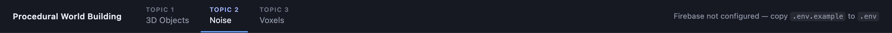

# Firebase integration

Jessica Hsiao · Assignment 2

[← back to the README](../../README.md) · [study notebook index](../README.md)

Sign-in, saved configurations and hosting for the voxel page (Topic 3). This
file tracks the integration as it is built; the survey that preceded it is
[`firebase-integration-report.md`](firebase-integration-report.md).

**Status:** Stage 1 — configuration and authentication. Firestore, Storage and
Hosting are not wired up yet.

## Setting it up

```bash
cp .env.example .env     # then fill the six values
npm run dev
```

The six values come from the Firebase console under **Project settings → Your
apps → SDK setup and configuration**. In the console you also need
**Authentication → Sign-in method → Google** enabled, and the origin you serve
from listed under **Authentication → Settings → Authorized domains**
(`localhost` is there by default).

`.env` is gitignored. `.gitignore` previously had only `*.local`, which does not
match a plain `.env`, so the rule was added explicitly along with `.env.*` and a
negation for `.env.example`.

These values are **not secrets**. Vite inlines them into the bundle by design,
and a web API key only names the project — anyone can read it from the deployed
site. What protects the data is the Firestore and Storage rules, which pin every
document to its owner's uid. They are kept out of git because they point at a
specific billable project, not because they are confidential.

## What exists

| File | Does |
| --- | --- |
| `src/firebase/config.ts` | Reads the env vars, initialises the app, exports `auth`/`db`/`storage` |
| `src/firebase/authContext.ts` | The auth context and the `useAuth()` hook |
| `src/firebase/AuthProvider.tsx` | Subscribes to `onAuthStateChanged` |
| `src/firebase/auth.ts` | `signInWithGoogle()`, `signOutUser()`, error translation |
| `src/AuthBar.tsx` | Header UI — sign in, signed-in identity, sign out |

## Notes

**A missing `.env` must not break Topics 1 and 2.** They have nothing to do with
Firebase, and a fresh clone has no `.env` at all. `initializeApp` does not throw
on undefined values — it fails later, at sign-in, with an opaque
`auth/api-key-not-valid`. So `config.ts` checks the six names up front, skips
initialisation entirely when any is missing, and exports `firebaseReady` plus
the *names* of what is absent. The header then says "Firebase not configured"
and everything else runs as before. Verified in the browser with no `.env`
present: all three topics render, console clean.



*What a fresh clone looks like with no `.env`: the header says so in place of
the sign-in button, and every topic still loads.*

**`initializeApp` is guarded by `getApps()`.** Vite re-executes the module on
hot reload, and a second `initializeApp` throws `app/duplicate-app`.

**`onAuthStateChanged` returns its unsubscribe, and the effect returns it.**
StrictMode mounts every effect twice in development; without the cleanup the
first mount's listener outlives its unmount and fires into a dead component.

**The hook is not in `AuthProvider.tsx`.** Vite's fast refresh only handles a
module whose exports are all components, and `eslint-plugin-react-refresh`
enforces that as an **error**, not a warning — `npm run lint` fails outright. So
the context and `useAuth()` live in `authContext.ts` and the provider file
exports only the component.

**Popup, not redirect.** `signInWithRedirect` unloads the page and returns to a
fresh one, which would discard the shape stack the user was editing. The cost is
that the origin has to be in the authorized-domains list.

**Errors are shown, not logged.** `describeAuthError` translates the codes a
user causes on purpose — a closed popup reads "Sign-in cancelled." rather than
looking like a fault — and anything unrecognised is shown verbatim rather than
hidden. One code was corrected against observed behaviour: a bad key produces
`auth/api-key-not-valid.-please-pass-a-valid-api-key.`, not the
`auth/invalid-api-key` the name suggests. Both are mapped.

**Cost of the SDK:** `firebase/app` + `firebase/auth` bundle to 136 kB raw,
34 kB gzipped — measured with esbuild over those imports alone. The production
bundle's 500 kB warning predates this; three.js already exceeded it.

**Focus mode hides the auth bar**, because `H` sets `display: none` on the whole
`.app-nav`. Confirmed rather than assumed: `navDisplay` is `none` and the bar's
`offsetParent` is null. Sign-in is a header action, so this is the right
behaviour, but it does mean there is no way to sign in without leaving focus
mode.
