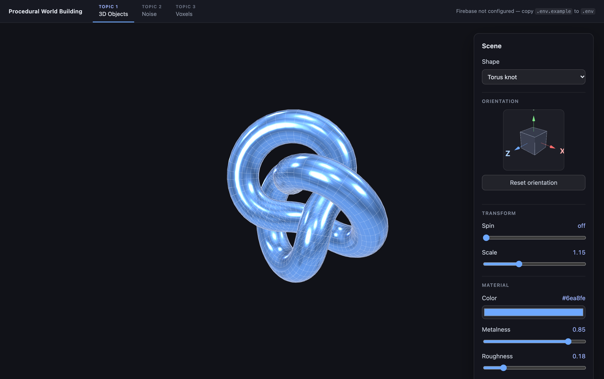
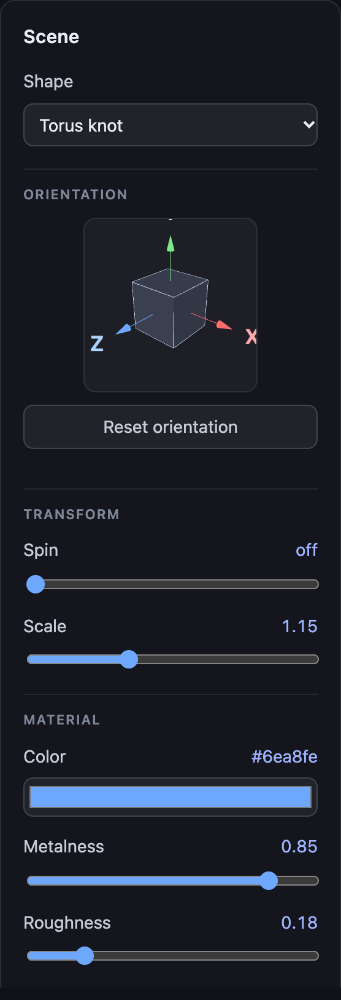

# Topic 1 — 3D Objects

A real-time WebGL object viewer: pick a primitive, orient it, and light it.
The topic's purpose was the render loop and the material model rather than any
generated content — the object is given, and everything around it is the work.

[← back to the README](../../README.md) · [study notebook index](../README.md)

## What it does

- **Shape switching** — cube, sphere, torus, icosahedron, and torus knot,
  swapped in place without rebuilding the scene.
- **Orientation gizmo** — a draggable mini-cube with labelled X/Y/Z axes.
  Orientation is stored as a quaternion so the object tumbles freely without
  gimbal lock.
- **Material controls** — colour, metalness, roughness, and wireframe, lit by a
  `RoomEnvironment` image-based light so metallic surfaces have something real
  to reflect.
- **Transform** — auto-spin (degrees/second) layered on top of the gizmo
  orientation, plus uniform scale.
- **Orbit camera** — click and drag the main canvas to orbit the view.

The whole topic fits in one floating widget: shape, orientation, transform and
material, in that order.

## Notes

**Orientation is a quaternion, not three angles.** Euler angles lose a degree
of freedom when two axes line up, so a gizmo built on them locks up partway
through a drag. Storing the orientation as a quaternion and composing each
drag onto it lets the object tumble freely from any starting attitude.

**The environment light is generated, not loaded.** `RoomEnvironment` builds a
small studio scene and renders it to a cubemap at runtime, so metallic
surfaces reflect something with structure instead of a flat colour — which is
the difference between metalness reading as a material and reading as a tint.
There is no HDR file to ship.
