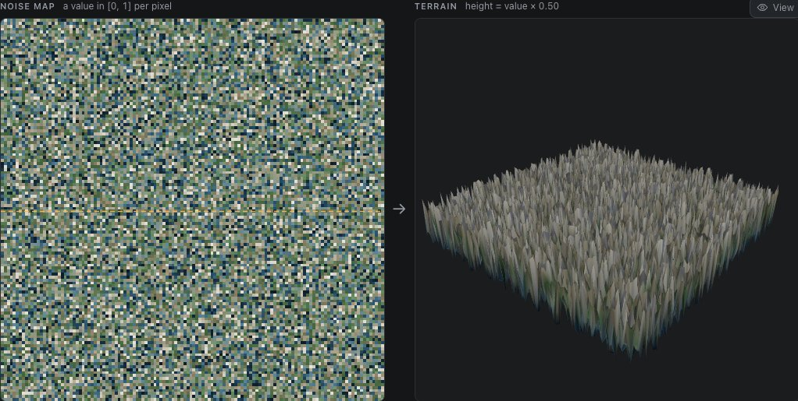
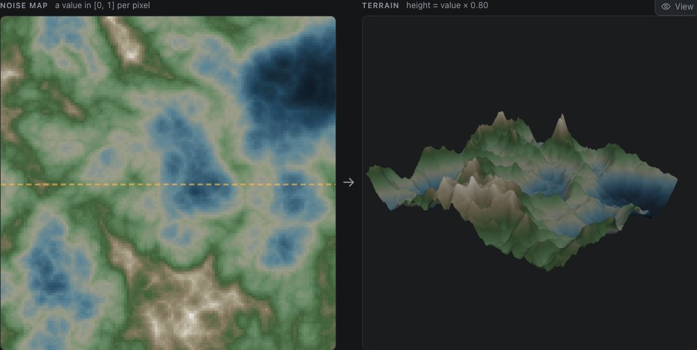
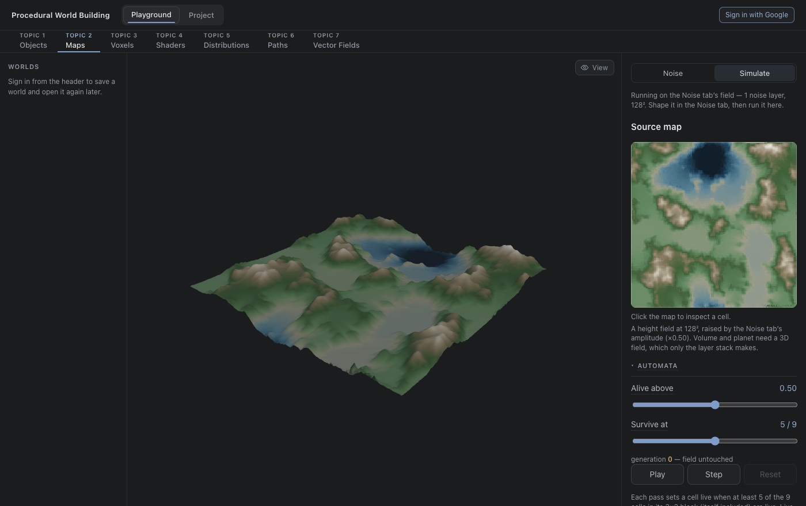
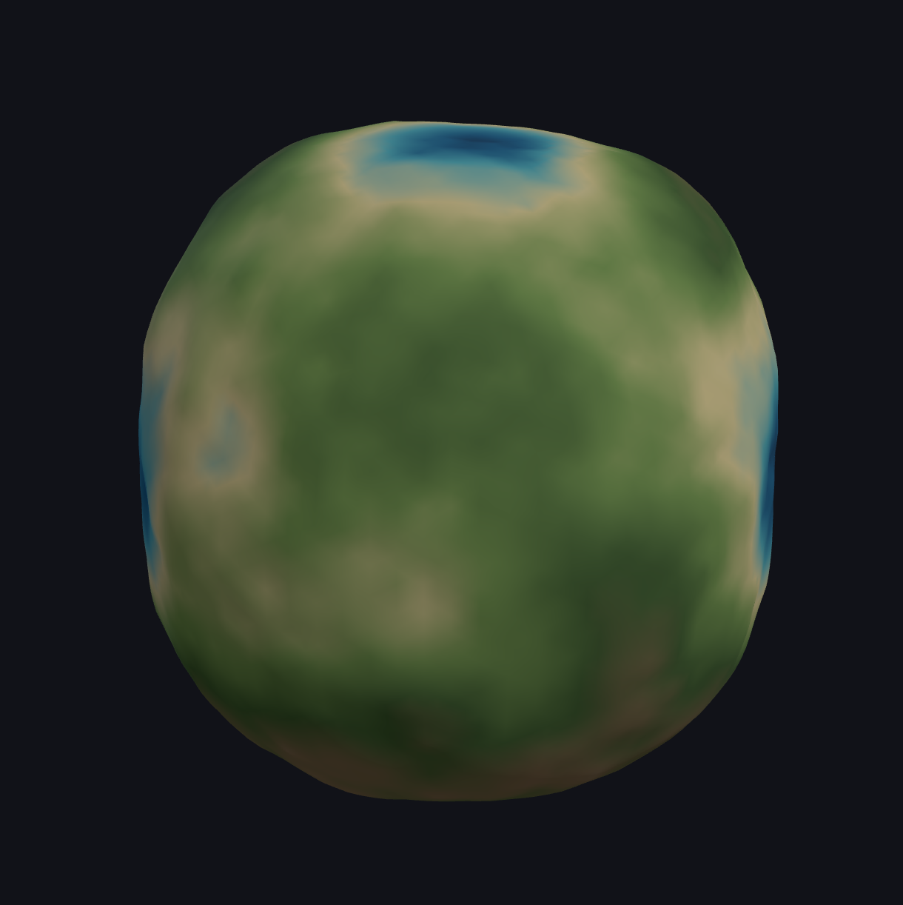
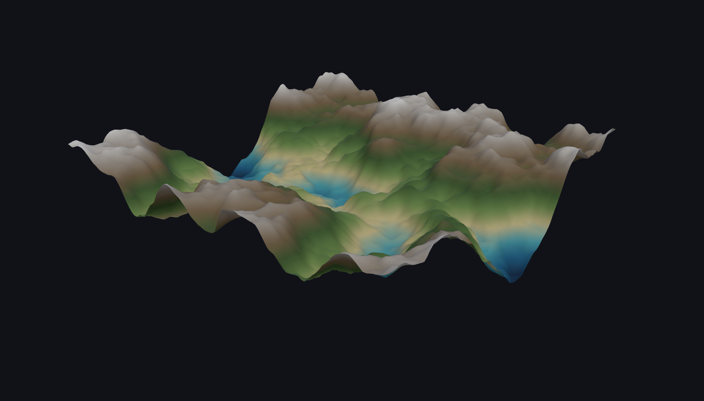
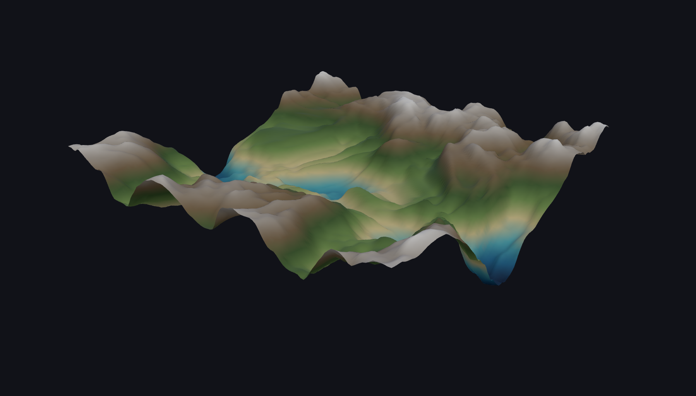
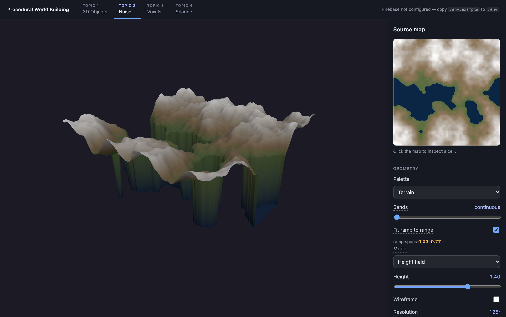
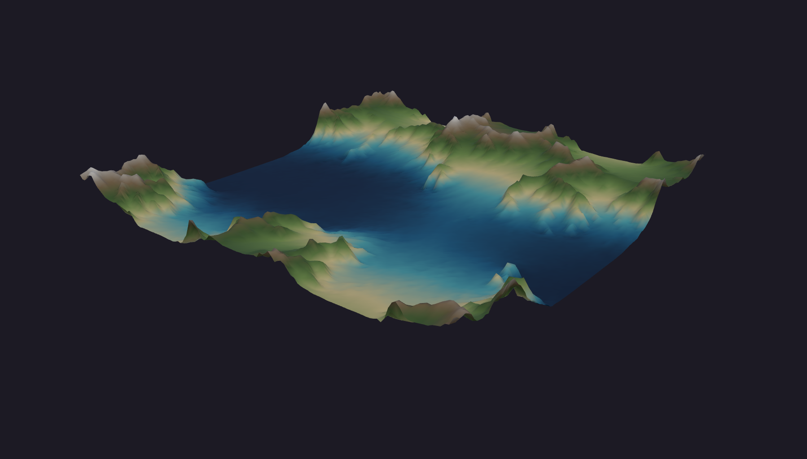

# Topic 2 — Maps

Noise turned into ground, in two stages: **noise → shape → simulate.** The
**Noise** tab stacks noise functions — white, Perlin or cellular, each its own layer
— shapes the stack, and shows the map beside the terrain it makes, with the
program the controls amount to written out under them. **Simulate** takes that
field and runs processes on it — a cellular automaton and droplet hydraulic
erosion. The layered value-noise generator Topic 2 began with is kept behind it
as the **Original generator**, for the record and for the worlds saved from it.

[← back to the README](../../README.md) · [study notebook index](../README.md)


## Contents

- [Noise](#noise) — noise → modify noise → use it as a map
  - [Three noise functions](#three-noise-functions)
  - [Noise layers](#noise-layers) — stacking noise functions, and how they combine
  - [The pipeline, in order](#the-pipeline-in-order)
  - [Presets are recipes](#presets-are-recipes)
- [Simulate](#simulate) — what happens to the ground
- [The field](#the-field) onward — the original generator and the processes, as first built
  - [The field](#the-field) — what a cell holds, and how the page is laid out
  - [Geometry modes](#geometry-modes) — height field, volumetric cloud, planet
  - [Colour ramps](#colour-ramps) — OKLab interpolation, ramp fitting, bands
  - [Inspecting](#inspecting) — reading a single cell
  - [Layers](#layers) — the stack, the blend modes, and building an fBm
  - [Warp](#warp) — displacing the lookup coordinates
  - [Automata](#automata) — a neighbour rule run to its fixed point
  - [Erosion](#erosion) — droplet hydraulics and thermal slippage
  - [Shaping operations](#shaping-operations) — the eight per-cell ops
  - [Reading the volumetric mode](#reading-the-volumetric-mode)
- [Notes](#notes) — the decisions, including the wrong ones

## Noise

The page opens here, and its argument fits in one line: **noise → modify noise →
use it as a map.** Every control belongs to one of those three steps, and the
two views on screen are the same numbers read two ways — the map is the value at
each point, and the terrain is that value used as height. A slider moves both at
once, so a mathematical change and its spatial meaning arrive together.

| Area | What it holds |
| --- | --- |
| Left column | **Presets** — eight recipes, each a different combination of the controls on the right |
| Noise map | 128² values in `[0, 1]`, coloured by the same ramp as the terrain. Click or drag to move the dashed row |
| Terrain | The same values as a height-field tile, `height = value × amplitude`, with an optional sea |
| Profile | The dashed row cut through the terrain — the "/\\_/\\" sketch of the field, drawn from the data |
| Pipeline | The controls written out as pseudocode with their current numbers, in the order they run |
| Right column | **Layers** and the selected layer's editor, then **Field**, **Shaping**, **Domain warp**, **Island mask**, **Water**, and the time the field took |

A **Noise | Simulate** switch sits at the top of the sidebar. The terrain tile is
its own small scene, not the Project's world: it exists to be thrown away.

### Three noise functions



*White noise as terrain. Every sample is independent of its neighbours, so
there is no slope to follow and no feature larger than one cell — the baseline
the other two functions exist to fix.*

| Noise | What is random | What it makes |
| --- | --- | --- |
| **White** | The value at every sample | Static. Has no frequency and nothing to stack, so its scale and octave controls are hidden rather than left inert |
| **Perlin** | The *slope* at each lattice point; the value there is always 0 | Smooth hills of one characteristic size. The extremes fall between lattice points, which is why it has no blocky cells |
| **Cellular** | One jittered point per lattice cell; the value is a distance | **F1** (nearest point) makes round basins; **F2 − F1** is 0 exactly where two points are equally near, so it draws the cell walls — here, as cracks between domes |

Perlin here is 2D gradient noise with eight unit gradients and the quintic fade
`6t⁵ − 15t⁴ + 10t³`, whose continuous second derivative keeps lattice lines out
of the lighting. Its signed output peaks at √2⁄2 in theory, so it is mapped to
`[0, 1]` by dividing by twice that. Measured over 50 seeds at frequency 8, a
single octave spans **0.032–0.967**: the mapping never clips, and very nearly
uses the whole range.

The values are hashed from lattice coordinates rather than drawn from a running
PRNG, so a sample is a function of *where* it is. That is what lets domain warp
read the same field at moved coordinates instead of producing a new one.

### Noise layers

The field is a stack of up to four noise layers, bottom first. Each one is a
complete fBm of its own — its own noise type, frequency and octaves — and each
above the bottom combines with everything beneath it. Select a layer in the
list to edit it; the checkbox turns it off without losing it, and the arrows
reorder the stack.

| Per layer | Effect | Shown when |
| --- | --- | --- |
| Noise | White, Perlin, or Cellular (F1 or F2 − F1) | Always |
| Frequency | First-octave features across the tile | Not white |
| Octaves | Copies stacked, each finer than the last | Not white |
| Persistence | Each octave's amplitude relative to the one before — the roughness dial | More than one octave |
| Lacunarity | Each octave's frequency relative to the one before | More than one octave |
| Fold | None, Ridged (with Sharpness) or Billow — applied to every octave of this layer | Always |
| Blend | How this layer combines with the ones below: Add, Subtract, Multiply or Max | Not the bottom layer |
| Weight | How strongly it acts | Not the bottom layer |

| For the field | Effect |
| --- | --- |
| Seed | Which random field. Each layer offsets it by its own number, so layers never share randomness, and removing one does not redraw the others |
| Amplitude | Height of a value of 1, against a tile 2.4 wide. Changes the terrain and caption, never the map — the map is unitless |

| Blend | `value = …` | What it is for |
| --- | --- | --- |
| Add | `value + n·w` | Detail riding on the shapes below |
| Subtract | `value − n·w` | This layer's high points become pits and channels |
| Multiply | `value · (1 − w + w·n)` | A mask: at weight 1 the ground survives only where this layer is high |
| Max | `max(value, n·w)` | This layer's peaks rise out of the ground without lowering anything |

Multiply is written as a lerp toward the product rather than a bare product so
that its weight means the same thing as the others' — 0 leaves the ground
alone, 1 is the full effect. The Mountains preset is the clearest use: a
broad, smooth layer at weight 0.85 multiplying a ridged one, so the ridges
stand where the land is already high and fade out in the lowlands.

**A one-layer stack is the Noise tab as it was before layers.** The bottom layer's
seed offset is 0, so on any seed a single layer produces the identical field —
Baseline on seed 42 still spans 0.182–0.697, and the octave table below is
unchanged. Every Noise-tab measurement taken before stacking still holds.

### The pipeline, in order

```
fbm(noise, p, octaves, persistence, lacunarity):
  for each octave o: sum += noise(p * lacunarity^o) * persistence^o
  return sum / (sum of persistence^o)

x2 = x + snoise(x * s, z * s) * strength          // domain warp
z2 = z + snoise(x * s + 100, z * s + 100) * strength
L1 = fbm(perlin, (x2, z2) * f1, …)                 // one line per layer
L2 = fbm(perlin, (x2, z2) * f2, …)
     each octave n → pow(1 - abs(n * 2 - 1), k)    // a fold, if that layer has one
value = L1
value *= 1 - w + w * L2                            // each layer's blend, in order
value = (value - min) / (max - min)                // stretch to [0, 1]
value *= max(0, 1 - falloff * d * d)               // island mask
value = pow(value, k)                              // power — or terrace
height = value * amplitude
```

The panel under the views prints this with the live numbers. The global stages
are greyed out when off rather than removed, so turning one on is seen to slot
into a fixed sequence instead of replacing what was there — which is the point
the presets make too. Layers are listed as they are: a disabled layer is simply
not part of the program.



*The Mountains preset: a broad three-octave layer multiplying a six-octave
ridged one at weight 0.85. The creases are sharpest on the high ground and fade
where the broad layer is low — ranges, rather than ridges spread evenly
everywhere.*

**Fold is per layer; Shaping is for the whole stack.** The two kinds are
different on purpose, and the split follows from it. `1 − |2n − 1|` is non-differentiable exactly
where `n = 0.5`, and a non-differentiable maximum is a crease. Folded *after*
the sum — which is what the layer stack's Output Ridge does — that happens along one
contour of the finished field, so the creases are all one scale. Folded per
octave, it happens along the 0.5 contour of *every* octave, so there are crests
at every scale and the large ridges carry smaller ones. That is what reads as a
range rather than a field of rounded knolls with a seam drawn through them.

Terrace and Power go the other way: they act once, on the finished stack. A
terrace applied to one layer would be blurred away by every layer added on top
of it, and a power curve applied before the stretch would act on a range that
moves every time a layer does.

**The fBm is stretched to `[0, 1]` before anything that cares about absolute
value.** Averaging octaves narrows the range — mean over 10 seeds, Perlin at
frequency 3, persistence 0.5:

| octaves | raw span | range |
| --- | --- | --- |
| 1 | 0.700 | 0.143–0.843 |
| 2 | 0.592 | 0.194–0.786 |
| 3 | 0.544 | 0.225–0.769 |
| 5 | 0.517 | 0.236–0.753 |
| 8 | 0.505 | 0.243–0.748 |

Without the stretch, a six-step terrace on the five-octave field above would
use only four of its six levels — `floor(0.236 × 6)` is 1 and `floor(0.753 × 6)`
is 4 — and a power curve would mean something different every time the octave
count moved. The
pipeline line prints the measured range it stretched from, so the
normalisation is visible rather than silent.

**The terrace is `min(floor(value × steps), steps − 1) / (steps − 1)`**, not the
textbook `floor(value × steps) / steps`. After the stretch the single highest
sample is exactly 1, and the textbook form lifts that one vertex a full step
above the top plateau — a needle on every mesa.

**Water reads the noise; it is not part of it.** Sea level is a flat plane in
the terrain and a tint on the map, the same colour in both, and the readout
reports the share of the tile above it.

### Presets are recipes

Each preset sets every control and every layer except the field seed. Keeping
the seed means switching preset compares recipes on the same ground — the island
and the mountain range are built from the same underlying noise. Two presets
stack: Mountains and Rocky. The rest are one layer and a few switches, which is
the other half of the lesson — most of the character comes from what is done to
the noise, not from piling more of it on.

| Preset | Recipe |
| --- | --- |
| **Baseline** *(default)* | Five octaves of Perlin at frequency 3, nothing else. Every other preset is a variation on this |
| Rolling Hills | Frequency 2, three octaves, persistence 0.35 — the fine octaves too quiet to roughen it |
| Mountains | **Two layers**: frequency 1.5, three octaves, multiplying a frequency-3, six-octave ridged layer at weight 0.85 |
| Terraces | Four octaves, terraced into seven steps |
| Islands | Baseline × radial falloff at 1.0, sea level 0.32 — **36%** land on seed 42 |
| Rocky | **Two layers**: gentle hills at frequency 2, plus a loud frequency-9 layer added at weight 0.3 |
| Organic | Baseline read through a domain warp of 25% of the tile at scale 2 |
| Cells | Cellular F2 − F1, frequency 5, two octaves |

Change any control and the highlighted preset clears — the settings no longer
describe that recipe, so the page stops claiming they do.

### Cost

Measured in Node over `generateLab`, median of five or seven runs at 128². The
sidebar reports the live figure for the field on screen.

| noise | 1 octave | 5 octaves | 8 octaves |
| --- | --- | --- | --- |
| White | 0.3 ms | — | — |
| Perlin | 0.23 ms | 0.77 ms | 1.20 ms |
| Cellular | 2.76 ms | 15.3 ms | 24.8 ms |

Cellular costs about twenty times Perlin from five octaves up (twelve at one),
because every sample searches nine cells and hashes two coordinates in each. It is still inside a frame at five octaves, so
the field is generated on the main thread during render with no worker and no
cache. Domain warp adds two Perlin lookups per sample: 0.77 → 1.32 ms at five
octaves.

Layers cost what their noise costs, added up: four five-octave Perlin layers
take 2.71 ms against 0.71 for one. The budget only bites with cellular — four
five-octave cellular layers would be about 60 ms, which is why the stack stops
at four.

## Simulate



The two tabs are split by kind of operation, not by feature. Everything in the
Noise tab is `f(x)`: a point's value depends on its own coordinates and nothing else,
and is computed once. Everything in Simulate is `f(x, neighbours)`, repeated —
the automaton counts its block, a droplet carries material from one cell to
another — so it has Play, Step and Reset, and the Noise tab never does.

Simulate runs on the field the Noise tab is showing, at 128² and the Noise tab's
amplitude and sea level, and shows only Automata and Erosion. Per-point work is
the Noise tab's; repeating it here would be a second, hidden copy of it.

**Original generator**, collapsed at the bottom of the panel, switches the ground
to the layered value-noise stack Topic 2 began with — everything from
[The field](#the-field) to [Reading the volumetric mode](#reading-the-volumetric-mode)
— and brings back its Geometry, Layers, Warp and Output controls. It stays for
three reasons: every measurement in those sections was taken on it, the
showcase worlds were built from it, and only it makes the 3D field that the
volume and planet modes need. A world saved before the Noise tab existed opens with
it on. For anything new, stacking noise is the Noise tab's job.

Changing anything in the Noise tab while Simulate holds an erosion run drops the run:
it was carved into ground that no longer exists. That comes for free — a run is
only valid while its stored source is the identical array the automaton
produced.

### The same erosion on the two grounds

Every number from here down to Notes was measured on the layer stack. Gorges on
the Noise tab's fields, in ticks of 0.3 droplets per cell at 128², seed 7919, with
channel concentration taken as the share of removed material that lands in the
busiest 10% of cells:

| ground | relief kept at 0.3 / 1.2 / 3 / 12 | concentration at 0.3 / 1.2 / 3 / 12 |
| --- | --- | --- |
| Layer stack (default) | 90 / 81 / 72 / 51% | 0.382 / 0.340 / 0.325 / 0.307 |
| Noise — Baseline | 90 / 81 / 69 / 42% | **0.461** / 0.384 / 0.342 / 0.330 |
| Noise — Rolling Hills | 94 / 88 / 80 / 55% | 0.456 / 0.399 / 0.355 / 0.325 |
| Noise — Mountains | 100 / 96 / 87 / 64% | **0.465** / 0.412 / 0.378 / 0.381 |
| Noise — Rocky | 94 / 87 / 79 / 50% | 0.433 / 0.381 / 0.351 / 0.338 |
| Noise — Islands | 100 / 99 / 96 / 83% | 0.413 / 0.364 / 0.357 / 0.375 |
| Noise — Organic | 86 / 74 / 62 / 39% | 0.466 / 0.382 / 0.361 / 0.362 |

**The chapter's conclusion holds on the new ground**: structure is cut early and
worn away after, so concentration peaks in the first tick on every field. **The
Noise tab's fields cut more selectively** — 0.41–0.47 in the first tick against the
stack's 0.38 — and Baseline loses relief faster under heavy rain, 42% left at
12 droplets per cell against 51%. Mountains holds the most relief of the
unmasked fields, 64% at 12: the multiply leaves broad low ground with little
gradient, so most droplets that land there do little work. Islands barely erodes: most of its area is a
flat seabed at 0, where a droplet has no gradient to follow.

The obvious explanation was the range. The Noise tab stretches its field to `[0, 1]`
while the stack spans 0.334–0.773, so the Noise tab's slopes are 2.3× steeper. It is
not the cause: squeezed into the stack's range, the Baseline field keeps *less*
relief (86 / 73 / 61 / 37%) and stays as selective (0.440 in the first tick). The
difference is in the noise, not its scale.

These are measured with one stated definition, and they do not reproduce the
older [preset table](#presets) exactly — the same reading gives River valleys
88% / 0.330 at 1.2 droplets per cell against the table's 83% / 0.435. That table
was measured earlier, by a method this chapter did not record. Compare within a
table, not across them.

## The field

Every cell holds a value in `[0, 1]`, built from a stack of noise layers. The
composited map drives geometry in the centre viewport; the map itself sits in
the sidebar as the source you inspect and tune.

Drag to orbit, scroll to zoom, right-drag to pan, and a **Spin** slider turns
the object about its vertical axis in degrees per second. Spin is a reading
tool as much as a flourish: relief that is ambiguous in a still frame usually
resolves as soon as the shading moves across it.

**Every term in the panel explains itself on hover.** Control labels carry a
dotted underline; hovering or tabbing to one opens a box with what the setting
does and, where it matters, what it costs. The explanations live next to the
values they describe — parameter definitions carry their own text in
`erosion.ts` and `noise.ts` — so a control and its description cannot drift
apart.

Simulate opens on the Noise tab's field. Turn on **Original generator** and it is a
six-octave fBm stack at 128², height 1.4, the Land palette fitted to the
field's range, the automaton off, and the erosion preset on Gorges — the
configuration that measures closest to real topography (see
[Building an fBm stack](#building-an-fbm-stack)). Press **Rain** to erode it.

## Geometry modes

| Mode | What it draws |
| --- | --- |
| **Height field** | The map as a graph — one vertex per cell, raised to its value and welded into a continuous surface. A **Height** slider scales the relief, and a **Wireframe** checkbox draws the sampling lattice over it. |
| **Volumetric cloud** | True 3D noise, one point per cell. The sidebar map shows a single z-slice, moved with the **Slice** slider. |
| **Planet** | A sphere whose every vertex is displaced by the 3D field sampled at its own position. A **Relief** slider scales the displacement. |

### The wireframe draws the lattice, not the triangulation

`material.wireframe` is the one-line way to get a mesh outline, and it draws
the wrong thing. Every quad in the surface is split into two triangles, so the
built-in wireframe adds a diagonal across each cell — a line that records how
the index buffer was written, not anything the field did. The lattice here is
a separate `LineSegments` indexed as rows and columns only — 2·R·(R−1)
segments, where the triangulation's distinct edges come to that plus one
diagonal per quad, (R−1)² more. Every line it draws is a real edge of the
sampling grid.

It shares the surface's `position` attribute *instance* rather than copying
it, so the lines follow every height `writeSurface` writes — an erosion tick,
a Height drag, an automaton generation — with no second buffer that can fall
out of step. Two details make that work: the mesh material carries a
`polygonOffset`, because the lines sit exactly on the triangle edges they
trace and would otherwise z-fight into a stipple; and the lines are excluded
from frustum culling, since the shared attribute is rewritten constantly while
that geometry never recomputes its own bounds.

Line count rises with the square of the resolution while the viewport does
not, so the opacity is faded in proportion (`14 / resolution`, clamped). A
fixed value that reads as a lattice at 32² buries the terrain colour at 128²
— the lines should annotate the surface, not become it.

### Why the planet samples the volume



*The planet, sampled from the 3D field at each vertex. There is no seam to hide
and no pole to pinch, because the field is defined everywhere in space rather
than on a wrapped 2D image.*

The obvious way to put noise on a sphere is to wrap the 2D map around it as a
texture. That gives a visible seam where the map wraps and pinching at both
poles, because an equirectangular grid crowds without limit as it approaches
them. Sampling the **volumetric** field at each vertex's own position in space
avoids the problem rather than working around it: there is no parameterisation,
so there is no seam and no poles, and detail stays even everywhere.

It also gives the volumetric field a second job — the same buffer the point
cloud draws is what the planet is carved from.

## Colour ramps

The field is a scalar in `[0, 1]` and the ramp is how it becomes visible. One
**Palette** drives both the sidebar map and the 3D geometry, because they show
the same field and a second control would only let them disagree.

Scaling a single colour by the value — what this page did first — is a
*luminance* ramp, and the eye resolves luminance far worse than hue. Measured as
path length through OKLab, where Euclidean distance is built to be perceptually
uniform, each ramp spends a different amount of colour on the same data:

| Palette | distinguishable steps | notes |
| --- | --- | --- |
| **Terrain** | **165** | Hypsometric tints, the cartographic convention. Widest range. |
| **Land** *(default)* | **127** | The same idea desaturated, to sit beside a neutral interface. |
| Magma | 114 | Dark to bright with rising hue. |
| Greyscale | 100 | Pure luminance — the baseline worth measuring against. |
| Single hue | 86 | Black to the picked colour. Shows the **Colour** picker. |
| Viridis | 83 | Perceptually uniform: equal value steps *look* equal. |

**Land is the default, and restraint is what it costs.** 127 against Terrain's
165 — desaturating spends 23% of the ramp's resolving power. The first draft of
it scored 94, *below greyscale*, which would have inverted the point this
section is making; getting back above the baseline meant widening the lightness
range and keeping hue rotation at low chroma rather than keeping saturation.
Both ramps stay, because deleting the cartographic one to make the interface
calmer would trade a measurement for a preference. See
[the visual system](../project/visual-system.md).

Viridis scoring lowest is not a defect. It deliberately trades total range for
even steps, which makes it the honest ramp rather than the punchy one — the
others crowd detail into whichever part of the range happens to have more
contrast.

### Fitting the ramp is what makes the palette pay

A palette only helps if the data reaches its ends, and this field does not. The
default six-octave stack spans 0.334 to 0.773, so against a fixed `[0, 1]` ramp
it touches 113 of 256 entries:

| Palette | reachable unfitted | fitted |
| --- | --- | --- |
| Terrain | **63 steps** | **165** |
| Magma | 44 | 114 |
| Greyscale | 44 | 100 |
| Single hue | 36 | 86 |
| Viridis | 35 | 83 |

Unfitted, the terrain palette resolves *less* than the 74 steps the old
single-colour ramp managed — the upgrade would have been a downgrade. **Fit ramp
to range** stretches the ramp across the field's actual min and max, and the
readout names the span it is using so the stretch is never silent. Geometry
keeps using the raw value, so fitting changes the colouring and never the shape.

The span is live: erode the terrain and it follows, drifting from 0.33–0.77 to
0.47–0.77 as the low ground fills in.

### Bands

**Bands** quantises the ramp into 2–48 steps, turning a smooth field into
contour-like regions — the colour equivalent of the Terrace shaping operation.
It quantises the *ramp*, not the field, so a banded map still sits on a smooth
surface instead of turning the terrain into terraces.

## Inspecting

Click or drag on the sidebar map to select a cell. Its exact value is reported
below the map, the cell is outlined there, and a marker appears at the matching
point on the 3D geometry — on the surface at that vertex's height, or at the
cell's centre in the volume.

Clicking the selected cell again clears the selection. A click that deselects
also suppresses the drag that would otherwise follow, so the pointer sitting on
the cleared cell cannot immediately reselect it.

## Layers

Each layer samples its own field and composites onto the running result,
bottom-up. A layer carries:

| Control | Effect |
| --- | --- |
| Frequency | Lattice cells per side, interpolated up to the display resolution |
| Spread (σ) | Standard deviation of that layer's distribution (mean is 0.5) |
| Blend | How it combines with the layers beneath it |
| Opacity | How much of the blend result is kept |
| Shaping | A remap applied to this layer before blending |

Blend modes: Normal, Add, Subtract, Multiply, Screen, Overlay, Difference,
Lighten, Darken. Layers can be reordered, disabled, reseeded, and removed;
order matters for every mode except the commutative ones.

### Building an fBm stack



*The default stack: six octaves from f2 to f64, persistence 0.5, drawn at 128²
with the Terrain ramp fitted to the field's own range (0.33–0.77).*

The stack defaults to six octaves — frequency doubling from f2 to f64, amplitude
halving — rather than the two layers it started with, and **Octaves**,
**Persistence** and **Rebuild as fBm stack** regenerate that stack from scratch.

Why it matters is measurable. A surface reads as terrain when its structure
function `S(d) = mean (h(x+d) − h(x))²` is a straight line on a log-log plot:
the same roughness at every scale. The slope gives the Hurst exponent H, and
real topography sits at H ≈ 0.5–0.8 with R² above 0.99.

| stack | H | straightness R² |
| --- | --- | --- |
| two layers, f4 + f16 | 0.67 | 0.960 |
| **six octaves, f2–f64** | 0.75 | **0.990** |
| six octaves + Gorges erosion | 0.73 | **0.996** |

The old pair was never too rough — H was already in range. It had content at f4
and f16 and a hole between them, and the eye reads that hole as randomness.

**Persistence is the roughness dial**, and the only one worth tuning by eye:

| persistence | H | R² | reads as |
| --- | --- | --- | --- |
| 0.30 | 0.93 | 0.998 | smooth, rolling |
| 0.50 | 0.75 | 0.990 | balanced (default) |
| 0.65 | 0.57 | 0.975 | craggy |
| 0.80 | 0.43 | 0.941 | out of the realistic band |

The opacities the builder writes — 1, 0.33, 0.14, 0.07, 0.03, 0.02 — look
arbitrary but are forced. Normal blend is a **lerp, not a sum**, so a layer's
weight in the finished field is its own opacity times ∏(1 − opacity) over every
layer above it; hitting halving weights means inverting that chain from the top
down. With the bottom layer opaque the weights telescope to exactly 1, which is
what keeps the composite's mean at 0.5 instead of drifting toward black.

Octave seeds are the octave index rather than a running counter, so rebuilding
at a different persistence redraws the *same* terrain at a different roughness
instead of an unrelated one — which is the only way the dial is readable.

One cost worth knowing: averaging six octaves shrinks the variance, so the
stack's relief is about 0.44 against the old pair's 0.71. Raising spread has
diminishing returns (0.3 → 0.31, 0.6 → 0.44, 0.8 → 0.49, no clipping at any of
them), so the default compensates with the **Height** slider instead — display
scaling costs nothing and never pushes values into a clamp.

**Frequency is what makes a stack worth having.** Blending independent fields
at the same frequency is a dead end — a sum of Gaussians is just another
Gaussian, so the stack would look like one noisier layer. A coarse lattice
interpolated up, sitting under a fine one, is the octave stacking that fractal
noise is built from. At frequency 4 the field is smooth blobs; at frequency
equal to the resolution it degenerates back to per-cell white noise.

The stack starts from 0 and the bottom layer blends against it like any other,
rather than being special-cased. That keeps the model predictable, but it does
mean a bottom layer set to Multiply yields nothing — exactly as it would in an
image editor.

## Warp



*The same six octaves as above, with **Warp amount** at 16 cells. Nothing was
added to the field — only where it is sampled changed — but ridges now curve
and strata fold back on themselves.*

Domain warping looks the field up at coordinates pushed around by *another*
noise field. Noise is stationary — every neighbourhood is statistically like
every other — which is exactly why an unwarped field reads as texture rather
than geology. Displacing the lookup breaks that: strata fold, ridges curve and
run, and features stretch in one place while bunching in another, none of which
a sum of octaves can produce on its own.

| Control | Effect |
| --- | --- |
| Warp amount | Maximum displacement in cells. 0 is off, and returns the field untouched |
| Warp scale | Lattice frequency of the offset fields — low bends whole regions, high jitters edges |
| New warp | A different offset field at the same settings |

**It is a character control, not a realism one**, and only free while it stays
small. On the default stack:

| warp amount | H | straightness R² |
| --- | --- | --- |
| 0 | 0.75 | 0.990 |
| 10 | 0.75 | 0.989 |
| 20 | 0.72 | 0.985 |
| 40 | 0.65 | 0.971 |

Below about 20 cells it moves where features are without changing how rough they
are — the picture changes completely while the measurement does not. Past that,
displacing features far enough starts shearing the fine octaves apart.

It warps in 3D as well, so the volume and the planet fold too, and costs about
0.4 ms at 128².

## Automata



*Run to its fixed point from the default stack: it settles at **generation 8**,
after which no cell can flip again. The sidebar's source map shows the result
as a field; the viewport shows the same data as relief.*

A cellular automaton runs between the layer stack and the output shaping. Where
the shaping operations are per-cell — `f(x)` — this is `f(x, neighbours)`
applied repeatedly, and it is what turns speckled noise into connected
landmasses and caves.

Each pass thresholds the field to a live/dead mask, then sets a cell live when
at least **Survive at** of the cells in its block are live. The block is the
whole 3×3 (or 3×3×3) neighbourhood, **the centre included** — counting only the
8 surrounding cells looks like the same rule but is not: with no vote of its
own a cell cannot hold its state, and the field erodes away instead of settling.

| Control | Effect |
| --- | --- |
| Alive above | Value at or above which a cell starts live |
| Survive at | Live cells needed in the block, out of 9 in 2D or 27 in 3D |
| Play / Step / Reset | Advance one generation at a time, or watch it run |

Generation 0 leaves the field untouched, so the automaton is genuinely off until
stepped. Live cells keep their original value and dead cells go to 0, so land
holds its noise detail while the sea goes flat — islands with terrain, rather
than a binary plateau. On a planet, that reads as continents against ocean.

### The run stops when it is actually finished

Each pass counts the cells it flipped, and a pass that flips none is a fixed
point: every later pass is identical to it. Play stops there and the readout
names the generation it reached. Running past that point would tick a counter
against a frozen picture, which reads as the controls being broken.

How long that takes depends entirely on the dimensionality. On the default
stack, 2D settles at generation 4 at 64² and 8 at 128², while 3D at 32³ needs
**42** — a 27-cell block has far more ways to stay balanced, so the boundary
keeps rearranging long after it looks finished. A rougher stack takes longer
still: the earlier two-layer default needed 82 passes in 3D, which is what the
cap of 96 was sized for. If a rule does reach the cap the readout says so and
reports how many cells were still flipping, rather than claiming the field had
settled.

### Dead-end rules say so

Large parts of the parameter space are silent no-ops that the picture cannot
show, so the readout reports them directly:

| Setting | What happens | Readout |
| --- | --- | --- |
| Alive above under the field's minimum, or Survive at 1 | Every cell is alive, so no cell can flip | *no cells changed* |
| Alive above over the field's maximum | Everything dies and the geometry vanishes | *every cell died* |

Where those boundaries fall depends on the field rather than being fixed
numbers. The default stack spans 0.33–0.77, so Alive above is inert below ~0.33
and wipes out over ~0.78; a stack whose values reach the ends of `[0, 1]` leaves
almost no inert region at all. Survive at behaves the same way — on a smooth
stack even 9 of 9 leaves plenty alive, because a cell surrounded by nine live
neighbours is common.

Without this, pressing Play in either region does nothing visible and looks like
a broken button rather than a rule with no work to do.

Each generation is recomputed from the composite rather than mutated in place,
so the generation count is just a number: editing a layer mid-run stays
consistent instead of leaving a stale automaton behind. The cost is that a run
is O(generations) per render — twelve passes take about 1 ms at 128² and 25 ms
at 32³, and the full 42-pass 3D run about 90 ms, so the tail of a 3D playback is
visibly slower than its start.

On the default stack at 64² the coastline perimeter falls about 11% and then
stops changing. The effect is milder than it looks on paper because an fBm stack
thresholds into a single connected landmass to begin with; on a speckled
two-layer stack the same rule merged four separate fragments into one and cut
the perimeter by 21%. Smoothing has more to do when there is more to smooth.

## Erosion



*The Gorges preset run to its cap — **12.00 droplets per cell**, 196,608
droplets in total, leaving 51% of the original relief. The branching valley
networks are the point: no amount of octave stacking produces them, because
noise has no mechanism that carries material downhill.*

Droplet-based hydraulic erosion, run over the height field between the automaton
and the output shaping. Each droplet lands at random, follows the downhill
gradient, and trades material with the terrain: it cuts where it runs fast down
a steep slope and drops its load where it slows or climbs. Thousands of them
carve the dendritic valley networks that noise alone never produces.

| Control | Effect |
| --- | --- |
| Preset | A measured starting point; nudging any slider below switches it to Custom |
| Rain per tick | Droplets **per cell**, with the resulting count shown beside it |
| Erosion rate | Fraction of the shortfall a droplet cuts per step |
| Carry capacity | Sediment a droplet can hold per unit of slope and speed |
| Deposition | Fraction of the excess it drops once over capacity |
| Inertia | How much of its previous direction it keeps; 0 is pure gradient descent |
| Gravity | Converts drop in height into speed |
| Evaporation | Water lost per step, so a droplet carries less as it dries |
| Droplet life | Steps before it expires and drops what it still holds |
| Erosion radius | Cells the cut is spread over |
| Colour by cut / fill | Tints the surface warm where material was removed, cool where it was added |
| Rain / Step / Reset | Run continuously, add one tick, or return to the uneroded terrain |
| New rainfall | A different set of droplets, from the uneroded terrain |
| Talus passes | Thermal slippage passes run after the droplets each tick. 0 is off |
| Angle of repose | Slope a cell can hold before it slumps |
| Slump strength | How much of the excess moves per pass |

**More erosion is not better.** Channel concentration — the share of all erosion
landing in the busiest 10% of cells, against 0.10 for perfectly even wear —
peaks early and decays as the rain keeps falling:

| rain (droplets/cell, 128²) | relief kept | channel concentration |
| --- | --- | --- |
| 0.3 | 94% | **0.485** |
| 3 | 81% | 0.355 |
| 24 | 57% | 0.262 |

The structure is cut in the first few ticks and worn away afterwards, so every
preset is deliberately restrained and the readout reports the **relief left**
rather than only the droplet count. Once that figure has fallen far, the run is
lowering the whole field rather than carving it. The rain is capped at 12
droplets per cell for the same reason.

### Thermal erosion

Talus slippage is the companion process, and it works the other way round.
Where the droplets *transport* — they pick material up, carry it, and put it
somewhere else — this is purely local: a cell gives its excess to whichever
neighbours sit below its angle of repose. Nothing is carried anywhere.

That is what puts scree at the foot of a cliff and stops slopes getting
arbitrarily steep, neither of which hydraulic erosion does on its own. Measured
after eight Gorges ticks at 128², three talus passes per tick cut the share of
over-steep adjacent pairs from **2.64% to 1.76%** — a third fewer — while
leaving relief untouched at 74%. It moves material sideways rather than removing
it: mass drift over five passes is 0.000%.

It runs after the droplets rather than interleaved with them: the water cuts the
slope, then the slope settles to something it can hold. Each pass costs about
6 ms at 128², so three passes roughly doubles the cost of a tick.

Neighbour drops are divided by their distance, which matters more than it looks:
without it a diagonal neighbour counts the same as an orthogonal one despite
being further away, and the result grows eight-armed stars.

### Presets

All four measured at the same 1.2 droplets/cell, so only the parameters differ:

| Preset | relief kept | channel conc. | volume moved | what it is for |
| --- | --- | --- | --- | --- |
| **River valleys** | 83% | **0.435** | 61 | Broad, shallow wear — the best structure per unit of terrain spent. |
| **Gorges** | 79% | 0.373 | 121 | The default. Cuts *fewer* cells than River valleys but each 2.3× deeper: a tight radius and a long droplet life. |
| **Badlands** | 58% | 0.281 | **301** | Deliberately destructive. Moves five times the material and is the *least* selective — a teaching demo for erosion going too far. |
| **Floodplain** | 92% | 0.404 | 26 | The gentlest. Droplets drop their whole load at once, so deposits are thicker than cuts are deep. |

Every preset cuts over a wide area and deposits into a narrow one, which is how
valleys form — broad hillslope wear feeding concentrated valley-floor fill.
Badlands flattening toward an even ratio is the numeric signature of mush: when
material comes off everywhere and goes back everywhere, the run is lowering the
field rather than sculpting it.

### Rain is measured per cell, never as a droplet count

A flat count means something entirely different at each resolution — 5,000
droplets is 0.3 per cell at 128² but 1.2 at 64². Held at a fixed count, the same
setting that carves valleys on one grid strips the relief off another; measured
as density, it behaves:

| resolution | relief kept, fixed 5,000 | relief kept, 0.3 /cell |
| --- | --- | --- |
| 32² | 40% | 83% |
| 64² | 69% | 83% |
| 128² | 87% | 88% |

A 47-point spread becomes 5. The residual is real rather than a leftover bug:
per-cell gradients genuinely get shallower as the grid gets finer, so a droplet
does less work per step on a larger grid.

### Limits worth knowing

- **Height field only.** A volume has no "down", and the planet is displaced
  from the 3D field precisely so that it needs no surface grid — there is no
  lattice to run droplets on. Eroding the planet would mean running the
  simulation over the icosphere's vertex adjacency instead, which is a separate
  and much larger job. The panel says so rather than greying out silently.
- **The automaton's sea is perfectly flat.** Dead cells are exactly 0, so the
  gradient there is exactly 0 and a droplet landing on it has nowhere to go. It
  drops what it carries and stops.
- **Channels need scales to bite into.** Erosion cuts hardest where the terrain
  already has structure across a range of sizes, which is why the default stack
  is six octaves rather than two — on the old pair the result was closer to
  uniform wear. Raising persistence gives it more to work with; flattening the
  stack gives it less.

## Shaping operations

Applied per layer, and again to the finished composite under **Output**.
In height-field mode these reshape the terrain directly — Terrace turns it
into stepped mesas, Threshold into flat plateaus:

| Operation | Parameters | Effect |
| --- | --- | --- |
| None | — | Raw samples |
| Power | Exponent | `x^k` — above 1 darkens, below 1 brightens |
| Gain | Strength | S-curve about 0.5; above 1 adds contrast |
| Smoothstep | Edge 0, Edge 1 | Hermite ramp between the edges, flat outside |
| Ridge | Sharpness | `(1 − \|2x − 1\|)^k` — folds the field about its middle, so smooth peaks become creases |
| Billow | Sharpness | The inverse fold: creases become rounded lobes, reading as dunes rather than peaks |
| Terrace | Steps | Quantises into bands |
| Threshold | Cutoff | Binary cut |

**Ridge is what turns a heightfield into mountains.** A sum of octaves has
smooth maxima because it is differentiable everywhere; folding it about its
midpoint makes the turning points non-differentiable, and a non-differentiable
maximum is a crease. Raising the fold to a power then narrows the crease without
moving it. On the default stack it takes relief from 0.44 to 0.79 and H from
0.75 to 0.67 — the creases are genuine fine structure, not just contrast.

## Reading the volumetric mode

A dense field is opaque — from outside you see a noisy shell, which is what a
uniform-density volume genuinely looks like. Shaping is what opens it up:
**Threshold** around 0.75 leaves only the brightest cells and the interior
structure becomes visible. Lightening blends such as Screen push the other way
and fill the volume in.

Cells below a visibility floor are omitted from the geometry rather than drawn
black, because that is the only way to see into the volume at all.

Resolution is capped at 128 for a height field and 32 for a volume, since a
volume costs the cube of the value; switching modes clamps it on the way in.

## Notes

### The Noise tab

**It was first called the Lab.** "Lab" said nothing about what was in it, and
read as a second name for the whole Playground. **Noise** names what is built
there and is the course's word for it, and beside **Simulate** the two tabs read
as the pipeline itself: noise, then what happens to it. The stored value is
still `source: 'lab'`, because saved worlds carry it, and the code keeps the
`NoiseLabPage` and `maplab/` names, which nobody sees.

**The Noise tab came second, and is the front door.** The page it joined — first
shown beside it as a "Workbench" — grew around one kind of noise, a lattice of
random values interpolated, and spent thirty controls on what happens
afterwards. It never showed what a noise function *is*, or why a given
operation makes a given landform. The Noise tab answers that, so it is what the page
opens on.

**Then the two were split by kind of operation.** Side by side, the Workbench's
Layers, Warp and Output overlapped the Noise tab almost entirely, and its automaton
and erosion were the parts the Noise tab had no answer for. So it became **Simulate**,
taking the Noise tab's field as its ground. For one commit the layer stack stayed as
an equal second source behind a **Ground** switch at the top of the panel; that
still read as two noise tools on one page. Stacking then moved into the Noise tab, and
the old generator went behind a collapsed **Original generator** section — kept,
not deleted, because saved worlds and all five showcase worlds are built from
it, and Cloud Planet needs its planet mode.

**Splitting Noise into its own topic was considered and not done.** It would
have meant renumbering Topics 3–7: about 250 text edits across 40 files, 52
file renames, recapturing every README screenshot (the tab bar is in the
pixels), and commit subjects on `origin/main` that would disagree with the new
numbers for good. It would also have contradicted the rule that a topic's
number is its order as a body of work — by which a separate Noise topic is
Topic 8, not 2. And it would not have removed the duplication, only spread it
across two pages: a Maps topic would still have held the layer stack.

**The Noise tab normalises and the layer stack does not, because they ask different
questions.** The stack keeps raw values and fits the *colour ramp* to them,
because the subject there is what averaging and erosion do to the distribution.
The Noise tab's subject is what an operation does to the ground, and that is only
legible if a power curve or a terrace acts on the same range every time.

**The profile's axis started fixed, and every profile came out flat.** It was
pinned at the amplitude slider's maximum so that lowering amplitude would
visibly flatten it. But at a 1600-pixel window the strip was about 1,020 pixels
wide and 96 tall, which against a 1.5 axis compresses a 2.4-wide tile 6.6×
vertically, and the result was a near-straight line for every preset — the one thing the strip
exists to show was the thing it hid. It is now fitted to `[0, amplitude]` and
says so in its caption; the terrain beside it carries the amplitude.

**The second tab first opened blank.** Both views were mounted up front with
the inactive one under `display: none`, so that switching back would find an
erosion run where it was left. Mounted hidden, its canvases measured a width of
0: the source map painted nothing and had no reason to repaint once shown, and
the viewport's resize cleared its drawing buffer without waking the idle render
loop, so it stayed black until the pointer moved. It now mounts on first visit
and stays mounted after, and `NoiseViewport` wakes its loop on every resize — a
resize always clears the canvas, hidden or not.

**The Noise tab's settings are saved inside the Simulate world.** A world whose ground
is the Noise tab's field means nothing without the Noise-tab settings that made it, so the
stored document carries `source` and the thirteen numbers and five choices of
`lab`. Loading one puts them back in the Noise tab. It needed no change to the
Firestore rules: those check a document's topic, name and that `settings` is a
map, not its shape. An earlier draft of this note said the rules whitelisted
each topic's shape; they do not.

**Converting the Noise tab's first saved shape nearly redrew it.** Before layers, the
Noise tab stored one flat record whose `seed` was the field seed. The parser turns
that record into a single layer, and the first version passed the whole record
to the layer parser — which read the field seed, 42, as the layer's own seed
offset. A converted world would have loaded as different terrain under its old
name. It was caught by comparing the field the old module generated with the
field after conversion: 0.232–0.952 against 0.191–0.964, where an exact
conversion has to give identical numbers. The legacy path now zeroes the offset,
and the two fields match to the last bit.

**A document with no `source` is a layer-stack world.** Every world saved before
the Noise tab existed was built from the stack, and defaulting it to the Noise tab would
load a different terrain under the old name. New worlds default to the Noise tab; the
showcase worlds name `source: 'stack'` explicitly, since they spread the
defaults.

**Saved warp was clamped to 1 cell.** The parser bounded `warpAmount` to 0–1
while the slider runs 0–40 cells, so a world saved with 16 cells of warp
reloaded with 1. It now clamps to 40. The showcase worlds were written against
the old bound — their 0.18–0.6 are sub-cell displacements, which do almost
nothing — and are left as stored.

**The pseudocode is the one monospace text in the app.** The visual system holds
to one family, and metrics use tabular figures instead. Pseudocode is content
rather than chrome, and its indentation is meaning — a loop body only reads as
one if it lines up — so it gets `--font-code`, and nothing else does. See
[the visual system](../project/visual-system.md).

### The layer stack and the processes

**Noise sampling is deterministic.** A seeded PRNG (mulberry32) feeds a
Box–Muller transform. `Math.random()` would resample on every re-render, so
dragging a slider would look like static rather than a parameter change — the
seed is what draws a new field.

**The composite and the output shaping are memoised separately**, so dragging
an Output slider reshapes the existing composite rather than resampling. Any
change *within* a layer does resample the whole stack; at these sizes (197k
samples for the six-octave default at 32³) that is about 5 ms, and not worth a
per-layer cache.

**Out-of-range samples are clamped, not rescaled.** Raising the spread piles
mass onto pure black and white rather than quietly renormalising the field —
at σ = 0.5 roughly a third of cells land on an end. Rescaling would look
smoother but would misrepresent the distribution.

**Layer lattices wrap, and so do the automaton and the droplets.** Interpolated indices wrap
rather than clamping, so a low-frequency layer tiles instead of flattening
against the edges of the field. The automaton wraps for a sharper reason: with
clamped borders the edge cells would be permanently short of neighbours, so the
field would erode inward from its edges whatever rule was set. Droplets wrap for
the same reason: clamped, they would pool against the borders and wear a rim
into the field.

**Erosion is the one stage that is not a pure function of its controls.**
Sampling, shaping and the automaton all recompute from scratch, so their state
is just the controls. Erosion accumulates — "0.6 droplets per cell" means a
second tick landing on the terrain the first one carved — so it is carried as an
`ErosionRun` in state instead. Validity is checked by comparing the run's stored
source against the current automaton output during render: a layer edit changes
that identity and the run is dropped. Resetting from an effect instead would
cost an extra render every time a slider moved.

**Each erosion tick allocates a new height buffer rather than mutating one.**
`applyShaping` returns its input unchanged when shaping is None, so an in-place
buffer would keep the same identity the whole way to the viewport and the
geometry effect — which compares `field` by reference — would never re-run. A
128² copy is 65 KB against roughly 15 ms of droplet work, so the safety costs
nothing measurable.

**The erosion brush divides its falloff by `radius + 1`.** With the textbook
`1 - distance / radius`, a cell exactly `radius` away weighs zero and drops out,
so radius 1 collapses to the centre cell alone and the brush stops spreading
anything. That is the single-cell cutting the brush exists to prevent: it carves
pinpoint pits, a pit steepens its own walls, steeper walls raise the droplet's
carrying capacity, and the field runs away until it hits the clamp — internally
reaching −15 and +17 before being clamped back to a terrain that looked merely
odd. Over 40 seeds at radius 1 the degenerate brush blew up 8 times and the
corrected one never, at the same cost and with channel concentration unchanged.

**The colour ramp is a 256-entry table, built once per palette.** Converting
through OKLab per cell costs 21 ms for a 128² field against 0.21 ms for a table
lookup — 99× — and the ramp only changes when the palette, colour or band count
does. Caching is also what makes the accuracy free: interpolating in OKLab
rather than sRGB is paid for at build time, so it costs nothing per frame.

That accuracy turned out to matter less than expected. Interpolating between
*adjacent* palette stops differs by 0–1% between the two spaces; it is only
between opposite hues that sRGB loses chroma, up to 61%. A palette with enough
stops would have been fine either way — but since the table makes OKLab free,
there is no reason to take the risk on a sparse one.

**The ramp is stored in both sRGB and linear light, because its two consumers
disagree.** Canvas `ImageData` bytes are sRGB; three.js reads a vertex-colour
attribute as linear. Feeding the same numbers to both — which is what scaling a
hex colour by the cell value did — rendered the same field lighter in 3D than on
the map. Deriving both encodings from one ramp is what actually keeps the map
and the geometry agreeing, which the single colour picker only claimed to do.

**Hover explanations are portalled to `<body>`, not rendered in place.** The
sidebar is `overflow-y: auto`, which clips any absolutely positioned child, so
a tooltip rendered next to its trigger would be cut off by the very panel it
belongs to. It is positioned `fixed` from the trigger's bounding rect instead,
placed to the left because the sidebar is only 296px wide and hard against the
right edge of the window. A layout effect measures the box and nudges it up if
it would run off the bottom — its own height being the only way to know.

**Compositing is done once, in the page.** The map preview and the 3D viewport
both receive a finished `Float32Array` and only draw it, so neither holds
sampling logic and they cannot drift apart. A volume slice is a `subarray`, not
a copy — index `z·R² + (y·R + x)` makes each slice contiguous.

**There is no floor grid.** An earlier version drew a `GridHelper` under the
field as a ground reference. It earned nothing: the height field already reads
as a plane, and the grid mostly competed with it. The wireframe replaced it —
a reference drawn *on* the data rather than beside it.

**The surface grid is built per resolution, then written into.** X and Z are
fixed by the lattice; only Y and vertex colour change with the field, so a
slider drag rewrites two attributes and recomputes normals rather than
rebuilding 32k triangles. The planet works the same way: its unit-sphere
directions are cached once and an update only rewrites radii, about 7 ms for
10,242 vertices.

**The icosphere is welded before use.** `IcosahedronGeometry` returns
non-indexed geometry — every triangle owns its three vertices — so the same
point would be displaced repeatedly and `computeVertexNormals` could only
produce flat facets. `mergeVertices` cuts 61k vertices to 10k and makes the
normals continuous. Note also that `PolyhedronGeometry` splits each edge into
`detail + 1` segments, so detail 31 means 20·32² = 20,480 faces, not 4³¹.

**The map is painted at one device pixel per cell** on an offscreen canvas and
scaled up with smoothing off. Filling cell rectangles directly would mean a
`fillStyle` change per cell, which is far slower at the top of the resolution
