# Topic 4 — Shaders

A shading study and four simulations, all running on the GPU. Topics 1–3
computed on the CPU in TypeScript and handed finished geometry to the graphics
card; this topic moves the work itself into a shader — first to decide what
colour a surface is, then to decide what the surface *does*.

[← back to the README](../../README.md) · [study notebook index](../README.md)

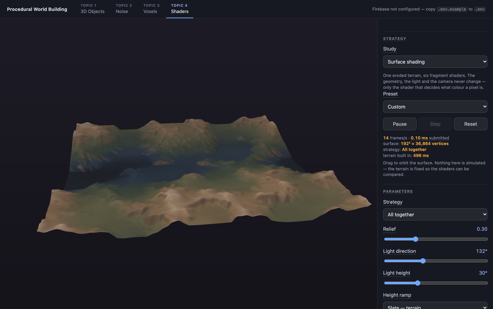

## Contents

- [Visual language](#visual-language) — two registers, and what was wrong with the first attempt
- [Surface shading](#surface-shading) — one terrain, six fragment shaders
- [The machine](#the-machine) — what the four simulations have in common
- [Water ripples](#water-ripples) — the wave equation, and a measured stability limit
- [Reaction–diffusion](#reactiondiffusion) — two chemicals, and the patterns behind coral
- [Hydraulic erosion](#hydraulic-erosion) — Topic 2's erosion, reimplemented because droplets cannot be parallel
- [Fish schooling](#fish-schooling) — Reynolds' rules, one fish per texel
- [Notes](#notes) — the decisions, and the four bugs that cost the most

## Visual language

The page carries two registers, because it shows two different kinds of thing.

**Dusk after dark** for anything lit in 3D — the shading study and the school.
Warm key `#E8D6BC`, shadows tinted lavender `#4A4657` rather than crushed, on a
warm ink ground `#201D1A` falling to `#181613`. Warm light against a cool
shadow is the arrangement carrying the form; the ground sits on the light's
side of it. An earlier version put the ground on the shadow's side —
`#1C1A24`, violet — and every surface standing on it was warm, so the page was
in opposition to itself.

**Slate and chalk** for the flat field views, which are maps rather than
photographs. Blue-grey board `#22242A`, contour lines in chalk `#E6E0D4`, ramps
weighted toward the dark end. There is almost no lighting model here on
purpose: colour carries the value, not light.

### A dark ground is not what made the first version look like plastic

The original shaders were dark, and read as wet sci-fi plastic. Three things
caused that, and only one of them was the darkness:

| | Before | Now |
| --- | --- | --- |
| Background | near-black `#0C141F` | `#201D1A`, dark but with hue and lightness |
| Specular | `pow(dot(n,h), 64)` at full strength | `pow(dot(n,h), 16)` capped at 0.035 |
| Diffuse | `max(dot(n,l), 0)`, terminating at an edge | wrapped: `dot(n,l) * 0.5 + 0.5` |

The tight specular exponent is what made every surface read as varnished. The
clamped diffuse gave a hard terminator where a matte surface wants a broad
gradient. And on *near*-black, anything at all glows by contrast — which is the
part people read as neon. Giving the ground a hue and a few percent of
lightness fixes it without giving up the dark.

### The two rules a dark ground adds

**The shadow tint is the floor, and the background sits below it.** In a light
scheme shadows are darker than the page. Inverted, a shadow darker than the
background dissolves the silhouette into it, so the ambient term is held
clearly above the ground.

**The lighting term has to reach past 1.** Albedo times a light that peaks
below 1 always darkens, which is harmless on a light ground and sinks every
surface into a dark one. The key is therefore a *gain* slightly above unity —
`#E8D6BC × 1.22` — rather than a colour multiplied straight in.

A third rule applies only to the filled views. **A map has no background**: the
ramp *is* the ground, so a ramp balanced around its midpoint fills the frame
with mid-tones and the board never shows. The slate terrain ramp keeps most of
its range in slate and dark sage, holding chalk back for the summits.

**The lighting maths runs in gamma space, deliberately.** Colours are authored
as sRGB and written straight to the framebuffer without converting to linear
light and back. That is not physically correct. It is also the point: lighting
in gamma space compresses the shadow end, which is exactly the flat, chalky
falloff this look wants. Doing it properly produced a deeper, more contrasty
image that drifted straight back toward the material this palette exists to
avoid.

## Surface shading

Six fragment shaders over one surface. The geometry, the light and the camera
are identical in all six — everything that differs is the answer to "what
colour is this pixel?".

The terrain is not simulated here. It is built once at startup by **Topic 2's
own droplet erosion**, run over a six-octave fBm stack at 192², and then held
still. Raw fBm is too blobby for a slope-based material to find anything
interesting; erosion puts real ridges and valley walls in it. The surface is
36,864 vertices and takes about 570 ms to build.

| Matte / diffuse | Height palette |
| --- | --- |
|  | 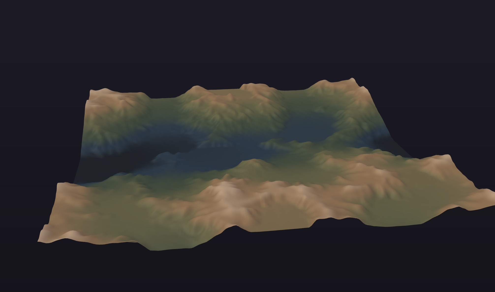 |
| One clay colour, lit only. No palette, no texture, no rim. The baseline every other strategy is a change from, and the only one where the form does all the work — which makes it the one to sweep the light direction on. | Albedo comes from elevation through a colour ramp, with the lighting unchanged. The two read as the same landscape in different materials, because that is exactly what they are. |

| Slope material | Procedural noise |
| --- | --- |
| 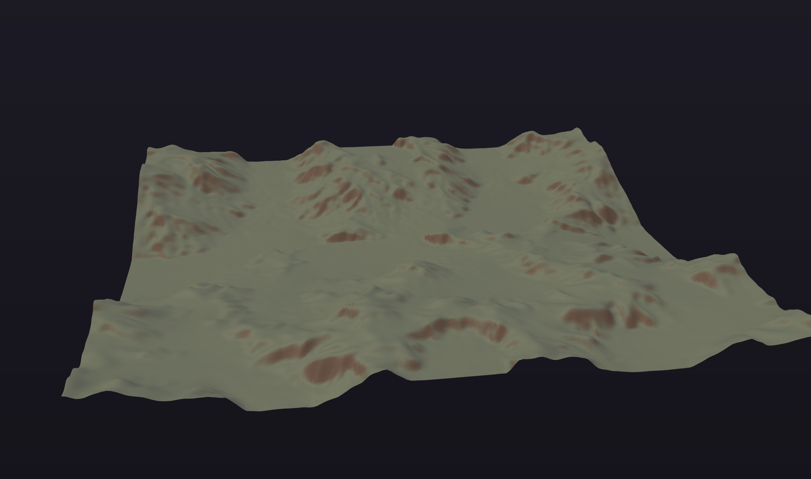 | 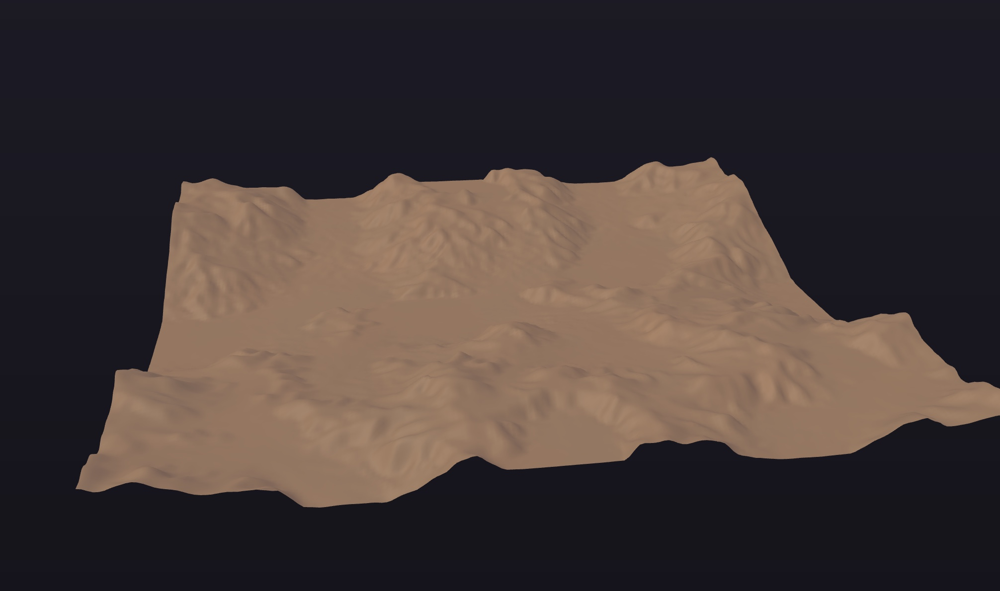 |
| Albedo from the *normal* rather than the position: flat ground is sage, anything past about 25° becomes bare earth. This is how grass-and-rock materials are usually driven, and it needs no texture and no authoring — the geometry already knows which faces are cliffs. | Three octaves of value noise in world space, moving the albedo between two close colours. Deliberately weak: it exists to stop large faces reading as flat vinyl, not to add pattern. Turn the amount up to find where it stops being a material and becomes a texture. |

| Fresnel / atmosphere | All together |
| --- | --- |
| 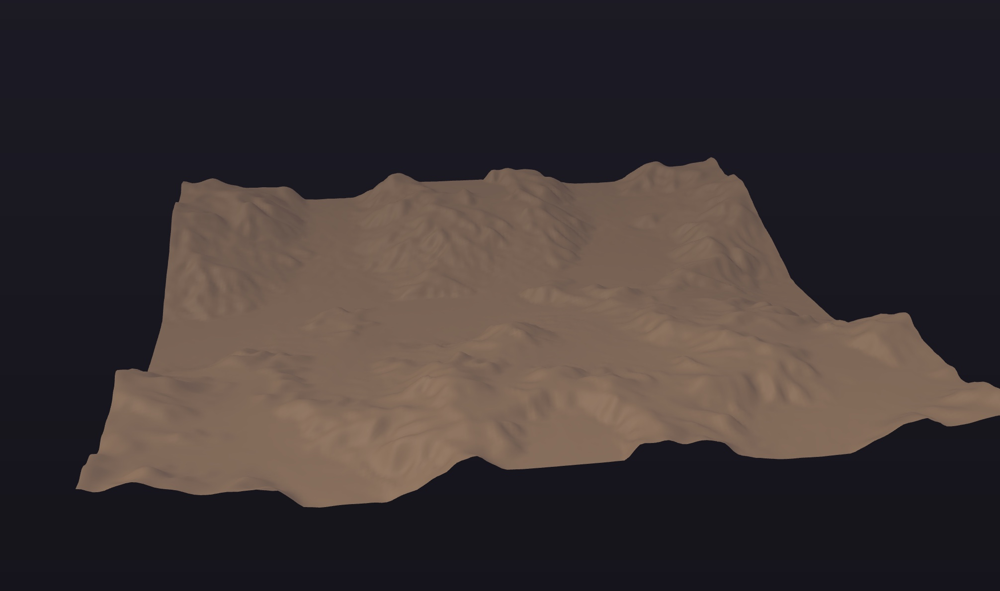 | 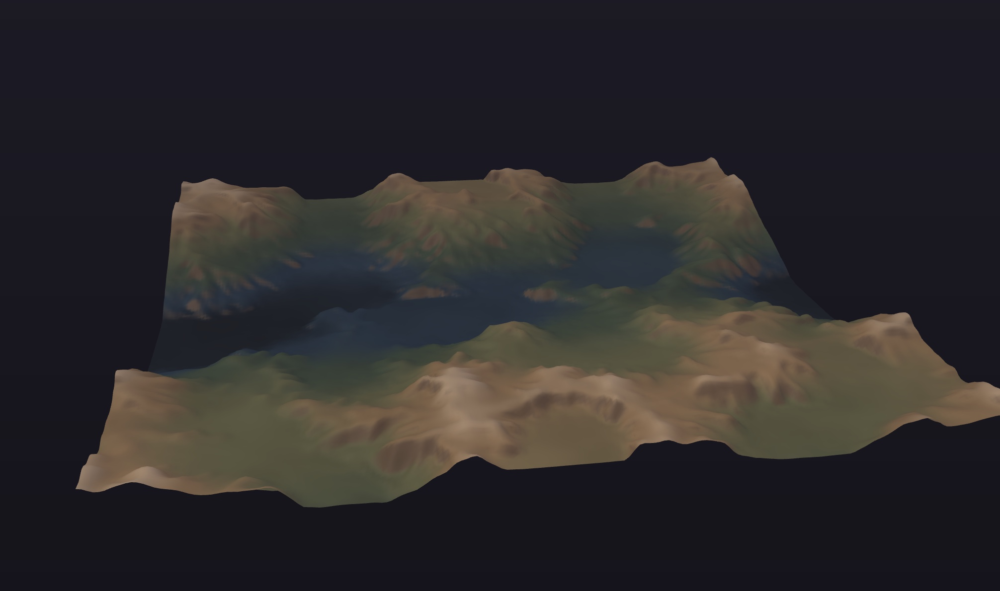 |
| Grazing faces sink *toward* the background rather than picking up sky colour, and distance fades the surface into it. Inverted from the usual additive rim on purpose: against a dark ground, adding light at the silhouette reads as a light source however faint it is, and puts the whole image back into sci-fi territory. Here the edge recedes instead, which is the same technique doing the opposite job. | Every technique layered in the order they are normally applied — elevation, then slope, then noise, then lighting, then rim and haze. Each of the five above is this with one term removed. |

**Relief is a uniform, not geometry.** The vertex shader samples the height
texture and derives the normal from its neighbours, so the surface can be
flattened to a plate or pushed into mountains without rebuilding 36,864
vertices on every movement of the slider.

## The machine

"Shader" means two different things and only one of them is a simulation.
**Shading** decides what colour a pixel is. **Simulation on the GPU** is where
the shader *is* the model: the state lives in a floating-point texture, and one
step is a full-screen quad drawn through a fragment shader that reads the old
state and writes the new one.

A texture cannot be read and written in the same draw, so every field keeps two
render targets and swaps them after each pass — ping-pong. That single
constraint is what [`src/gpu/core.ts`](../../src/gpu/core.ts) exists for:

```ts
field.texture   // read the current state
field.target    // write the next one
field.swap()    // and they trade places
```

All four simulations are that three-line dance, repeated. What differs is the
fragment shader in the middle and how many passes one step takes.

| | Grid | Passes per step | State per cell |
| --- | --- | --- | --- |
| Water ripples | 512² = 262,144 | 1 | height, previous height |
| Reaction–diffusion | 512² = 262,144 | 1 | chemical A, chemical B |
| Hydraulic erosion | 256² = 65,536 | 5 | ground, water, sediment, + 4 outflows |
| Fish schooling | up to 96² = 9,216 agents | 2 | position, velocity |

The state textures are `NearestFilter` throughout, and deliberately: a
simulation cell holds a value, not a sample of a smooth image, and linear
filtering would quietly diffuse state between steps. The one place that is
wrong is discussed under [erosion](#hydraulic-erosion).

**Where the colour ramps come from.** Reaction–diffusion and erosion both map
their field through one of Topic 2's palettes. Those are interpolated in OKLab
on the CPU in `palette.ts`; the 256-entry result is uploaded as a lookup
texture and sampled in the shader. That is cheaper than redoing OKLab in GLSL
and it guarantees that the same value reads as the same colour on both pages.

## Water ripples

The discrete wave equation, ∂²h/∂t² = c²∇²h, written as a three-term
recurrence: the next height comes from this one, the previous one, and the
Laplacian. Two states have to be in flight at once, so the texture carries the
height in R and the previous height in G.

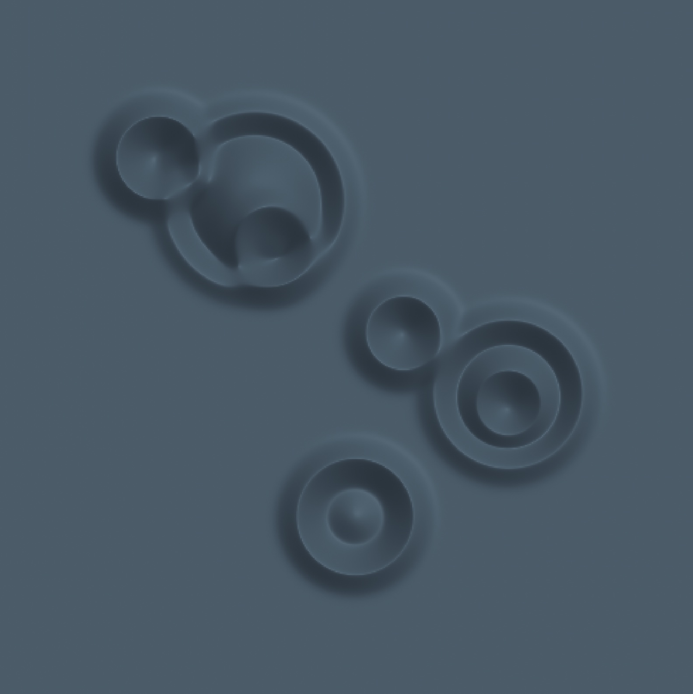

Click or drag to add a Gaussian impulse. The rings reflect off the edges
because the field is `ClampToEdge`, which makes the outside neighbour a copy of
the border cell — the gradient across the wall is zero, which is a reflecting
(Neumann) boundary. Nothing was written to make that happen; it falls out of
the wrap mode.

### The stability limit is the interesting part

`Wave speed` is the Courant number C = c²Δt²/Δx², and it is the one control on
this page that can *break* a simulation rather than change it. Above the CFL
limit a wave advances more than one cell per step, the five-point stencil can
no longer see where it came from, and the field diverges.

The page reports peak amplitude, so that limit can be measured instead of
quoted. With damping off, dropping one impulse and running about 300 steps:

| Wave speed C | Peak amplitude | |
| --- | --- | --- |
| 0.300 | 1.76 | stable |
| 0.450 | 3.43 | stable |
| 0.490 | 1.61 | stable |
| **0.500** | **3.17** | **stable** |
| **0.510** | **4.4 × 10³⁰** | **diverged** |
| 0.550 | overflow | diverged |
| 0.700 | overflow | diverged |

The theoretical CFL bound for this scheme in two dimensions is exactly **1/2**,
and the measurement brackets it between 0.500 and 0.510 — the resolution of the
slider. The **Past the CFL limit** preset sits at 0.72 so the failure can be
watched happen; Reset brings it back.

### The same state, shaded two ways

`Shade as data` swaps only the display shader while the simulation keeps
running. Left, the height shaded as a water surface from its own gradient;
right, the signed height straight through a diverging ramp. The simulation is
byte-for-byte the same in both.

| Shaded as a surface | Shaded as data |
| --- | --- |
|  | 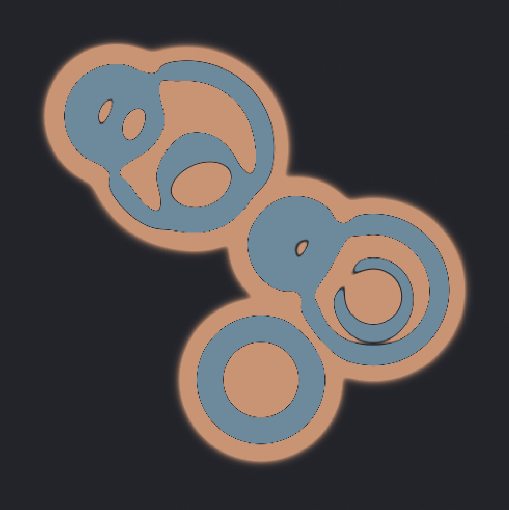 |

This is the clearest demonstration on the page that shading and simulation are
separate jobs that happen to be written in the same language.

## Reaction–diffusion

Two chemicals on a grid:

```
A' = A + (Da∇²A − AB² + f(1−A)) Δt
B' = B + (Db∇²B + AB² − (f+k)B) Δt
```

B consumes A to make more of itself — the AB² term, which is why B needs a seed
to exist at all. Feed `f` replenishes A; kill `k` removes B. That is the whole
model, and nothing in those two lines knows what a stripe is.

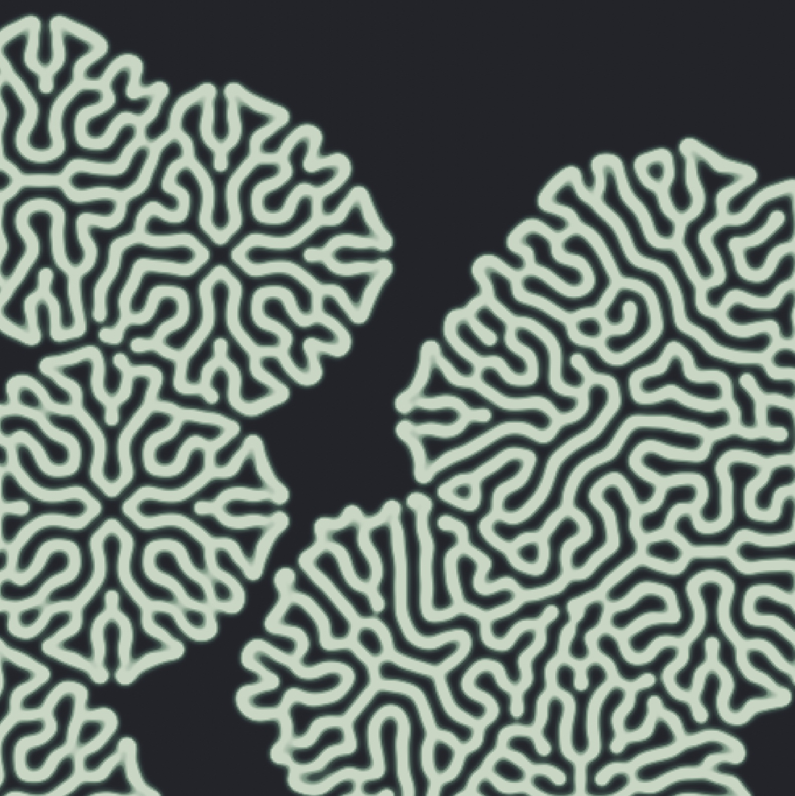

This is Turing's 1952 result, and it remains the best explanation for how coral
and fish skin get their markings — which is why it belongs in this project
rather than being a pretty aside. Paint with the pointer to seed more B.

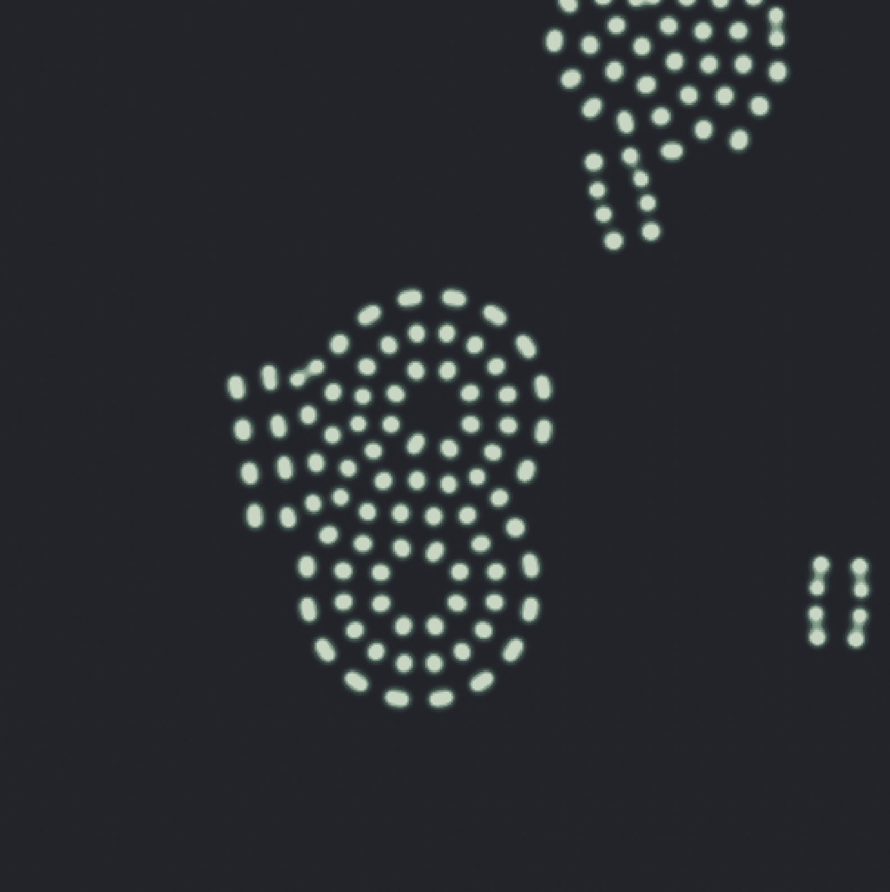

The **Mitosis** preset (f 0.0367, k 0.0649), about 10,000 steps in: blobs grow
to a size, split, and the daughters push each other into a hexagonal packing.
Nothing in the model asks for hexagons; it is the densest arrangement of
mutually repelling discs, so it is what the system finds.

**The interesting region is narrow.** Moving kill by 0.002 can turn a growing
coral into a static blob or kill the field entirely. That sensitivity is the
point of having presets, and it is worth deliberately falling off the edge of
one to see how abruptly it happens.

One implementation note: the Laplacian here is the **nine-point** stencil, not
the five-point one the wave equation uses. A five-point Laplacian is anisotropic
enough that the patterns visibly align to the grid axes; the diagonal terms are
what make them look organic.

## Hydraulic erosion

Topic 2 erodes with **droplets**: each one walks downhill carrying sediment,
modifying terrain the next droplet will see. That is inherently serial — the
result depends on the order they ran — and a GPU cannot do it.

So this is not a port of [`erosion.ts`](../../src/erosion.ts). It is a
different algorithm chosen for the same job: the **virtual-pipe model**, where
every cell holds a water depth and an outflow to each of its four neighbours,
and all cells update at once from the previous state alone. Flow emerges from
pressure differences between neighbours rather than from a path being walked.

One step is five passes, in order, because each depends on the last:

1. **rain** — add water, and whatever the pointer is pouring in
2. **flux** — height differences decide outflow, scaled to the water that exists
3. **hydraulic** — move the water, then erode or deposit against capacity
4. **transport** — carry sediment along the flow, evaporate, drop the load
5. **thermal** — material above the talus angle slides downhill

| The fBm terrain it starts from | After ~2,800 steps |
| --- | --- |
| 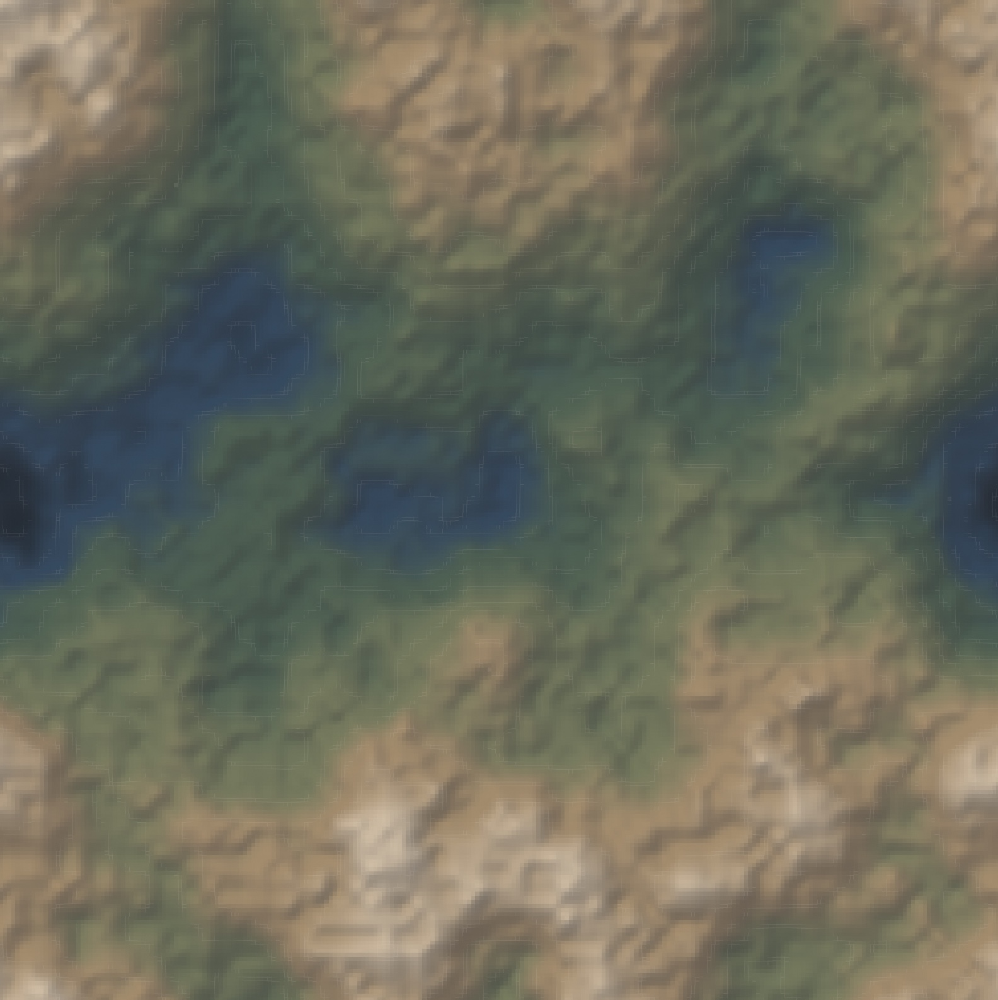 | 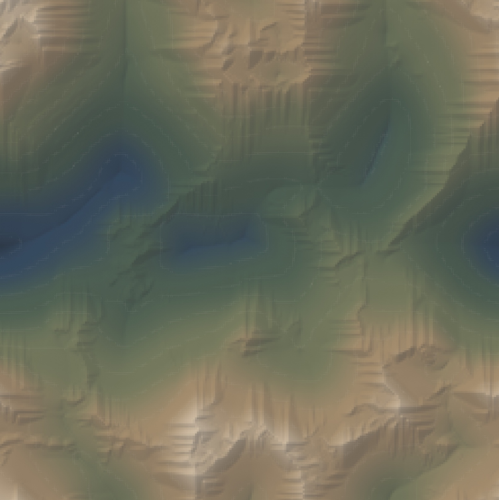 |

The starting ground is the same six-octave fBm stack Topic 2 opens on, built by
`compositeLayers` and uploaded as a texture — so the two topics are eroding
literally the same terrain by two different methods.

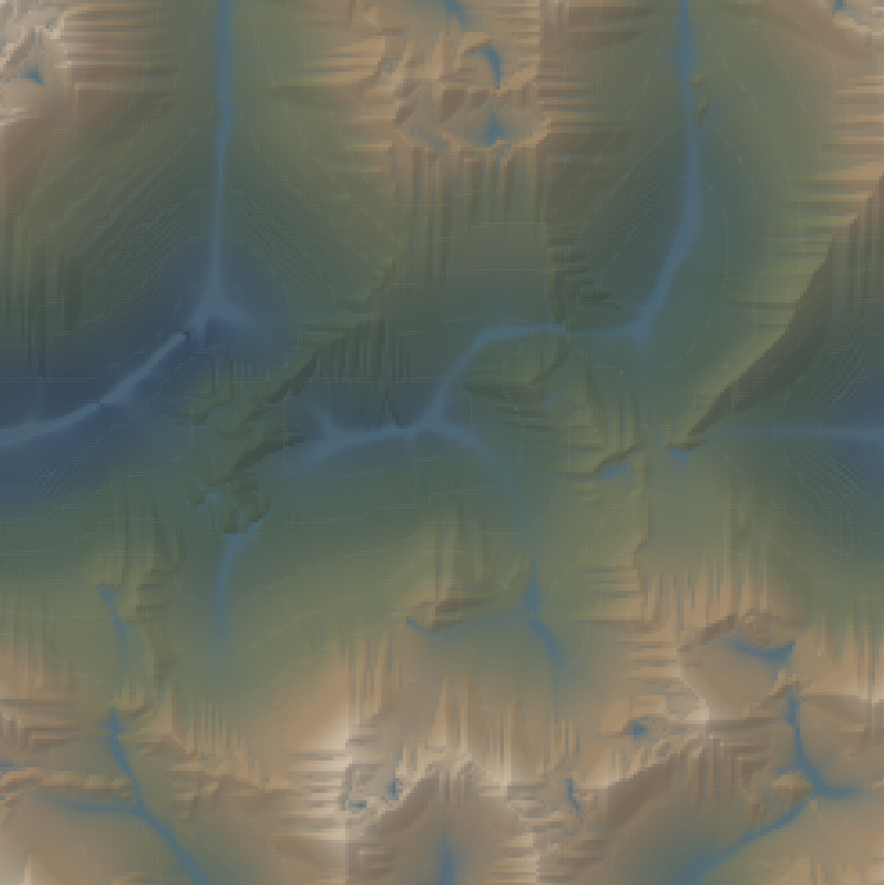

With **Show water** on, the connected drainage network is visible directly:
standing water in blue, suspended sediment in brown. Uniform rain carves a
whole network at once, which is the thing droplet erosion cannot do in a single
pass. Paint rain onto one ridge and only that side develops.

### Mass conservation, measured

Nothing leaves the domain — the flux pass seals the borders — so ground plus
suspended sediment is a closed system and their total must hold steady. The
page measures it, and every wrong version of this simulation was found that
way rather than by looking at it. After the fixes below, drift is at most
**0.001% over runs of 4,600–5,900 steps**.

### What it does not do

With no outlet and no uplift, a long enough run grades the whole landscape to
base level — a smooth basin. That is the correct end state for a closed system,
not a bug, and it is why a real terrain generator adds an outlet at the
boundary or tectonic uplift underneath. The interesting phase here is the first
few thousand steps.

Some **grid anisotropy remains**: slopes carry faint stripes aligned to the
axes, because a four-neighbour pipe model can only move water along four
directions. Friction and thermal slippage reduced it a great deal (see the
notes) but did not remove it. An eight-neighbour flux would do better.

## Fish schooling

Reynolds' three rules — separation, alignment, cohesion — with every agent
living in one texel. Position is one texture and velocity another; one fish is
one pixel in each. A step is two passes: new velocity from the rules, then new
position from that velocity.

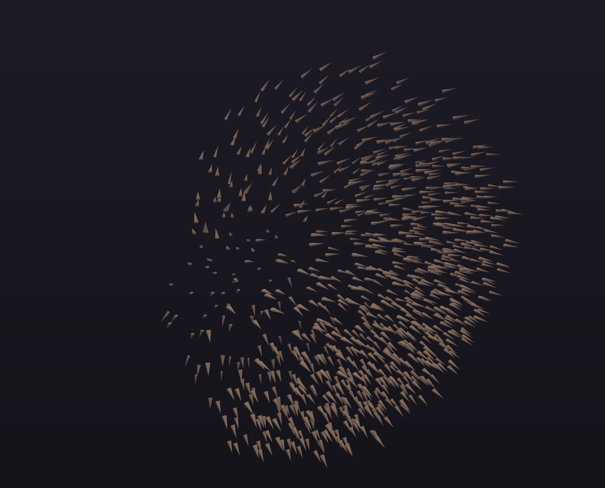

Hold the pointer in the school and it becomes a predator: the fish part around
it and close again behind. The cursor is a ray, not a point, so the predator is
placed at the point on that ray closest to the origin — which puts it inside
the school rather than on the glass in front of it.

### The cost is the point

Each fish reads **every** other fish, so the work is O(N²):

| School | Neighbour tests per step |
| --- | --- |
| 256 | 65,536 |
| **1,024** (default) | **1,048,576** |
| 2,304 | 5,308,416 |
| 4,096 | 16,777,216 |
| 9,216 | 84,934,656 |

Raising the school size four steps multiplies the work by 1,296. Production
crowd systems use a spatial grid so each agent only tests nearby ones; here the
brute-force version is deliberate, because it is what makes the rule legible
and the wall measurable. The readout reports the tests per step, so the cost
can be watched rather than described.

A GLSL detail forced by that loop: in GLSL ES 1.00 the bounds of a `for` must
be compile-time constant, so the school size cannot be a uniform. The velocity
shader is **rebuilt** whenever the count changes.

## Notes

**Play and Step are disabled on the shading study.** It declares
`accumulates: false` — its terrain is built once at startup and held — so there
is no state to advance and the two controls did nothing on that one study while
looking live. Reset stays, because it still re-centres the camera. The page also
opens paused now, so a simulation starts when it is asked to rather than being
several hundred steps from its initial condition before you have looked at it.

**`step` advances state; `draw` presents it.** The frame function calls `step`
only while the simulation is advancing, and `draw` every frame. Anything a
control changes about *appearance* therefore has to be written in `draw`, or it
never reaches the GPU while paused.

The shading study got this wrong: it wrote every shader uniform — strategy,
relief, light direction, noise, Fresnel, haze — inside `step`. Paused, moving
those sliders updated their labels and changed nothing on screen. `ramp` was
already in `draw`, which is why exactly one control appeared to work and the
rest looked broken. All of them now live in `draw`, and `step` is empty, which
is the honest shape for a study that declares `accumulates: false`.

The turntable moved with them. Spin is a View control, so it has to turn
whether or not a simulation is running — and this study never runs one. Left in
`step` it froze the moment the page defaulted to paused, while `animating()`
still reported movement, so the loop drew 60 unchanging frames a second.

The four real simulations already split correctly: ripples keeps speed and
damping in `step` and relief in `draw`, and the others follow the same line.


**Droplets are not parallelisable, so the algorithm changed.** Keeping the
droplet model and running many droplets at once would have them writing to the
same cells in the same step with no defined order. The pipe model was chosen
because it is a *field* update — every cell reads its neighbours and writes
only itself — which is the shape a fragment shader can express at all. The
honest summary is that "port the erosion to the GPU" was not possible; only
"solve the same problem again, differently" was.

**The border leaked mass, and it was enormous.** `ClampToEdge` does not report
that a neighbour is outside the domain — it hands back a copy of the cell
asking. In the transport pass that meant every border cell received its own
outflow as inflow, duplicating it once per step. A ring one cell wide sounds
negligible; measured, it ran total mass to **+890% over 4,400 steps**, because
the extra material deposits, erodes again and compounds. Explicit guards on all
four directions took drift to +0.001%. This was invisible in the picture —
the terrain just looked wrong — and obvious the moment there was a number.

**Semi-Lagrangian advection is stable but not conservative.** The first
transport pass asked where the material now here came from and sampled the load
upstream. That is unconditionally stable, which is why it is the standard
choice for fluids — but two cells can sample the same upstream cell and
duplicate its load, and a cell nothing samples loses its own. With erosion
feeding sediment in continuously the drift ran one way and the interior sank.
Moving sediment as shares of the same flux the water uses makes what leaves a
cell exactly what arrives next door.

**Evaporating water was keeping its load.** The other half of the same leak:
depth was multiplied by (1 − evaporation) while the suspended sediment was left
untouched, so ground turned into suspended sediment and never came back.
Sediment now drops in proportion to the water lost.

**The published pipe model is frictionless, and that is what combed the
terrain.** Flux changes only by the height difference between neighbours, so
once water is moving nothing stops it and a pair of cells trades the same water
back and forth indefinitely. Each of those sloshes erodes a little, on
alternating cells, and it accumulated into a one-cell comb texture over the
whole field. Thermal slippage could *hide* it; only adding friction to the flux
removed it. Default 0.95; set it to 1.0 to watch the comb come back.

**A safety clamp became the behaviour.** Per-step erosion is capped so a single
step cannot cut a pit. Tuned so that the cap bound most cells, every cell
eroded the same fixed amount per step — which is uniform lowering, not channel
cutting, and the whole landscape sank while the channels washed out. A clamp
has to stay a clamp: carrying capacity is now set so ordinary cells fall below
it.

**A reset that reseeds makes a sweep meaningless.** Erosion's Reset originally
generated a new landscape each time, so two parameter settings were compared on
two different terrains — which invalidated a whole sweep before it was noticed.
Reset now returns the same ground deliberately.

**The frame rates in the app are real; the ones measured here were not.**
Headless Chrome in this environment falls back to SwiftShader, a software
rasteriser, with or without the ANGLE flags — so no figure on this page is a
GPU measurement, and none is quoted as one. The numbers that *are* quoted —
grid sizes, pass counts, neighbour tests, mass drift, the CFL threshold — are
properties of the algorithms and do not depend on the hardware. For real
throughput, read the frames/s the page prints on your own machine.

**What the readout means.** The millisecond figure is wall-clock time spent
*issuing* a frame's work, not GPU kernel time: a driver returns from a draw
call long before the hardware has finished it. It measures how much work the
page hands over, which is why it stays small even when the frame rate does not.

**A contour of a rough surface is a scribble, not a line.** The paper register
draws ink contours at eleven elevation bands. Taken from the raw field they
broke into hatching across the whole map, because the eroded terrain carries
cell-scale roughness and every band boundary crossed it dozens of times.
Averaging the elevation over nine taps first turns them back into lines —
though the grid anisotropy the pipe model leaves behind still shows through
them on steep ground, which is the same limitation noted above wearing
different clothes.

**`half` is a reserved word in GLSL.** The dusk lighting model named its
halfway vector `half`, which compiles fine as far as any TypeScript tooling is
concerned and fails at shader compile time with `Illegal use of reserved word`.
Typecheck, lint and build were all green while the page rendered nothing —
a reminder that GLSL inside a template literal is an untyped string as far as
the rest of the toolchain is concerned, and only the browser can check it.

**Paper grain is expensive to store.** The per-pixel grain that makes the flat
views read as print is, to a PNG encoder, noise: it defeats run-length
compression almost completely. The fourteen Topic 4 figures came to 17 MB as
PNG and 6.7 MB as JPEG at quality 88, with no visible difference at any size
they are displayed at. Continuous-tone renders belong in a lossy format;
screenshots with UI text still do not.

**The page was drawing frames nobody could see.** Every viewport in the app
ran an unconditional `requestAnimationFrame` chain, so a paused simulation and
a motionless shading study both issued a full-screen pass per frame producing
an image identical to the previous one. Measured per second while idle: 295
draw calls on Topic 1, 59 on a paused Topic 4, 39 on Topic 3. All three are 0
now. The loop also caps at 60 fps, which on a 120 Hz display halves everything
on its own.

Two things made it harder than it sounds. The shading study is modelled as a
simulation by the page but accumulates nothing — its surface is built once and
held — so `running` being true was keeping it awake forever; it declares
`accumulates: false` and lets `animating()` speak for the spin instead.
And `OrbitControls.update()` reports movement down to its own 1e-6 epsilon,
which under damping kept a loop awake for hundreds of frames after a drag,
rendering motion orders of magnitude below a pixel. Gating on a threshold the
eye can resolve brings an orbit's coast-down to a measured 76 frames — about a
second and a third at 60 Hz.

Two things did not need fixing. Only the active page exists at all: `App.tsx`
renders one entry of `PAGES`, so leaving Topic 4 unmounts the viewport, cancels
the loop, disposes the simulation and destroys the WebGL context — nothing
keeps stepping in the background. And the browser already stops a hidden tab:
measured on Topic 4 with a second tab in front, `requestAnimationFrame` fired
0 times per second and issued 0 draw calls, against 39 draw calls per second
with the tab in front. A `visibilitychange` handler would be duplicating that.
What the browser keys on is visibility, not focus — the same measurement ran
with `document.hasFocus()` false throughout — which is the behaviour you want,
since a window you can see but have not clicked should still animate.

The full accounting — including the measurement showing that for three of the
four simulations the display pass costs more than the simulation, and the one
showing that lowering the pixel ratio buys frame rate rather than energy — is
in [Energy and idle cost](../analysis/energy-and-idle-cost.md).

**Simulations are not React components.** Each owns WebGL resources and a
stepping loop, and rebuilding one on a re-render would drop exactly the state
it exists to accumulate. The page holds one at a time and disposes it on the
way out; the renderer and the animation loop outlive every swap, because a
WebGL context per strategy would leak contexts and browsers cap how many may
exist at once.
