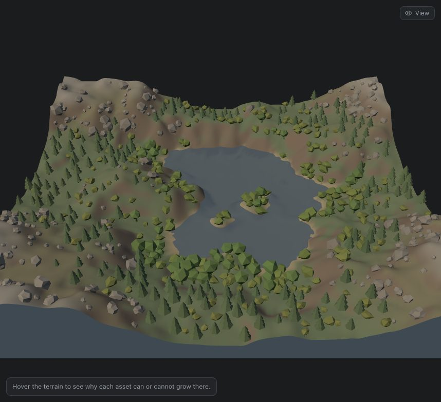
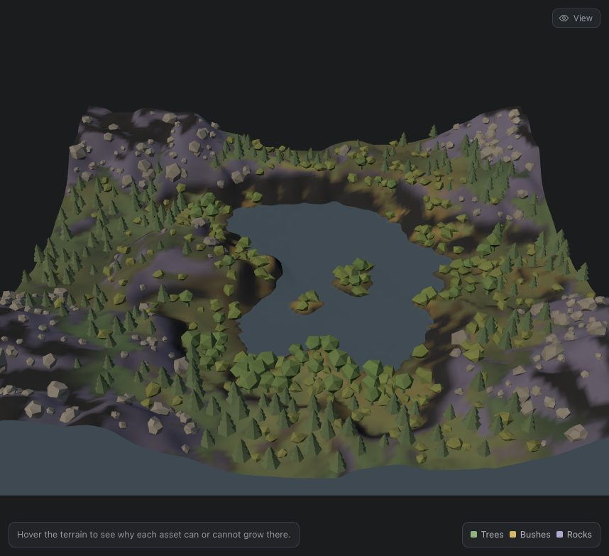
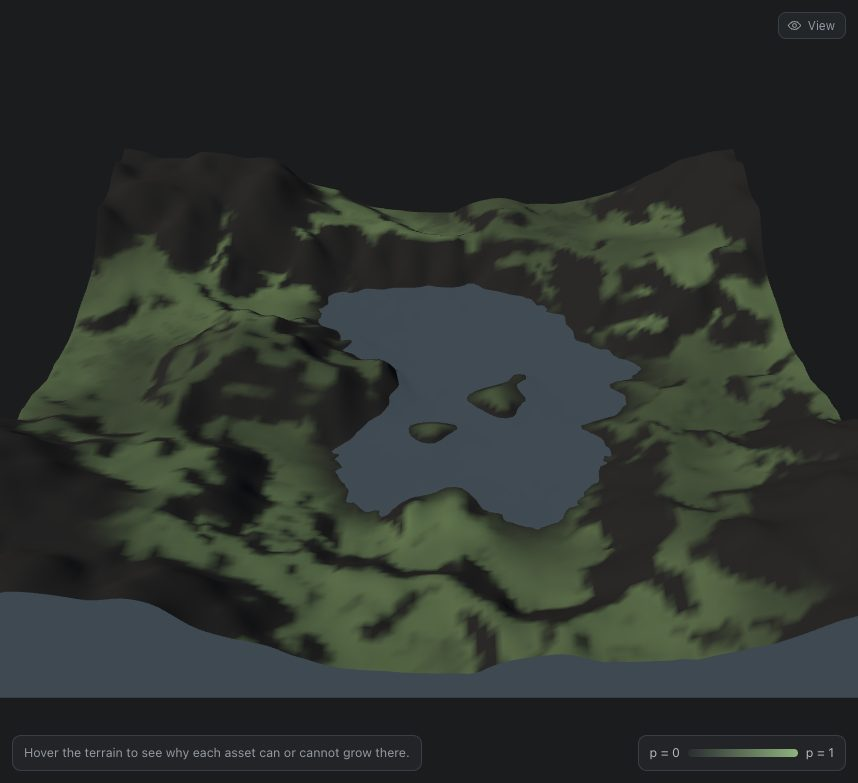
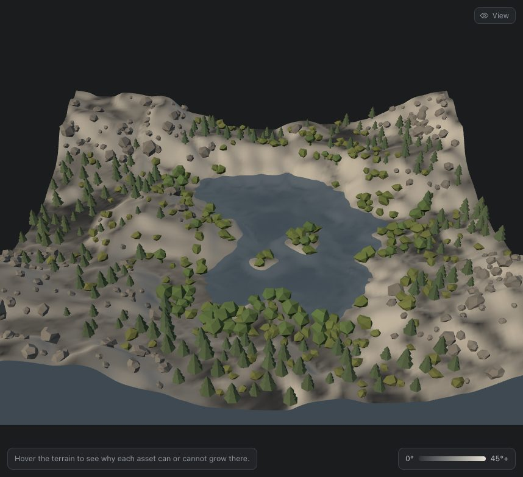

# Topic 5 — Distributions

Jessica Hsiao · Procedural World Building

A scattering study. One small eroded terrain, three asset layers — trees,
bushes, rocks — and a rule per layer that turns the ground at a point into a
probability. The subject is *where things appear*, not what they look like:
the assets are a few dozen triangles each, and every one of them stands where
it does for a reason the page can print.

[← back to the README](../../README.md) · [study notebook index](../README.md)


## Contents

- [What is on the page](#what-is-on-the-page)
- [The ground](#the-ground) — what a rule can ask about a point
- [A rule is a product of factors](#a-rule-is-a-product-of-factors)
- [The three layers](#the-three-layers) — and what they measurably did
- [From probability to instances](#from-probability-to-instances)
- [Variation](#variation) — size, rotation and colour from the ground
- [Debug views](#debug-views)
- [Notes](#notes)

## What is on the page

| Control | What it does |
| --- | --- |
| **Layers** | One density per asset type, scaling its whole probability field |
| **Rule** | Pick a layer, then edit its slope window, elevation band, water influence and clustering |
| **Debug view** | Paint the terrain with any layer's probability, all three at once, or one of the three input fields |
| **Seeds** | Terrain seed (rebuilds the ground) and scatter seed (re-rolls the dice); **Regenerate** steps the scatter seed |
| **Hover** | The probe under the viewport prints every factor of every rule at the point under the pointer |
| **View** | Hide the assets to read a mask cleanly, or hide the water |

The probe is the part to demonstrate. Hover a valley floor and the tree row
reads `1 · 1 · 0.83 · 0.48 → 0.30`; move up a valley wall and the slope column
turns red at 0 and every probability after it collapses. A rule refusing a
point always says *which* question refused it.

## The ground

The terrain is Topic 2's machinery at 129²: a five-octave value-noise stack,
carved by two droplets per vertex of the gentle *River valleys* erosion preset,
10 world units across and 1.8 tall. Erosion is not decoration here. Raw fBm has
one broad hump of slopes and no landforms, so a slope rule run over it picks
out a speckle; erosion cuts real valley floors and real valley walls, which is
what a rule needs to tell apart. It builds in 84–107 ms.

Three fields are computed once per vertex and read back bilinearly:

| Field | How |
| --- | --- |
| **Elevation** | Height above the waterline, normalised so 0 is the shore and 1 the summit |
| **Slope** | Degrees from horizontal, by central differences |
| **Distance to water** | A two-pass 3–4 chamfer distance transform from every flooded vertex, in world units. At most about 8% off true Euclidean distance, and two linear passes instead of a search per vertex |

**The waterline is a quantile, not a height.** Every seed floods exactly its
lowest 16%. A fixed level drowned one seed and left the next dry, and "near
water" would have meant something different on each.

**The relief was chosen from a measurement.** At 2.4 units tall the median
slope came out at 24–30° across four seeds — so steep that "trees prefer flat
ground" had almost no flat ground to prefer. At 1.8 it is 18.5–23.3°, with a
75th percentile of 25–34°, and the rule defaults below are set against those
numbers rather than chosen by eye.

## A rule is a product of factors

```
p = density × elevation × slope × water × patch   [× sparse, rocks only]
```

Every factor is 0–1 and answers one question about the ground:

| Factor | Question | Shape |
| --- | --- | --- |
| elevation | Is this inside the layer's height band? | 1 inside `[min, max]`, smoothstepped to 0 over 0.06 either side |
| slope | Is this inside the layer's slope window? | The same, over 4° |
| water | How does this layer feel about water? | `near = e^(−d / 1.2)`; positive influence *w* gives `1 − w + w·near`, negative gives `1 + w·near` |
| patch | Is this inside one of the layer's clusters? | Two octaves of value noise, smoothstepped, blended in by the clustering amount |
| sparse | Has vegetation already claimed this? | `1 − 0.75 × max(p_tree, p_bush)` |

**A product, not a sum,** because each factor is a veto. With a weighted sum, a
perfect elevation could buy a tree onto a cliff. **Soft edges, not
thresholds,** because a hard cutoff draws the threshold on the ground as a
line where instances stop dead — which reads as a rule, not as growth.

## The three layers

| | Trees | Bushes | Rocks |
| --- | --- | --- | --- |
| Slope window | 0–22° | 0–30° | 24–70° |
| Elevation band | 0.04–0.62 | 0–0.50 | 0.30–1.05 |
| Water influence | +0.35 | +0.85 | −0.40 |
| Clustering | 0.55, large patches | 0.70, small clumps | 0.25 |
| Candidate spacing | 0.20 | 0.13 | 0.17 |

Trees stop just above the terrain's median slope, so they take the flatter
half; bushes reach about its 75th percentile; rocks start a little above the
median and run to the cliffs.

**Measured, the layers separate the way the rules say they should.** Mean
ground under each placed instance, default rules, scatter seed 1:

| Terrain seed | Trees | Bushes | Rocks | Mean slope T / B / R | Mean distance to water T / B / R |
| --- | --- | --- | --- | --- | --- |
| 1 | 250 | 298 | 164 | 14.6° / 20.0° / 29.3° | 1.67 / 0.99 / 2.34 |
| 2 | 218 | 175 | 222 | 12.7° / 19.0° / 32.0° | 2.16 / 1.19 / 1.83 |
| 3 | 240 | 253 | 214 | 13.8° / 17.6° / 32.6° | 1.72 / 1.06 / 2.48 |
| 7 | 166 | 216 | 317 | 13.4° / 18.4° / 36.0° | 1.84 / 1.07 / 2.11 |

On every seed the slope ordering is trees < bushes < rocks and the bushes are
the layer closest to water — the two orderings the brief asked for, produced
rather than placed.

| Natural | All three probability masks |
| --- | --- |
|  |  |
| The default scatter on terrain seed 3. Forest on the valley floors, bushes crowding the lake, rocks on the rim. | The same scatter over all three probability fields: green trees, ochre bushes, lavender rocks. The dark band between the forest and the rim is ground where every layer is vetoed — steeper than trees allow, too low for rocks. |

## From probability to instances

**Candidates come from a jittered grid.** Each layer lays a grid at its own
spacing and jitters every point inside its cell. Uniformly random points clump
and leave holes by chance, and those clumps would be read as the *rule*
clustering — exactly what the page is trying to show honestly. The grid bounds
density from above; the probability decides what share of it survives.

**A candidate is kept** when a seeded uniform draw falls under its probability,
and nothing already placed is within the two keep-out radii. Trees go first,
then bushes, then rocks, so the order is also a priority: a bush cannot land in
a trunk.

**Each layer draws from its own seeded stream, four draws per candidate whether
kept or not.** Sharing one stream, a change to the tree rule would shift every
number the bushes and rocks drew afterwards, and moving one slider would
reshuffle all three layers — noise, not a rule changing. Separate streams and a
fixed draw count mean a slider only ever adds or removes instances where its
own probability crossed the draw.

**Rendering is five `InstancedMesh`es** — two tree silhouettes, one bush, two
rocks — so a scatter of seven hundred instances is five draw calls. Capacity is
the candidate count, which no rule can exceed, so a re-scatter never
reallocates: it rewrites matrices and sets `count`. The geometry is the
Explore worlds' own `propGeometry`, normalised to one unit tall. A full
re-scatter, evaluating all three rules at 11,640 candidates, takes 3–8 ms,
which is why every slider updates live.

## Variation

Random variation alone makes a uniform forest of random trees. Here each
instance's variation is tied to the ground first and to chance second, so the
variation itself says something:

| | Driven by the ground | Then by chance |
| --- | --- | --- |
| **Trees** | Broadleaf in wet lowlands (near water, low elevation), conifers above. Shrink toward the treeline, up to 45%. Drier, more olive away from water; darker and bluer with height | ±30% size, any heading, ±10% lightness |
| **Bushes** | Up to 50% larger at the shore; yellower away from it | ±30% size, any heading |
| **Rocks** | Up to 90% larger on steep ground; paler with height; **tilted to the terrain normal** so they sit on the slope rather than balancing upright on it | Size skewed toward small, two shapes, any heading |

Every base is sunk a little — 4% of the height for plants, 25% for rocks — so
nothing hovers over a slope it only touches at one corner.

## Debug views

| Tree probability | Input: slope |
| --- | --- |
|  |  |
| The tree layer's probability, assets hidden. Black is never, green is certain. The patch noise is what breaks the valley floors into forests and clearings. | One of the three inputs every rule reads. The tree mask is, roughly, the dark half of this image intersected with the patch noise. |

The probability views evaluate the same function the scatter sampled, at every
one of the 16,641 vertices, in about 3 ms. An instance standing off a lit
patch would therefore be a bug, not an approximation — which makes the mask a
test as well as a figure.

## Notes

**The coupling between layers was weaker than designed, and the rule says
why.** Rocks carry a `sparse` term so they take ground the vegetation gives up.
Turning tree density to zero was expected to grow the rocks; measured over four
seeds it grew them by 5–10% (164 → 175, 222 → 243, 214 → 232, 317 → 333) — and
grew the *bushes* by 40–61% (298 → 458 on seed 1). The reason is in the
defaults: the tree slope window ends at 22° and the rock window starts at 24°,
so there is almost no ground both layers want, and nothing for rocks to
inherit. The bushes inherit instead, through the keep-out radius rather than
any rule: trunks were occupying candidate sites. Open the rock rule onto
tree ground — minimum slope 10°, minimum elevation 0 — and the coupling
appears: removing the trees then grows the rocks by 17–32% across the same
four seeds (453 → 598 on seed 1). The term was kept because the brief
asks for it and because it is honest at both settings — but the bigger
interaction between layers turned out to be placement order, not probability.

**The probe went stale under a still pointer.** It computed its factors when
the pointer moved, so dragging a density slider with the pointer parked on the
terrain left the table describing the old rule. The scatter effect now
re-asks the last probed point after every rebuild.

**Variation uses a hash of one draw, not more draws.** Size, colour and shape
need four more random numbers per kept instance. Drawing them from the stream
would make the stream length depend on how many candidates were kept, which is
the reshuffling problem above coming back through a side door.

**Why not Poisson-disc sampling.** It gives the most even candidate set, and
it was the obvious choice. But its point set depends on the order points are
accepted in, so a probability change in one corner can move candidates in
another. The jittered grid is slightly less even and completely local: a cell's
candidate depends only on that cell's draws.

**Saving needs the rules redeployed.** The Firestore rules allow a saved world
only for topics they list, and `distributions` was added to that list in
`firestore.rules`. Until it is deployed (`npx firebase-tools deploy --only
firestore:rules`, see [Firebase setup](../project/firebase-setup.md)) a save
from this page is refused as `permission-denied`. The showcase seeder walks its
own list of the first four topics, so it never tries to write a world into a
topic it was not designed for.
