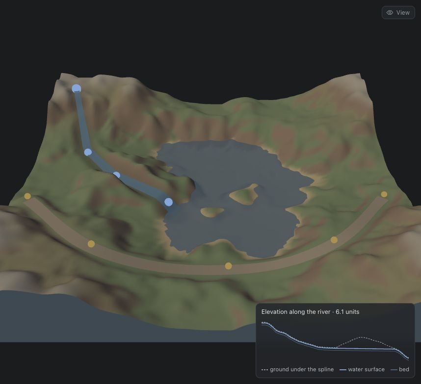
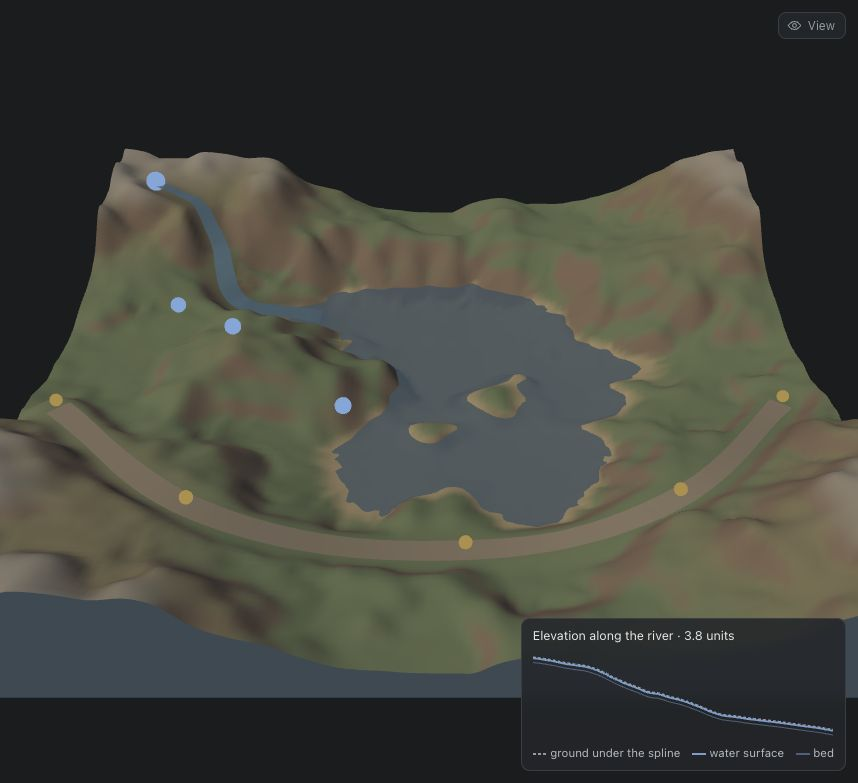

# Topic 6 — Paths

Jessica Hsiao · Procedural World Building

A spline study. Roads and rivers on the same small terrain — up to four of
each — built from the same 2D curve machinery, and deliberately opposite in who
gives way to whom. A road is put where you drag it and the ground is reshaped
to carry it; a river is put where the ground lets it go and only cuts into it.
The page exists to make those two arrows — **terrain → spline** and
**spline → terrain** — visible and adjustable, and with several paths on one
ground, to show what happens where they meet.

[← back to the README](../../README.md) · [study notebook index](../README.md)


## Contents

- [What can be a line](#what-can-be-a-line)
- [What is on the page](#what-is-on-the-page)
- [The curve](#the-curve) — 2D first, height second
- [The road](#the-road) — terrain → spline, then spline → terrain
- [The river](#the-river) — the terrain decides the route
- [Several paths on one ground](#several-paths-on-one-ground) — junctions, causeways, tributaries
- [Seeing the projection](#seeing-the-projection)
- [Notes](#notes)

## What can be a line

Anything whose length matters far more than its width, and whose cross-section
is the same all the way along: roads, rivers, paths, walls, fences, power
lines, hedgerows, ridgelines, coastlines, a railway, a tide mark, a trail of
footprints. Each is cheaper and more controllable as a curve plus a profile
than as geometry, and each has to answer the question this page is about —
does the line follow the ground, or does the ground follow the line? A fence
follows it completely; a railway almost not at all; a road sits in between and
is the interesting case. A river is the odd one out: it is the line that the
ground *produces*.

## What is on the page

| Control | What it does |
| --- | --- |
| **Paths** | Every road and river on the terrain, up to four of each; picks which one the controls edit and the profile chart shows. Clicking a handle selects its path too. **+ Road** and **+ River** add one on a prepared route; **Delete** removes the selected one |
| **Handles** | Drag any control point across the terrain; the path and everything it does to the ground rebuild as you drag |
| **Add point / Remove / Reset** | A new point goes halfway along the longest span, so the curve barely moves when one is added |
| **Road** | Width, embankment falloff, grade smoothing, levelling strength, width variation |
| **River** | Terrain influence, width, depth, bank falloff |
| **Debug** | The 2D spline on a map plane, drop lines to the ground, projected points, centrelines, the raw river trace, and each path's footprint tinted on the terrain |
| **Profile** | Elevation along the active path: the ground under the spline, dashed, against the height the path was built to |
| **View** | Hide all the road or all the river surfaces. Their effect on the ground stays, which is the clearest way to see the cuts, the fills and the channels |

## The curve

Every path starts as points in **plan** — x and z only. A centripetal
Catmull–Rom spline runs through them and is resampled at even arc length,
about 0.06 units apart. Height comes afterwards, from somewhere else.

**Centripetal, not uniform.** Uniform Catmull–Rom overshoots and can loop when
two control points are close and the next is far — precisely what dragging a
handle produces. Centripetal (α = 0.5) does not.

**Even arc length, because everything downstream is per sample.** The grade
smoothing is a moving average over samples; with uneven spacing its window
would be a different length of road in different places.

**Which vertices a path touches** is found segment by segment: for each
segment, only the grid vertices inside its bounding box (grown by the path's
reach) are asked for their distance to it. Each vertex keeps the nearest
distance and a *fractional* sample index, so the path's height and width can be
interpolated at exactly the point it is nearest to. Asking every vertex about
every segment would be 16,641 × ~180 ≈ 3 million tests; the boxes cut it to the
corridor. A full rebuild — every path, then the terrain normals — takes a
median 2.9 ms in Node with the default two roads and two rivers, and 4.8 ms with
four of each: fast enough to rebuild on every frame of a drag.

## The road

```
control points → 2D spline → projected onto the ground → smoothed grade
               → corridor levelled to the grade (cut and fill) → ribbon
```

**Terrain → spline.** The road takes its heights from the ground beneath each
sample — the projection. Raw, that is a profile with every bump of the terrain
in it: on the default route the steepest half-unit stretch rises at **73%**.

**Smoothing the grade.** A three-pass moving average over arc length (close to
a Gaussian) turns the projection into a road a vehicle could drive. Measured
on the default route:

| Grade smoothing | Steepest stretch | Cut | Fill |
| --- | --- | --- | --- |
| 0 (draped) | 73% | 0.203 | 0.148 |
| 0.5 | 50% | 0.218 | 0.165 |
| 1.5 (default) | 26% | 0.312 | 0.258 |
| 3 | 15% | 0.528 | 0.452 |

Volumes are in cubic world units. The trade is the whole of road engineering in
four rows: a gentler road moves more earth.

**Spline → terrain.** Once the grade exists, the ground is pulled to meet it:
fully across the paved width, then over an embankment band that eases back into
whatever the hillside was doing. Rises are **cut**, dips are **filled**. The
levelling strength scales the pull — at 0 the road is still projected onto the
ground but changes nothing (cut 0, fill 0); at 0.5 it moves exactly half the
earth (0.156 / 0.129); at 1 the ground under the pavement meets the grade
exactly. Width wanders ±15% along the road by default, from value noise over
arc length.

**The grade never goes below the waterline.** Where the projection dips into
the lake the road becomes a causeway at 0.05 above the water rather than a road
along the lake bed.

**The ribbon drapes on the result,** not on the grade. With levelling at 1 the
two are the same; turn levelling down and the ribbon shows honestly that a road
which has not moved the ground is a road over bumps.

## The river

```
source + guides → traced downhill → smoothed → descending profile
               → channel carved (only ever down) → water ribbon
```

The road takes its *heights* from the ground. The river takes its *route* from
it too. From the source it steps forward, about 0.06 units at a time, and each
step's direction blends two answers:

- toward the next guide point (switching to the next when within 0.35), and
- straight downhill, from a central-difference gradient two cells wide,

weighted by **terrain influence**. An inertia filter (60% of the old heading
each step) stops it turning on a point; without it a pure-downhill trace
zig-zags across every valley floor it meets. The trace ends in the lake, off
the edge of the map, or — if it has gone sixty steps without finding lower
ground while the terrain is in charge — in a basin with no outlet. The traced
points are then thinned to every sixth and run through the same spline as the
road, which keeps the course and drops the jitter.

**Two rules make it a river rather than a road with water in it:**

- **The water surface only ever descends.** Each sample takes the lower of "a
  minimum fall of 0.012 per unit below the last one" and "0.3 × depth below the
  ground here". The first guarantees it falls; the second keeps it in its bed
  where the course crosses a rise. Monotonic by construction, not checked
  afterwards.
- **The channel only ever cuts.** Ground is pulled down toward the bed, never
  up. A road fills across a dip; a river leaves the dip alone.

The channel also widens downstream, from 0.6× to 1.4× its width at the source,
as if collecting flow.

**The default guides cross a ridge on purpose,** at about (−2.7, −0.5). That is
what makes terrain influence measurable:

| Terrain influence | Length | Ground climbed | Deepest cut |
| --- | --- | --- | --- |
| 0 — obey the guides | 6.13 | 0.407 | 0.547 |
| 0.3 | 6.24 | 0.393 | 0.547 |
| 0.5 | 7.19 | 0.343 | 0.492 |
| 0.6 | 4.02 | 0 | 0.170 |
| 0.7 (default) | 3.80 | 0 | 0.146 |
| 1 — ignore the guides | 3.91 | 0 | 0.150 |

| Obeying the guides (influence 0) | Following the terrain (influence 0.7) |
| --- | --- |
|  |  |
| The river goes where it is told. The ground under it climbs 0.41 units over the ridge, so the descending water surface has to be cut 0.55 deep into the hillside to stay level-or-falling — the profile chart shows the dashed ground rising over a water line that never does. | The terrain decides. The river leaves the guides, finds the valley floor, climbs nothing, and its deepest cut is only its own depth plus the banks. The guides are still on screen, ignored. |

**It is a switch, not a dial.** Up to 0.4 the river is still the guide's; at
0.5 it wanders — longer than either extreme, because the two directions are
nearly balanced and the inertia carries it back and forth across the slope —
and by 0.6 the downhill pull wins and it snaps into the valley. Blending two
directions does not blend two routes: the trace is a sequence of decisions, and
once one goes the other way everything after it is somewhere else.

## Several paths on one ground

The page opens with two roads and two rivers, and holds up to four of each.
Each has its own control points and its own parameters. They are all applied to
one copy of the ground, and **the order is the design**:

1. **Rivers carve first, in order, each on the ground the earlier ones left.**
   A channel is the lowest ground around, so a later river that comes near an
   earlier one tends to find it. When its trace enters an earlier channel —
   after its first eight steps, so a source placed beside a river can still
   leave it — it stops there: a **tributary**. Without the stop, the second
   river would run down the first one's bed and carve it twice.
2. **Roads grade last, over everything.** Where a road crosses a river it
   fills the channel — a **causeway**, which is what a road with no bridge is.
   Where two roads cross, the later grade wins, and the earlier road's ribbon
   drapes on the result, so the two meet at a level **junction** rather than
   one floating over the other.

The routes are placed against terrain seed 3, so each shows one of those:

| Path | Route | What it shows |
| --- | --- | --- |
| Road 1 | Round the south shore, over hills at both ends | The grade-smoothing trade above: 73% → 26% |
| Road 2 | Down the east side, ending where Road 1 ends | A junction; 57% → 24% |
| River 1 | North-west corner, guides across the ridge | The influence switch above; reaches the lake |
| River 2 | North-east corner to the lake | Crosses Road 2: a causeway |
| River 3 (the first **+ River**) | From the slope above River 1 | Joins River 1 after 1.12 units: a tributary |

River 3's source was found rather than placed by eye: five candidate sources
were traced against the two default rivers, and of those one reached the lake,
three ended in basins with no outlet, and one joined. Measured with all four of
each, every river ends where it is meant to — Rivers 1, 2 and 4 in the lake,
River 3 in River 1 — none climbs more than 0.001 units of ground, and the four
roads cut 0.149–0.324 units³ each.

## Seeing the projection

The debug view draws "project a 2D line onto a 3D mesh" literally:

- the 2D spline, flat, on a map plane 0.9 units above the summit;
- the control points on that plane, joined by a thin polygon — the input the
  spline was fitted through;
- a vertical drop line every few samples, down to a white dot where it lands on
  the ground — the projected points;
- the centreline the path was actually built to — the road's smoothed grade,
  the river's descending water surface — drawn through the terrain so it shows
  even where the ground has been cut to it;
- the river's raw downhill trace, before smoothing;
- each path's footprint tinted on the terrain, amber for the road's levelling
  and blue for the river's carving.

The gap between the dots and the centreline *is* the spline → terrain step: on
the road, dots above the line are rises that were cut, dots below are dips that
were filled.

## Notes

**One road and one river became lists.** The first version held exactly one of
each, with the active path stored as a bare kind. Saved worlds from then are
schema 1; the parser reads their single `road` and `river` as lists of one, so
they open as they were saved. The active path is now a kind and an index, and
it is checked against what was actually loaded — a pointer into a list that a
document can shorten.

**A drag orbited the camera, then did nothing — two bugs, both invisible on
an idle machine.** Both surfaced while capturing these figures, on a machine
running at a load average above 20, where the first frame arrived about eight
seconds after the page loaded.

*The camera had no shape until its first frame.* It was constructed with aspect
1 and aimed only when `OrbitControls.update()` first ran inside the render
loop. A press before that frame projected every handle through a camera still
looking down −z — logged, the five road handles landed at y = 1,421–1,700 on a
1,000-pixel page — so nothing was picked and the press fell through to the
orbit. The camera now gets its aspect and its aim at construction. Topic 5's
viewport had the same latent fault in its hover probe and got the same fix.

*The release discarded the drag.* Moves are coalesced to one rebuild per
frame, and the pending frame checked that a drag was still in progress. Under
load the frame arrived after the release every time, found the drag over, and
dropped it: eight logged moves, and the point never moved. The release now
lands the point where the pointer let go, directly.

While chasing the first, picking also moved from a raycast against the handle
spheres to the nearest handle within 18 screen pixels. The raycast was not the
fault, but a sphere 0.11 units across is a few pixels wide from the default
camera, and a target that stays the same size at every zoom is a better grab
target regardless.

**The first default river showed nothing.** Its guides already ran downhill,
so every influence setting produced the same river: climbed at most 0.005, deepest cut
0.15–0.18 at 0, 0.3, 0.6 and 1. The study needs the guides and the terrain to
*disagree*, so the defaults were moved to cross the ridge — placed against a
height map of terrain seed 3, not by eye.

**The defaults belong to one terrain.** On other seeds the same guides mostly
send the river off the edge of the map (seeds 1, 2 and 11) rather than into the
lake (seed 7), because the lake is somewhere else. The control points survive a
terrain change on purpose, so a route can be tried on a different landscape,
and Reset restores them.

**Timings in this environment are not the page's.** The readout's "rebuilt in"
figure is wall-clock time on whatever machine runs it. The headless browser
used to capture these figures shared its CPU with other work and took 270–510
ms just to allocate the terrain grid, so the costs quoted above are Node
measurements of the same modules, labelled as such.

**Saving needs the rules redeployed,** as for Topic 5: `paths` was added to
the topic list in `firestore.rules`, which takes effect once deployed.
