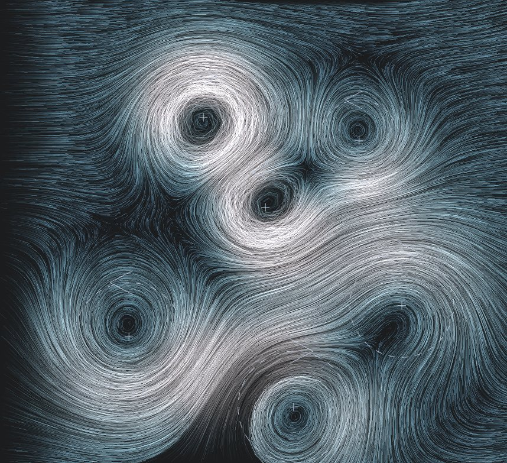
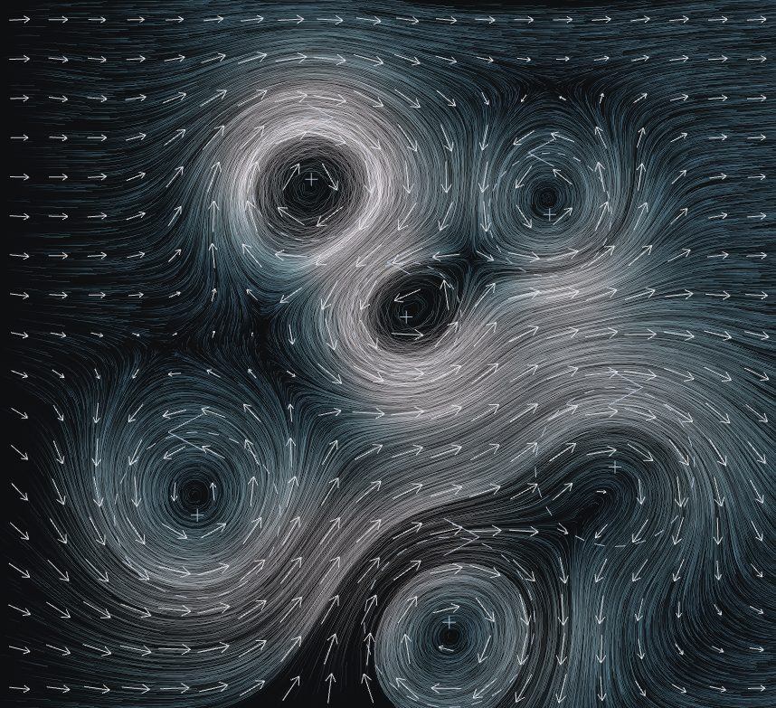
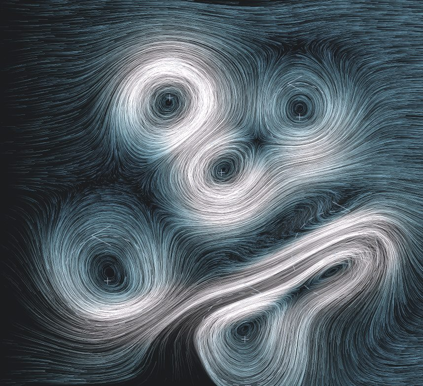

# Topic 7 — Vector Fields

Jessica Hsiao · Procedural World Building

A flow study. Eighteen thousand particles, none of which has any motion of its
own: every one of them asks the same 2D velocity field how fast and which way
to move where it stands, and the trails they leave are the field made visible.
A current runs left to right, a handful of vortices bend it into swirls, and a
drag of the mouse stirs it.

[← back to the README](../../README.md) · [study notebook index](../README.md)



## Contents

- [What is on the page](#what-is-on-the-page)
- [The field](#the-field) — four terms, all divergence-free
- [The particles](#the-particles) — and why the midpoint method
- [The trails](#the-trails) — an accumulation buffer, not geometry
- [Seeing the field](#seeing-the-field)
- [Stirring](#stirring)
- [Notes](#notes)

## What is on the page

| Control | What it does |
| --- | --- |
| **Field** | Base current, number of vortices, vortex strength and radius, curl-noise strength |
| **Particles** | Count (2,000–30,000), flow speed, trail persistence |
| **Show vector field** | A sparse grid of arrows, each the field's velocity at that point; the trails dim behind it so the two can be compared |
| **Vortex handles** | A dashed ring at each vortex's radius of peak speed, a chevron for its spin, and a cross to drag it by |
| **Pause / Regenerate / Reset** | Freeze the image; new seed (new vortex layout and noise); respawn every particle with the field unchanged |
| **Drag** | Anywhere but a vortex centre, a drag stirs the fluid |

The readout reports the step cost, the number of field samples per frame, the
stirs still decaying, and a numerical check that the field is divergence-free.

## The field

```
v(p, t) = current + Σ vortices + curl noise + Σ stirs
```

Coordinates run −1…1 bottom to top and −aspect…aspect left to right, so a unit
is half the viewport's height at any window size, and vortex positions are
stored as fractions of the frame so a resize keeps the layout.

**Every term is divergence-free, and that is the most important decision on
the page.** A field with sources and sinks herds particles into the sinks and
empties the sources within seconds; what is left looks like dust settling, not
water moving. An incompressible field can only move particles *around* each
other, which is why the streaks keep their spacing and fold into one another
rather than piling up.

- **Current** — uniform, left to right.
- **Vortices** — purely tangential, with speed depending only on distance from
  the centre: `s · (r/R) · e^((1 − r²/R²)/2)`. That is solid-body rotation in
  the core, a peak of exactly *s* at radius *R*, then a Gaussian fall to
  nothing. A point vortex's 1/r would be infinite at the centre and would still
  be pulling at the far edge of the frame. Any purely tangential field of this
  kind has zero divergence.
- **Curl noise** — the rotated gradient of a two-octave value-noise potential
  ψ: `v = (∂ψ/∂y, −∂ψ/∂x)`. Divergence-free by construction however ψ is made.
  ψ drifts slowly in time, so a steady configuration never looks frozen.
- **Stirs** — see [Stirring](#stirring).

Vortices are placed by the seed with rejection sampling so no two overlap, and
spins alternate before being shuffled: an all-one-way set sums to a single
giant gyre that hides the individual vortices.

**Measured, it is divergence-free.** The readout samples the field on a 48 × 32
grid and reports the largest |∇·v| as a fraction of the mean velocity gradient:

| Terms | Largest \|∇·v\| / mean \|∇v\| |
| --- | --- |
| Current and six vortices | 2.6 × 10⁻⁵ — float32 rounding |
| + curl noise at 0.08 | 1.0 × 10⁻³ |
| + curl noise at 0.3 | 3.3 × 10⁻³ |
| + a stir | 1.0 × 10⁻³ |

The residual comes from the noise. Value noise blends with a smoothstep fade,
which is only once-differentiable, so the divergence of its curl — a mixed
second derivative — is not quite zero across each lattice line. A quintic fade
would remove it; at a thousandth of the gradient it is invisible.

## The particles

A particle is a position, last frame's position, an age and a lifetime — six
`Float32Array`s of 30,000, not 30,000 objects. Each frame it samples the field,
moves, and is respawned if it left the frame or outlived its 2–6 s life.

**Respawn is uniform over the frame,** not at the upstream edge. Inflow at the
edge gives the classic streakline look, but in the lee of a strong vortex the
field is nearly closed and nothing from upstream ever reaches inside: the core
stays empty. Uniform respawn keeps every region populated. Lifetimes are
staggered so particles never expire together and pulse the image, and each
fades in and out over half a second so a respawn does not pop.

**Midpoint (RK2), not Euler — measured.** Euler takes the velocity at the start
of a step and goes straight, so around a vortex every step lands slightly
outside the circle it was on. A particle started on a vortex's radius in still
water, after 10 s (about seven laps):

| Integrator | 60 fps | 30 fps |
| --- | --- | --- |
| Euler | radius **+78%** | **+101%** |
| Midpoint | +0.12% | +0.92% |

With Euler every vortex would empty itself within seconds, and the spiral
would look like physics. The midpoint method samples again half-way along the
step and costs one extra field evaluation per particle: 36,000 samples a frame
at the default count, which Node measures at 5.9 ms per 40,000.

The time step is the frame's real delta, clamped at 0.1 s, times the flow
speed — so motion is the same speed at any frame rate.

## The trails

**One segment per particle per frame, into a buffer that is never cleared.**
Each frame draws where every particle was to where it is, additively, into an
off-screen target, after first fading that target toward the background by a
full-screen quad. A streak is what is left of the last few dozen segments.
The alternative — a polyline of history per particle — would rewrite N ×
trail-length vertices every frame; this writes N segments and one quad at any
trail length, in two draw calls.

**Persistence is per sixtieth of a second, corrected for the real frame
time:** the fade each frame is `1 − persistence^(Δt × 60)`. Without the
correction, a 30 fps laptop would draw trails half as long as a 60 fps one.

**The buffer is half-float.** In an 8-bit buffer the fade stalls: a channel at
3 times 0.92 rounds back to 3, so faint trails never reach the background and
the frame slowly fills with grey ghosts of every path ever taken.

**Colour is speed, in one hue family:** slate-blue when slow, cyan through the
currents, near-white only at the fastest. No rainbow — speed is one quantity.

## Seeing the field

| Show vector field | After a stir |
| --- | --- |
|  |  |
| A grid of arrows, eighteen rows, each the velocity at its centre. The particles are visibly doing what the arrows say. Arrow length saturates (tanh) rather than scaling linearly — a vortex core is several times faster than the current, and linear arrows would either vanish in the current or overlap at the cores. The trails drop to 40% brightness while the arrows are up. | Two drags across the lower half: the stirred fluid is pushed along the drag and curls into eddies either side of it, then the stirs decay over about a second and the vortices take it back. |

The vortex handles draw each vortex's radius of peak speed as a dashed ring —
dashed so it reads as a guide rather than an object — with a chevron at the
top pointing the way the fluid turns there.

## Stirring

A drag adds a **stir** every 30 ms at the pointer, carrying the drag's own
velocity, capped at 3 units/s so a flick stirs hard without throwing every
particle across the frame in one step. Each stir decays with a 0.8 s half-life;
at most 48 are alive at once.

**A stir is a stream function, not a push.** The obvious implementation adds
the drag velocity inside a Gaussian blob. That is a source in front of the
pointer and a sink behind it, and it sweeps particles into a hole. Instead each
stir is `ψ = (u × d) · e^(−|d|²/R²)`, and its contribution is the curl of ψ:
exactly the drag velocity at the centre, closing into two counter-rotating
eddies either side — a vortex dipole, which is what a finger drawn through real
water leaves behind. It is divergence-free like every other term, which the
readout confirms while stirs are alive.

## Notes

**The first divergence check found 0.41, in a field that is divergence-free on
paper.** Vortices and stirs were skipped beyond a few radii to save time — 4R
for a vortex, where the envelope is e^−7.5 ≈ 5 × 10⁻⁴. Small, but a step, and a
finite-difference stencil that straddled the cutoff read the step as
divergence. Moving the cutoff to 6.3R (e^−19.5 ≈ 3 × 10⁻⁹) took the
current-and-vortices residual from 0.41 to 6.7 × 10⁻⁵. A cutoff on a smooth
function has to be where the function is already zero to the precision being
checked, not merely small.

**The first trails were overexposed.** Each segment was drawn at 0.55 of full
intensity, and segments add. Inside a vortex the same circle is redrawn by
hundreds of particles, so every core saturated to flat white and the structure
inside it — the thing the page is for — disappeared. Segments now carry 0.2,
and default persistence fell from 0.94 to 0.92.

**The step cost was reported as the half-second's total.** The readout divided
by the frame count after resetting it, and showed 381.9 ms per step beside 38
frames per second. The average is now taken before the counters reset.

**The page opens running,** unlike Topic 4's simulations. There, the first
frame is a meaningful initial condition. Here, a paused page is an empty dark
rectangle: trails only exist once particles have moved.

**This is not a fluid solver.** Nothing here solves Navier–Stokes; the field is
written down, not evolved, and a stir does not transport the vortices or the
noise. What it captures is the part that reads — incompressibility, and
structure at more than one scale — at the cost of a few multiplications per
sample. The vortices hold still unless dragged.

**Figures are JPEG, including the README's.** A frame of fine anti-aliased
lines is the worst case for PNG, and the README figure is the viewport alone,
with no interface text in it. The three Topic 7 images are 727 KB together,
which leaves `docs/images/` at 9.5 MB.

**Frame rates here are not the page's.** Captured in a headless browser on a
heavily loaded machine (load averages of 17–24), the page ran at 38–54 frames
per second with a 12–21 ms step. Those are not a laptop's numbers, and none is
quoted here as one; the readout reports whatever machine it runs on.

**Saving needs the rules redeployed,** as for Topics 5 and 6: `flow` was added
to the topic list in `firestore.rules`.
